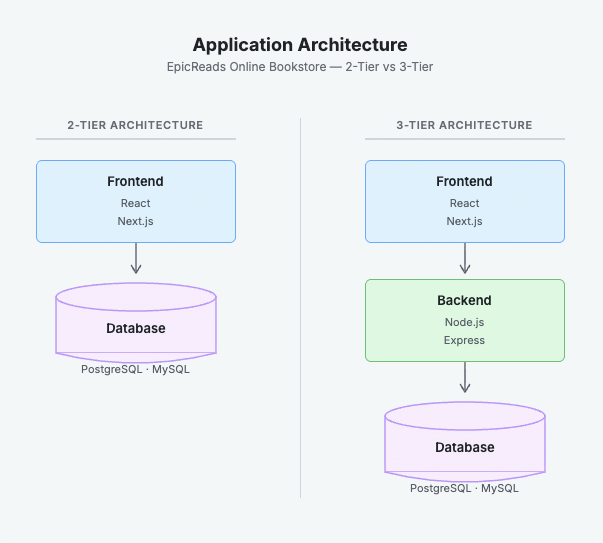
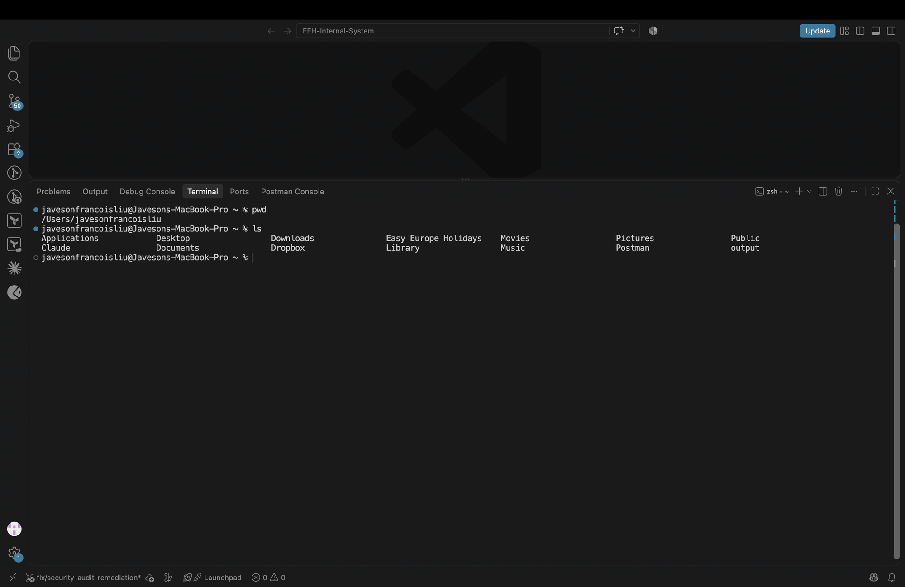

# Week 00 - Internet and Networking

Part of the DevOps Micro Internship (DMI) with Agentic AI

---

# 🧑‍💻 Task 1: Using ChatGPT as Your Learning Assistant

## Scenario

You're new to DevOps and will frequently encounter technical questions. ChatGPT can be your learning companion.

## Your Task

Write a clear ChatGPT prompt to help you understand:

> "What is a protocol in networking? Explain with a simple real-life example."

Take a screenshot of your interaction showing:

* Your detailed prompt (with clear expectations)
* ChatGPT's simplified response with an example

## Screenshot

Save your screenshot in the `screenshots` folder and update the file name below.


Replace `task-1-chatgpt.png` with your actual screenshot file name.

---

## What I Learned (2–3 lines)

A protocol is a set of rules that devices must follow to communicate with each other - similar to how a letter needs a correct address and format to reach its destination. Without a shared protocol, two devices have no common language and cannot exchange data. HTTP/HTTPS is one of the most common protocols, governing how browsers request and receive web pages.

---

# 🌐 Task 2: Internet and Networking

## Scenario

Your friend is launching an online bookstore named **EpicReads**.

He asked you to explain how users globally can access his website hosted in Finland.

## Your Task

Write a short explanation (**100–150 words**) that includes:

* Packet Switching
* IP Address
* TCP/IP
* HTTP/HTTPS

💡 **Tip:** You may use ChatGPT (as demonstrated in Task 1) to refine your explanation.

## Answer

When a user visits EpicReads from anywhere in the world, their request travels across the internet using **packet switching** - the data is broken into small packets, each routed independently through different paths, then reassembled at the destination. Every device on the network has a unique **IP address**, like a postal address, so packets know where to go. The **TCP/IP** protocol suite manages how packets are sent reliably and in the correct order. Finally, **HTTPS** (a secure version of HTTP) handles the actual communication between the user's browser and EpicReads' web server - encrypting the connection so the data cannot be intercepted in transit.

---

# 🏗️ Task 3: Application Architecture & Stack

## Scenario

EpicReads bookstore has two application versions:

### Two-Tier Application

* Frontend
* Database

### Three-Tier Application

* Frontend
* Backend
* Database

## Your Task

* Draw simple diagrams (hand-drawn or tool-based such as draw.io)
* Label each layer clearly
* List at least two common technologies or tools used for each layer
* Submit a screenshot or photo clearly showing your own drawing

## Diagram Screenshot / Photo

Save your diagram image in the `screenshots` folder and update the file name below.




Replace `task-3-diagram.png` with your actual diagram file name.

---

## Technologies Used

### Frontend

* React
* Next.js

### Backend

* Node.js
* Express

### Database

* PostgreSQL
* MySQL

---

# 🌍 Task 4: Domain Name & DNS (Basic Concepts)

## Scenario

Your friend's bookstore **EpicReads** is currently accessible through:

```text
52.172.142.222:3000
```

He purchased the domain:

```text
epicreads.com
```

## Your Task

In **50–100 words**, explain in your own words:

1. What is DNS (Domain Name System)?
2. Which DNS record type should be used to connect the domain to the given IP, and why?

## Answer

DNS (Domain Name System) is the internet's directory service - it translates human-readable domain names like `epicreads.com` into IP addresses like `52.172.142.222` that computers use to find each other. Without DNS, users would need to memorize IP addresses to visit any website.

To connect `epicreads.com` to the IP `52.172.142.222`, an **A record** should be used. An A record maps a domain name directly to an IPv4 address, which is exactly the situation here - pointing the purchased domain to the server's IP so browsers can resolve it correctly.

---

# 💻 Task 5: Visual Studio Code Setup (Hands-on)

## Your Task

Install Visual Studio Code (if not already installed).

Take a screenshot of your VS Code environment showing:

* Terminal open inside VS Code
* Running a basic command:

### Windows

```powershell
dir
```

### Linux / macOS

```bash
pwd
ls
```

* Your selected VS Code theme clearly visible

⚠️ **Important:** The screenshot must show your username or another identifiable detail to confirm it is your environment.

## Screenshot

Save your screenshot in the `screenshots` folder and update the file name below.




Replace `task-5-vscode.png` with your actual screenshot file name.

---

# 🔗 Task 6: Publish Your Assignment as a LinkedIn Post

## Objective

Publishing on LinkedIn helps you:

* Build your professional online presence
* Reinforce your learning
* Document your DevOps journey publicly

## Your Task

Summarize your answers from Tasks 1–5 into a LinkedIn post.

Clearly structure your post into the following sections:

* ChatGPT
* Internet & Networking
* App Architecture
* DNS
* VS Code Setup

Use the credit note that matches your track:

Add the following credit note at the end of your post **(If you are DMI Cohort 3 student)**:

> **P.S. This post is part of the DevOps Micro Internship (DMI) with Agentic AI — Cohort 3 — by Pravin Mishra. My graded progress is public: https://dmi.pravinmishra.com/s/YOUR-GITHUB-USERNAME.html · Start your DevOps journey: https://dmi.pravinmishra.com/?utm_source=student&utm_medium=ps-linkedin&utm_campaign=cohort3**

**Tag [Pravin Mishra](https://www.linkedin.com/in/pravin-mishra-aws-trainer/) in your LinkedIn post, then tag Lead Co-Mentor — [Anjana Muthunayake](https://www.linkedin.com/in/anjana-muthunayake/).**

Add the following credit note at the end of your post **(If you are DMI Self-paced track student)**:

> **P.S. This post is part of the DevOps Micro Internship (DMI) — Self-Paced Engineer Track — by Pravin Mishra. My graded progress is public: https://dmi.pravinmishra.com/s/YOUR-GITHUB-USERNAME.html · Start your DevOps journey: https://dmi.pravinmishra.com/?utm_source=student&utm_medium=ps-linkedin&utm_campaign=self-paced**

Add the following credit note at the end of your post **(If you are DMI Campus student)**:

> **P.S. This post is part of the DevOps Micro Internship (DMI) — Campus — by Pravin Mishra. My graded progress is public: https://dmi.pravinmishra.com/s/YOUR-GITHUB-USERNAME.html · Start your DevOps journey: https://dmi.pravinmishra.com/?utm_source=student&utm_medium=ps-linkedin&utm_campaign=campus**

**Tag [Pravin Mishra](https://www.linkedin.com/in/pravin-mishra-aws-trainer/) in your LinkedIn post, then tag Lead Co-Mentor — [Anjana Muthunayake](https://www.linkedin.com/in/anjana-muthunayake/).**

Hashtags:

#DMIByPravinMishra #AgenticAI #DevOps

Replace `YOUR-GITHUB-USERNAME` with your GitHub username — that link is your public DMI progress page (your graded badge page).
---

## LinkedIn Post URL

Paste your LinkedIn post URL here:

```text
Add your URL here...
```

---

## LinkedIn Post Backup Copy

Week 0 of the DevOps Micro Internship is done - and it covered more ground than I expected.

Here is what I worked through:

**ChatGPT as a Learning Tool**
Used it to break down what a networking protocol actually is. The analogy that stuck: a protocol is like the rules for sending a letter - address, envelope, delivery service. Without the rules, nothing arrives.

**Internet & Networking**
How does a user in Malaysia access EpicReads hosted in Finland? Packet switching breaks the request into small chunks, each routed independently. TCP/IP handles reliable delivery and ordering. HTTPS encrypts the connection. DNS translates epicreads.com into the server's IP address. All of this happens in milliseconds.

**Application Architecture**
2-Tier: Frontend talks directly to the Database (React/Next.js → PostgreSQL). Simple but tightly coupled - scaling one layer means scaling both.
3-Tier: Frontend → Backend → Database (React/Next.js → Node.js/Express → PostgreSQL). The backend handles business logic separately, making the system easier to scale and maintain.

**DNS**
To connect epicreads.com to IP 52.172.142.222, you use an A Record - it maps a domain name directly to an IPv4 address.

**VS Code Setup**
Terminal running inside VS Code, pwd and ls confirmed. This is the environment I will be using for the next 14 weeks.

The networking fundamentals this week are the foundation everything else in DevOps is built on. You cannot debug a broken deployment without understanding how traffic flows.

P.S. This post is part of the DevOps Micro Internship (DMI) with Agentic AI — Cohort 3 — by Pravin Mishra. My graded progress is public: https://dmi.pravinmishra.com/s/javesonfrancoisliu.html · Start your DevOps journey: https://dmi.pravinmishra.com/?utm_source=student&utm_medium=ps-linkedin&utm_campaign=cohort3

#DMIByPravinMishra #AgenticAI #DevOps

---

# Reflection – Week 0

### What did you find easy?

The conceptual side of networking - protocols, IP addresses, and DNS - clicked quickly because I could relate them to real-world analogies like postal systems and phone directories. Setting up VS Code and running terminal commands was also straightforward since I already use it daily.

---

### What was difficult?

Articulating the packet switching process clearly in 100-150 words without losing accuracy. Networking involves a lot of moving parts happening simultaneously, and condensing that into a concise explanation required careful word choice.

---

### What will you improve next week?

I want to go deeper on the OSI model and understand exactly which layer each protocol operates at. Week 0 gave me the surface understanding - I want the mental model that lets me reason about what breaks at which layer when something goes wrong in production.

---

## 📌 About DMI & CloudAdvisory

DevOps Micro Internship (DMI) is a project-based DevOps program run by Pravin Mishra (The CloudAdvisory) focused on real-world execution, systems thinking, and career readiness.

It helps learners build strong DevOps foundations with hands-on experience.


## 📌 Resources

- 🌐 **DMI Official Website:** https://dmi.pravinmishra.com?utm_source=github&utm_medium=readme  
- 🎓 **University:** https://university.pravinmishra.com?utm_source=github&utm_medium=readme  
- 💬 **Discord Community:** https://discord.pravinmishra.com?utm_source=github&utm_medium=readme  
- 📝 **Blog:** https://dmi.pravinmishra.com/blog?utm_source=github&utm_medium=readme  
- ▶️ **YouTube Playlist (DMI Cohort 3):** https://www.youtube.com/playlist?list=PLFeSNDtI4Cho  
- 🔗 **Pravin Mishra (LinkedIn):** https://www.linkedin.com/in/pravin-mishra-aws-trainer/  
- 🏢 **CloudAdvisory (LinkedIn):** https://www.linkedin.com/company/thecloudadvisory/

---

*This submission is part of DevOps Micro Internship (DMI) — Agentic AI Track*