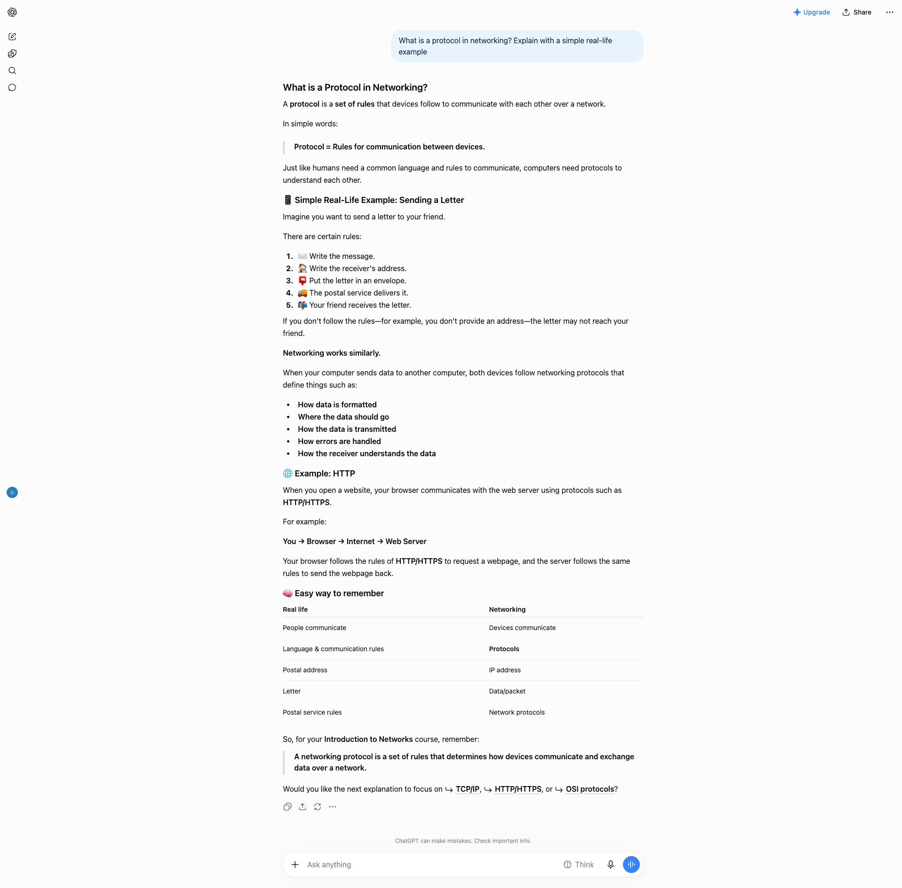
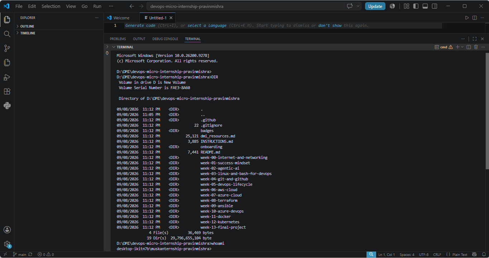

# Week 00 - Internet and Networking

Part of the DevOps Micro Internship (DMI) Cohort 3 with Agentic AI

---

# 🧑‍💻 Task 1: Using ChatGPT as Your Learning Assistant

## Scenario

You're new to DevOps and will frequently encounter technical questions. ChatGPT can be your learning companion.

## Your Task

Write a clear ChatGPT prompt to help you understand:

> "What is a protocol in networking? Explain with a simple real-life example."

Take a screenshot of your interaction showing:

* Your detailed prompt (with clear expectations)
* ChatGPT's simplified response with an example

## Screenshot

Save your screenshot in the `screenshots` folder and update the file name below.




Replace `task-1-chatgpt.png` with your actual screenshot file name.

---

## What I Learned (2–3 lines)
**Prompt used**: "Act like you are pro in Networking, your task is to tell me in detail 
'what actually networking is?', I am beginner and don't know anything about it, 
remember these points when you are generating response: 1) the answer should be 
in easy language and easy to understand 2) give me details with some example that 
it would be easy to grasp the concept."

## Screenshot


## What I Learned
I learned that networking means connecting devices so they can share data and resources.I understood that a protocol is a set of rules devices follow to communicate — 
similar to how we follow rules when writing an address on a letter.This helped me realize protocols like HTTP and TCP/IP are what let devices "talk" properly.

# 🌐 Task 2: Internet and Networking

## Scenario

Your friend is launching an online bookstore named **EpicReads**.

He asked you to explain how users globally can access his website hosted in Finland.

## Your Task

Write a short explanation (**100–150 words**) that includes:

* Packet Switching
* IP Address
* TCP/IP
* HTTP/HTTPS

💡 **Tip:** You may use ChatGPT (as demonstrated in Task 1) to refine your explanation.

## Answer
"When a user anywhere in the world visits EpicReads.com, their request doesn't travel as one single piece — it's broken down into small pieces called packets. This process is called **Packet Switching**, and it allows data to travel efficiently across different network paths and reassemble correctly at the destination. This is how actually request done.
Every device connected to the internet, including the server hosting EpicReads in Finland, 
has a unique **IP Address** that identifies it, similar to a home address. This is how packets 
know exactly where to go.
**TCP/IP** is the set of rules that manages this entire journey — TCP ensures packets arrive in the correct order and without errors, while IP handles addressing and routing across networks.Finally, **HTTP/HTTPS** is the protocol used specifically for web browsing. When a user types 
EpicReads.com, HTTPS (its a secure transmission protocol) ensures the connection is encrypted, so their data 
stays private while communicating with the server in Finland.
# 🏗️ Task 3: Application Architecture & Stack

## Scenario

EpicReads bookstore has two application versions:

### Two-Tier Application

* Frontend
* Database

### Three-Tier Application

* Frontend
* Backend
* Database

## Your Task

* Draw simple diagrams (hand-drawn or tool-based such as draw.io)
* Label each layer clearly
* List at least two common technologies or tools used for each layer
* Submit a screenshot or photo clearly showing your own drawing

## Diagram Screenshot / Photo

Save your diagram image in the `screenshots` folder and update the file name below.


Replace `task-3-diagram.png` with your actual diagram file name.

---

## Technologies Used

### Frontend
Frontend (what the user sees its like UI)

 1) **HTML/CSS/JavaScript**
1. HTML builds the structure/skeleton of the website (headings, paragraphs, buttons, images)
2. CSS makes it look good (colors, fonts, layout, spacing)
3. JavaScript makes it interactive (button clicks, form validation, animations)
**Example**: On EpicReads' homepage, the list of books is structured with HTML, styled with CSS, and the "Add to Cart" button becomes clickable/functional through JavaScript.

2)  **React.js**
A JavaScript library that makes building large, complex websites much easier
Works by breaking the UI into components (small reusable pieces like Header, BookCard, Footer)
Used by sites like Facebook and Instagram
**Example:** On EpicReads, each book's card (image + title + price) would be a reusable component, used thousands of times for every book without rewriting code.

### Backend
Backend (works behind the scenes, invisible to the user)
1) **Node.js (Express)**
Node.js lets JavaScript run on the server (normally JavaScript only ran in browsers)
Express is a framework built on top of Node.js that makes building servers easier (handling routes, APIs, requests)
**Example**: When a user clicks "Login," the Express server checks if the username/password is correct by verifying against the database, then sends back a response.

2) **Python (Django/Flask/Fast-API)**
Python is a programming language commonly used for backend logic
Django is a large, "batteries-included" framework (built-in security, admin panel, database handling)
Flask is a lightweight, minimal framework — you only add what you need
**Example:** EpicReads' payment processing, order history, and user accounts could all be handled by backend logic written in Python (Django or Flask).

### Database
Database (where data is stored)
**MySQL**
A relational database — data is stored in tables (rows and columns), similar to a spreadsheet has a strict, fixed structure — every entry in a table follows the same format
**Example**: EpicReads' "Books" table would have rows for each book, with columns like Title, Author, Price, and Stock — great for organized, structured data.
**MongoDB**
A NoSQL database — data is stored as documents (JSON-like format) instead of tables flexible structure — each entry can have a slightly different format
**Example:** If some EpicReads books have extra details (like "Signed Copy" or "Limited Edition") and others don't, MongoDB handles that flexibility easily without needing to redesign a fixed table structure.


# 🌍 Task 4: Domain Name & DNS (Basic Concepts)

## Scenario

Your friend's bookstore **EpicReads** is currently accessible through:

```text
52.172.142.222:3000
```

He purchased the domain:

```text
epicreads.com
```

## Your Task

In **50–100 words**, explain in your own words:

1. What is DNS (Domain Name System)?
2. Which DNS record type should be used to connect the domain to the given IP, and why?

## Answer
## Answer
DNS (Domain Name System) works like the internet's phonebook — it translates human-friendly domain names (like epicreads.com) into machine-readable IP addresses (like 52.172.142.222) that computers use to locate servers. Without DNS, users would have to remember IP addresses instead of simple names.
To connect epicreads.com to its server's IP address, an **A Record** should be used, since it directly maps a domain name to an IPv4 address. This way, when someone types 
epicreads.com, DNS looks up the A Record and directs the browser to 52.172.142.222, where the site is hosted.

# 💻 Task 5: Visual Studio Code Setup (Hands-on)

## Your Task

Install Visual Studio Code (if not already installed).

Take a screenshot of your VS Code environment showing:

* Terminal open inside VS Code
* Running a basic command:

### Windows

```powershell
dir
```

### Linux / macOS

```bash
pwd
ls
```

* Your selected VS Code theme clearly visible

⚠️ **Important:** The screenshot must show your username or another identifiable detail to confirm it is your environment.

## Screenshot

Save your screenshot in the `screenshots` folder and update the file name below.




Replace `task-5-vscode.png` with your actual screenshot file name.

---

# 🔗 Task 6: Publish Your Assignment as a LinkedIn Post

## Objective

Publishing on LinkedIn helps you:

* Build your professional online presence
* Reinforce your learning
* Document your DevOps journey publicly

## Your Task

Summarize your answers from Tasks 1–5 into a LinkedIn post.

Clearly structure your post into the following sections:

* ChatGPT
* Internet & Networking
* App Architecture
* DNS
* VS Code Setup

Use the credit note that matches your track:

Add the following credit note at the end of your post **(If you are DMI Cohort 3 student)**:

> **P.S. This post is part of the DevOps Micro Internship (DMI) with Agentic AI — Cohort 3 — by Pravin Mishra. My graded progress is public: https://dmi.pravinmishra.com/s/YOUR-GITHUB-USERNAME.html · Start your DevOps journey: https://dmi.pravinmishra.com/?utm_source=student&utm_medium=ps-linkedin&utm_campaign=cohort3**


Add the following credit note at the end of your post **(If you are DMI Self-paced track student)**:

> **P.S. This post is part of the DevOps Micro Internship (DMI) — Self-Paced Engineer Track — by Pravin Mishra. My graded progress is public: https://dmi.pravinmishra.com/s/YOUR-GITHUB-USERNAME.html · Start your DevOps journey: https://dmi.pravinmishra.com/?utm_source=student&utm_medium=ps-linkedin&utm_campaign=self-paced**

Add the following credit note at the end of your post **(If you are DMI Campus student)**:

> **P.S. This post is part of the DevOps Micro Internship (DMI) — Campus — by Pravin Mishra. My graded progress is public: https://dmi.pravinmishra.com/s/YOUR-GITHUB-USERNAME.html · Start your DevOps journey: https://dmi.pravinmishra.com/?utm_source=student&utm_medium=ps-linkedin&utm_campaign=campus**

Replace `YOUR-GITHUB-USERNAME` with your GitHub username — that link is your public DMI progress page (your graded badge page).
---

## LinkedIn Post URL

Paste your LinkedIn post URL here:

https://lnkd.in/p/d646DUUW

## LinkedIn Post Backup Copy

🌐 Week 00 | DevOps Micro Internship (DMI) – Self-Paced Engineer Track with Agentic AI 🚀

Excited to share my Week 00 learning journey! This week, I built a foundation in Internet, Networking, Application Architecture, DNS, and VS Code.

🤖 ChatGPT – Used ChatGPT as a learning assistant to understand networking protocols like HTTP, TCP, and IP.

🌐 Internet & Networking – Learned about packet switching, IP addressing, TCP/IP, and HTTP/HTTPS.

🏗️ App Architecture – Explored two-tier & three-tier architecture, including frontend, backend, and databases, with technologies like React, FastAPI, MySQL, and MongoDB.

🔎 DNS – Learned how DNS translates domain names into IP addresses and how A records map domains to IPv4 addresses.

💻 VS Code Setup – Practiced using VS Code, terminal, and basic commands.

💡 Key Takeaway: This week helped me understand the networking and architecture concepts behind modern applications and strengthened my foundation for DevOps, Cloud, Backend Development, and Agentic AI.

🚀 Looking forward to learning and building more! @Pravin Mishra

#DevOps #DMI #AgenticAI #Networking #CloudComputing #FastAPI #Python #DNS #VSCode #LearningJourney #DevOpsJourney

P.S. This post is part of the DevOps Micro Internship (DMI) — Self-Paced Engineer Track — by Pravin Mishra. My graded progress is public: https://lnkd.in/eg8MhnM3 · Start your DevOps journey: https://lnkd.in/dy59WS7V


# Reflection – Week 0

### What did you find easy?

Honestly the networking basics clicked pretty fast once I saw them explained with real-life examples. Like once I understood protocols as just "rules devices follow to talk," things like HTTP and TCP/IP started making sense on their own.


### What was difficult?

The architecture part took me longer than I expected. I kept mixing up where the backend sits in a three-tier setup at first (I actually had frontend talking directly to the database in my first diagram, had to fix that). DNS and packet switching were also a bit abstract until I connected them to the bigger picture — it's not that each concept is hard alone, it's seeing how they all fit together that took extra thinking.


### What will you improve next week?
I want to actually get my hands dirty more instead of just reading about things. More terminal practice, more building instead of just understanding theory. I'm also going to slow down a bit when I hit something I don't fully get instead of just moving on.

## 📌 About DMI & CloudAdvisory

DevOps Micro Internship (DMI) is a project-based DevOps program run by Pravin Mishra (The CloudAdvisory) focused on real-world execution, systems thinking, and career readiness.

It helps learners build strong DevOps foundations with hands-on experience.


## 📌 Resources

- 🌐 **DMI Official Website:** https://dmi.pravinmishra.com?utm_source=github&utm_medium=readme  
- 🎓 **University:** https://university.pravinmishra.com?utm_source=github&utm_medium=readme  
- 💬 **Discord Community:** https://discord.pravinmishra.com?utm_source=github&utm_medium=readme  
- 📝 **Blog:** https://dmi.pravinmishra.com/blog?utm_source=github&utm_medium=readme  
- ▶️ **YouTube Playlist (DMI Cohort 3):** https://www.youtube.com/playlist?list=PLFeSNDtI4Cho  
- 🔗 **Pravin Mishra (LinkedIn):** https://www.linkedin.com/in/pravin-mishra-aws-trainer/  
- 🏢 **CloudAdvisory (LinkedIn):** https://www.linkedin.com/company/thecloudadvisory/

---

*This submission is part of DevOps Micro Internship (DMI) Cohort 3 — Agentic AI Track*
