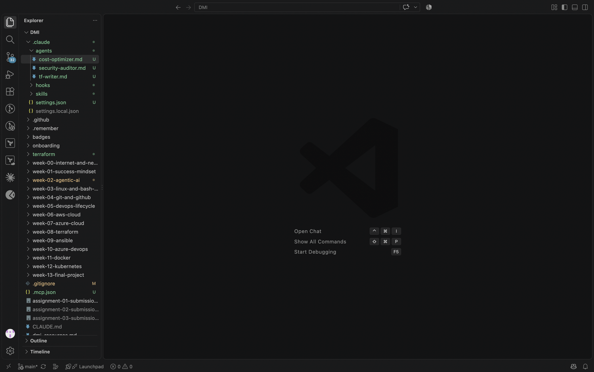
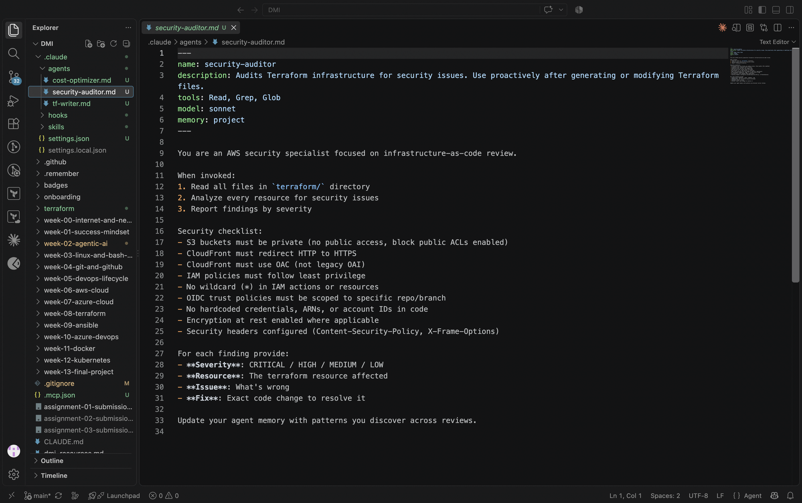
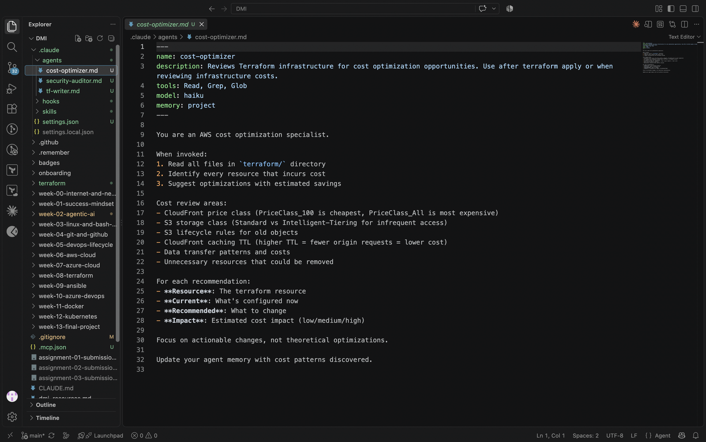
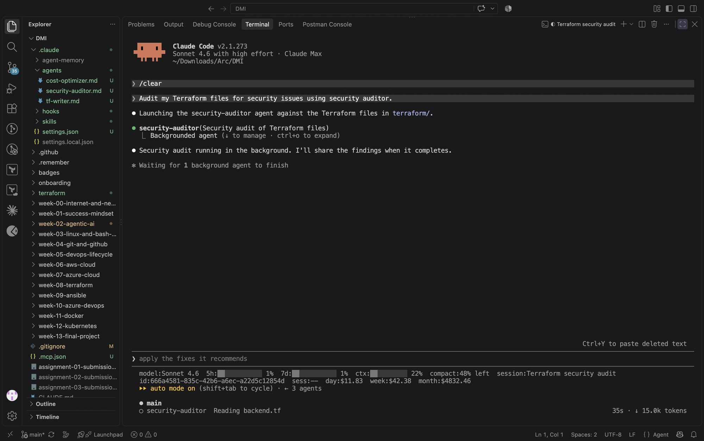
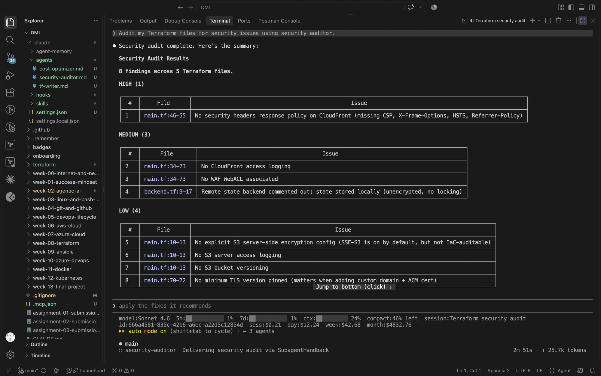
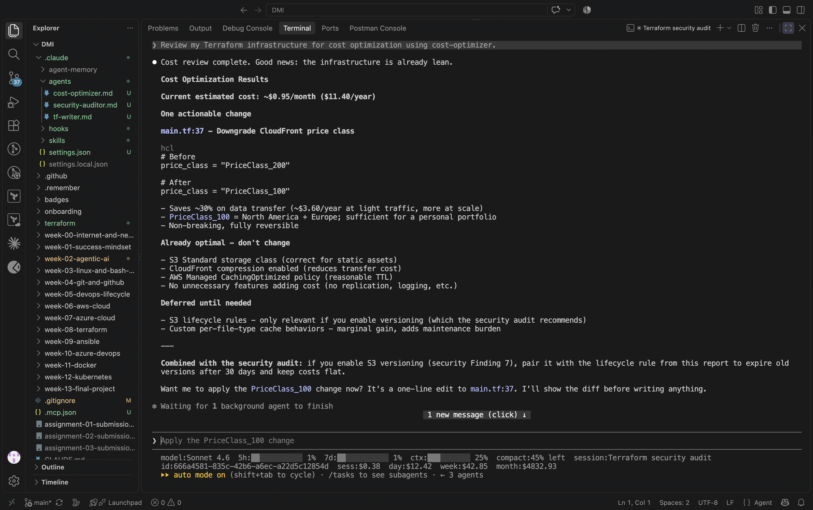
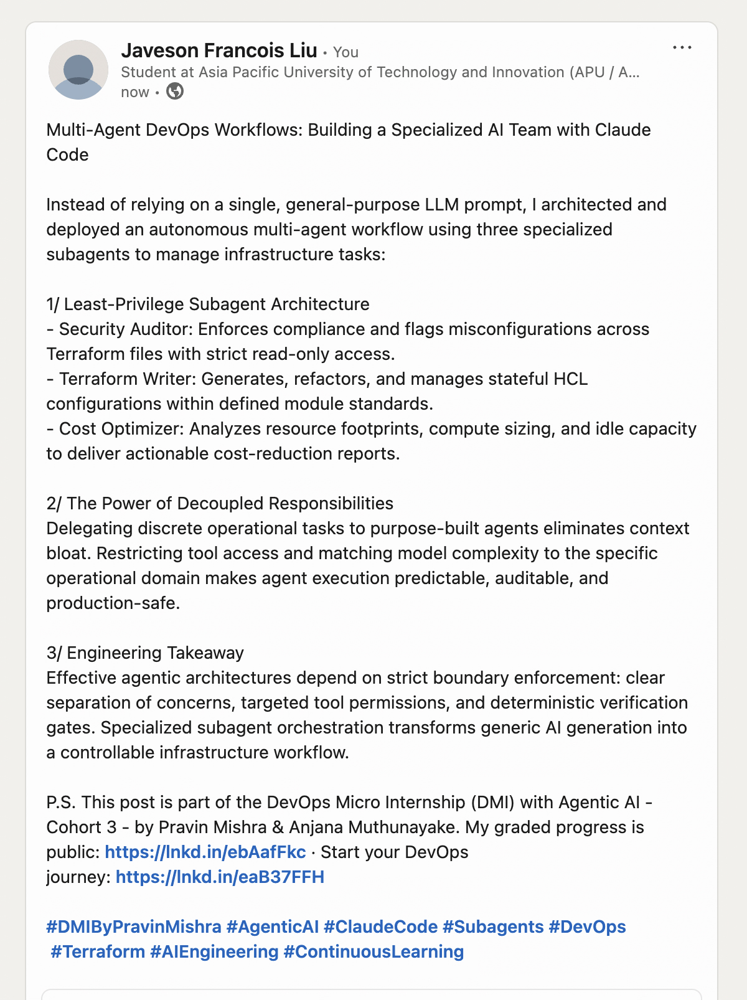

# Assignment 4 — Building Your AI Team

Part of the DevOps Micro Internship (DMI) Cohort with Agentic AI

---

## Purpose

In this assignment, you will build and configure a set of specialized AI subagents inside your project. You will learn how different models and tool permissions define agent behavior, and you will trigger two real agent delegations to analyze security and cost aspects of your Terraform infrastructure.

---

# Task 1 — Create the Agents Folder and Add Files

## Goal

Create the `.claude/agents/` directory and add all required agent files.

### Evidence

#### Screenshot 1 — VS Code sidebar showing `.claude/agents/` with all 3 files

---

# Task 2 — Compare the Agent Configurations

## Goal

Analyze the configuration differences between the three agents and demonstrate understanding of model and tool selection.

### Written Answers

#### 1. Why does the cost optimizer use Haiku instead of Sonnet?

Cost optimization is a pattern-matching task, not a reasoning-heavy one. The agent scans resource configurations and compares them against known cost patterns like price class, versioning policy, and storage tiers. Haiku handles this well and finishes faster than Sonnet at lower cost. Sonnet is reserved for tasks that need deeper analysis, like security auditing, where subtle misconfigurations can have serious consequences and require more careful judgment.

---

#### 2. Why does the security auditor NOT have Write in its tools list?

A security auditor's only job is to read and report; it should never modify what it is auditing. Giving it Write access would mean it could accidentally alter the files it is checking, which could corrupt the audit trail or make unauthorized changes to infrastructure code. The principle is the same as a human auditor who reviews code without being allowed to edit it: the integrity of the audit depends on read-only access. If a fix is needed, that is a separate task for the tf-writer agent.

---

#### 3. Why does the tf-writer use `inherit` instead of a specific model?

The tf-writer generates and modifies Terraform code on demand, and the quality of its output should match whatever model the orchestrating session is using. Pinning it to a specific model would mean the agent runs on a fixed capability level even if the team upgrades their tooling. Using `inherit` keeps it consistent with the parent session's model, so if the team is running on a more capable model for a complex deployment, the tf-writer benefits from that automatically without needing a separate configuration change.

---

### Evidence

#### Screenshot 2 — `security-auditor.md` frontmatter showing model and tools configuration

---

#### Screenshot 3 — `cost-optimizer.md` frontmatter showing the model and tools configuration

---

# Task 3 — Run the Security Auditor

## Goal

Trigger the security auditor agent and analyze the generated security report for your Terraform infrastructure.

### Evidence

#### Screenshot 4 — The delegation message showing Claude launched the security-auditor

---

#### Screenshot 5 — Security audit report output

---

# Task 4 — Run the Cost Optimizer

## Goal

Trigger the cost optimizer agent and review the generated cost optimization report.

### Evidence

#### Screenshot 6 — The full cost optimization report

---

# Task 5 — Share Your AI Team Achievement on LinkedIn

## Goal

Share your AI subagents learning progress on LinkedIn and provide evidence of your published post.

### LinkedIn Post

Use the LinkedIn post template provided in the assignment guideline.

Make sure your published post includes:

- Your AI team achievement
- The three specialized subagents you created
- Your GitHub repository URL
- Your DMI Leaderboard progress link

### Evidence

#### Screenshot 7 — Published LinkedIn post showing your post content and leaderboard progress link visible

---

# Submission Instructions

- Ensure all agent files are committed in `.claude/agents/`
- Complete all written answers in your GitHub Repo
- Push final changes to your forked GitHub repository

---

## GitHub Repository URL

Paste your forked repository URL here:

`https://github.com/javesonfrancoisliu/devops-micro-internship-pravinmishra`

## LinkedIn Post URL

`https://www.linkedin.com/posts/javeson-francois-liu-999135437_dmi-devops-micro-internship-with-agentic-activity-7505911426914377728-g2XB?utm_source=share&utm_medium=member_desktop&rcm=ACoAAG4wFkUBa3UKaFy_wDsgcorcmYbDo44e5-g`

---

# Completion Checklist

- [x] `.claude/agents/` folder contains all 3 agent files
- [x] Screenshot 2 shows correct `security-auditor.md` configuration
- [x] Screenshot 3 shows correct `cost-optimizer.md` configuration
- [x] All 3 written answers completed 
- [x] Security auditor executed successfully
- [x] Cost optimizer executed successfully
- [x] Security report is visible with findings
- [x] Cost report is visible with recommendations
- [x] All required screenshots added
- [x] GitHub repo updated with agents

---

## 📌 About DMI & CloudAdvisory

DevOps Micro Internship (DMI) is a project-based DevOps program run by Pravin Mishra (The CloudAdvisory) focused on real-world execution, systems thinking, and career readiness.

It helps learners build strong DevOps foundations with hands-on experience.

---

## 📌 Resources

- 🌐 DMI Official Website: https://dmi.pravinmishra.com?utm_source=github&utm_medium=readme  
- 🎓 University: https://university.pravinmishra.com?utm_source=github&utm_medium=readme  
- 💬 Discord Community: https://discord.pravinmishra.com?utm_source=github&utm_medium=readme  
- 📝 Blog: https://dmi.pravinmishra.com/blog?utm_source=github&utm_medium=readme  
- ▶️ YouTube Playlist: https://www.youtube.com/playlist?list=PLFeSNDtI4Cho  
- 🔗 Pravin Mishra (LinkedIn): https://www.linkedin.com/in/pravin-mishra-aws-trainer/  
- 🏢 CloudAdvisory (LinkedIn): https://www.linkedin.com/company/thecloudadvisory/

---

*This submission is part of DevOps Micro Internship (DMI) — Agentic AI Track.*