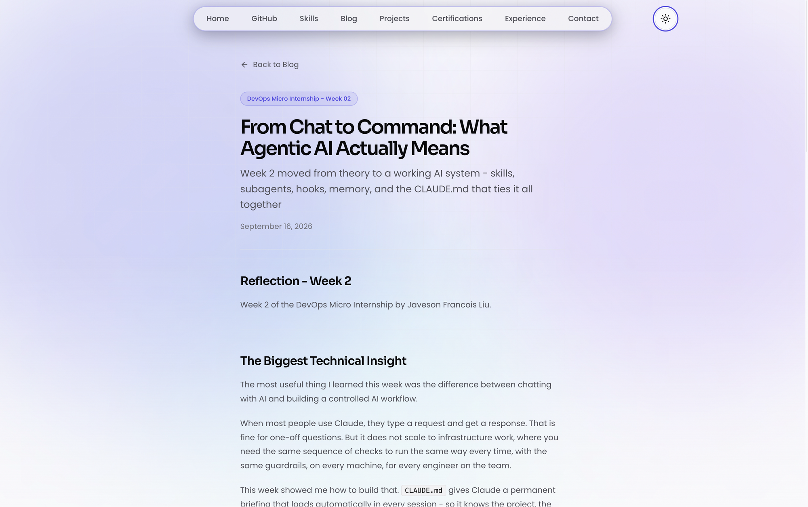
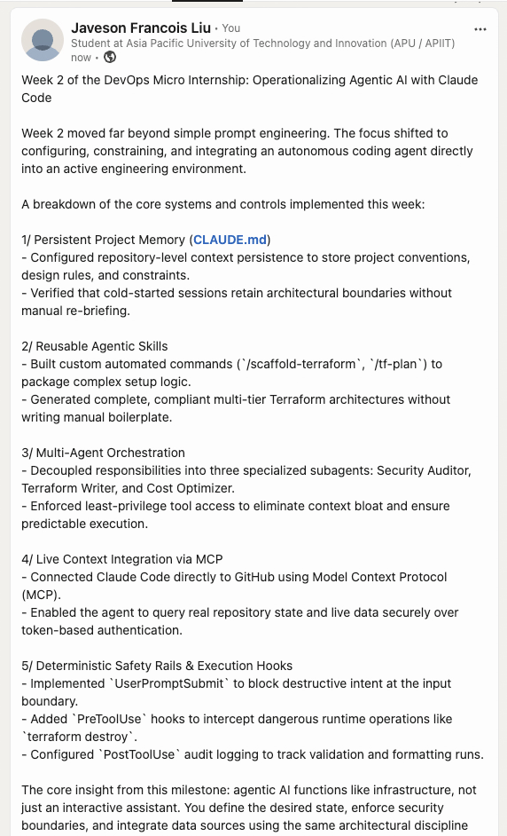

# Assignment 8 — Week 2 Reflection Blog

Part of the DevOps Micro Internship (DMI) with Agentic AI

---

# Purpose

In this assignment, you will reflect on your Week 2 learning journey and write a short blog capturing your experience working with Agentic AI tools such as Claude Code, Skills, Subagents, MCP, Hooks, Permissions, and Memory.

You will also publish a LinkedIn post summarizing your learning and share both links for evaluation.

---

# Task 1 — Write Your Reflection Blog

## Goal

Write a reflection blog covering your Week 2 learning experience.

### Blog Requirements

Your blog must include:

* Title: **Reflection – Week 2**
* Minimum 300 words
* At least 2–3 topics from Week 2 (Claude Code, Skills, Subagents, MCP, Hooks, Permissions, Memory)
* Honest personal reflection (learning, challenges, mindset)
* One habit/system you plan to implement
* Your full name clearly visible

### Allowed Platforms

You can publish your blog on:

* Hashnode
* Medium
* Dev.to
* LinkedIn Article
* GitHub Markdown file
* Substack

---

## Blog Content — Javeson Francois Liu

### Reflection – Week 2: How I Gave an AI a Memory, Safety Rails, and a Team

**By Javeson Francois Liu**

Week 2 of the DevOps Micro Internship with Agentic AI was not what I expected. I thought it would be about learning Claude Code features. What I actually learned was how to think about AI as infrastructure — something you configure, constrain, and connect to external systems, not just something you prompt.

**CLAUDE.md: Context as Configuration**

The most mind-shifting moment came early with `CLAUDE.md`. Before I added it, asking Claude about my project gave me a generic answer. After I defined the project rules — S3, CloudFront, Terraform, no JavaScript — Claude stopped suggesting React and started referencing my actual stack. That is when I realized the real skill in agentic AI is not crafting clever prompts. It is defining the context clearly enough that the AI stays in bounds without being micromanaged every session.

**Skills: Reusable Automation**

Skills changed how I think about repetition. Running `/scaffold-terraform` and watching Claude read the template specification and generate five Terraform files — that is not just convenient. That is the same principle behind infrastructure as code. Instead of writing Terraform by hand every project, I write the spec once and the skill handles the rest. The fact that `tf-plan` uses `allowed-tools: Bash, Read, Grep` and blocks Write access is exactly the principle of least privilege applied to AI agents.

**Subagents: Specialization Over Generalization**

Building the security auditor, cost optimizer, and Terraform writer as separate agents taught me something I have seen in every well-functioning engineering team: specialization reduces errors. The security auditor does not have Write access because an auditor should never touch what it is reviewing. The cost optimizer runs on Haiku because cost pattern matching does not need the same reasoning depth as security analysis. These are engineering decisions, not configuration details.

**Hooks and Permissions: AI Safety by Design**

This was the hardest part to appreciate at first, but the most important. The `UserPromptSubmit` hook that blocks destructive intent before Claude even processes the request — that is not a workaround for a bad AI. That is defense in depth. You do not trust any system with your infrastructure unconditionally. You add guardrails at every layer.

**Memory: Persistence Across Sessions**

Memory was the feature that made everything feel coherent. Closing a session and reopening it to find Claude still knows the CSS hero colors and the JavaScript restriction — that is what turns a chatbot into a persistent collaborator.

**One System I Will Implement**

Starting every new project with a `CLAUDE.md` before writing a single line of code. Define the stack, the constraints, the conventions. That single habit will save more time than any prompt optimization.

Week 2 taught me that working with agentic AI well is a form of systems thinking. You are not just using a tool — you are designing the conditions under which the tool operates safely and effectively.

---

### Evidence

#### Screenshot 1 — Blog published and visible



---

### Submission Field

Blog Link:

`https://javesonfrancoisliu.vercel.app/blog/dmi-w2-claude`

---

# Task 2 — Create LinkedIn Post

## Goal

Share your Week 2 learning publicly on LinkedIn.

---

### Evidence

#### Screenshot 2 — LinkedIn post published



---

### Submission Field

LinkedIn Post Content (copy-paste here):

```
Week 2 of the DevOps Micro Internship: Operationalizing Agentic AI with Claude Code

Week 2 moved far beyond simple prompt engineering. The focus shifted to configuring, constraining, and integrating an autonomous coding agent directly into an active engineering environment.

A breakdown of the core systems and controls implemented this week:

1/ Persistent Project Memory (CLAUDE.md)
- Configured repository-level context persistence to store project conventions, design rules, and constraints.
- Verified that cold-started sessions retain architectural boundaries without manual re-briefing.

2/ Reusable Agentic Skills
- Built custom automated commands (/scaffold-terraform, /tf-plan) to package complex setup logic.
- Generated complete, compliant multi-tier Terraform architectures without writing manual boilerplate.

3/ Multi-Agent Orchestration
- Decoupled responsibilities into three specialized subagents: Security Auditor, Terraform Writer, and Cost Optimizer.
- Enforced least-privilege tool access to eliminate context bloat and ensure predictable execution.

4/ Live Context Integration via MCP
- Connected Claude Code directly to GitHub using Model Context Protocol (MCP).
- Enabled the agent to query real repository state and live data securely over token-based authentication.

5/ Deterministic Safety Rails & Execution Hooks
- Implemented UserPromptSubmit to block destructive intent at the input boundary.
- Added PreToolUse hooks to intercept dangerous runtime operations like terraform destroy.
- Configured PostToolUse audit logging to track validation and formatting runs.

The core insight from this milestone: agentic AI functions like infrastructure, not just an interactive assistant. You define the desired state, enforce security boundaries, and integrate data sources using the same architectural discipline applied to cloud platforms.

Read my full reflection: https://javesonfrancoisliu.vercel.app/blog/dmi-w2-claude

GitHub Repository: https://github.com/javesonfrancoisliu/devops-micro-internship-pravinmishra

P.S. This post is part of the DevOps Micro Internship (DMI) with Agentic AI - Cohort 3 - by Pravin Mishra & Anjana Muthunayake. My graded progress is public: https://dmi.pravinmishra.com/s/javesonfrancoisliu.html · Start your DevOps journey: https://dmi.pravinmishra.com/?utm_source=student&utm_medium=ps-linkedin&utm_campaign=cohort3

#DMIByPravinMishra #AgenticAI #ClaudeCode #DevOps #InfrastructureAsCode #AISafety #Automation
```

---

### LinkedIn Post Link:

`https://lnkd.in/p/ehcF6j5J`

---

# Submission Instructions

* Blog must be publicly accessible
* LinkedIn post must be visible (public or unlisted where applicable)
* All required fields must be filled
* Screenshot proofs must be added to GitHub repository
* Do not include sensitive information in blog or post

---

# Completion Checklist

* [x] Blog written with required structure
* [x] Blog includes at least 2–3 Week 2 topics
* [x] Blog is publicly accessible
* [x] LinkedIn post created
* [x] Required P.S. line included
* [x] LinkedIn post content copied in submission field
* [x] Blog link added
* [x] LinkedIn post link added
* [x] Screenshots added to GitHub repo

---

# About DMI & CloudAdvisory

DevOps Micro Internship (DMI) is a project-based DevOps program run by Pravin Mishra (The CloudAdvisory), focused on real-world execution, systems thinking, and agentic AI workflows.

It helps learners build strong DevOps foundations through hands-on experience.

---

# Resources

* 🌐 DMI Official Website: [https://dmi.pravinmishra.com?utm_source=github&utm_medium=readme](https://dmi.pravinmishra.com?utm_source=github&utm_medium=readme)
* 🎓 University: [https://university.pravinmishra.com?utm_source=github&utm_medium=readme](https://university.pravinmishra.com?utm_source=github&utm_medium=readme)
* 💬 Discord Community: [https://discord.pravinmishra.com?utm_source=github&utm_medium=readme](https://discord.pravinmishra.com?utm_source=github&utm_medium=readme)
* 📝 Blog: [https://dmi.pravinmishra.com/blog?utm_source=github&utm_medium=readme](https://dmi.pravinmishra.com/blog?utm_source=github&utm_medium=readme)
* ▶️ YouTube Playlist: [https://www.youtube.com/playlist?list=PLFeSNDtI4Cho](https://www.youtube.com/playlist?list=PLFeSNDtI4Cho)
* 🔗 Pravin Mishra (LinkedIn): [https://www.linkedin.com/in/pravin-mishra-aws-trainer/](https://www.linkedin.com/in/pravin-mishra-aws-trainer/)
* 🏢 CloudAdvisory (LinkedIn): [https://www.linkedin.com/company/thecloudadvisory/](https://www.linkedin.com/company/thecloudadvisory/)
---

*This submission is part of DevOps Micro Internship (DMI) — Agentic AI Track.*
