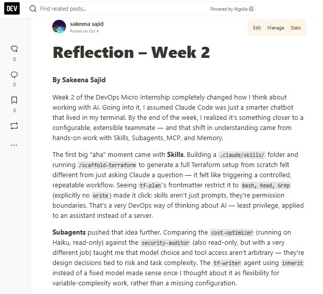
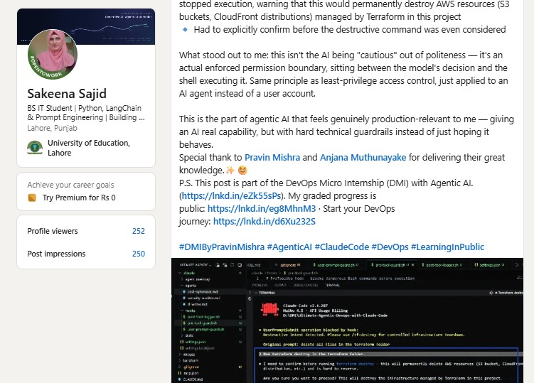

# Assignment 8 — Week 2 Reflection Blog

Part of the DevOps Micro Internship (DMI) Cohort 3 with Agentic AI

---

# Purpose

In this assignment, you will reflect on your Week 2 learning journey and write a short blog capturing your experience working with Agentic AI tools such as Claude Code, Skills, Subagents, MCP, Hooks, Permissions, and Memory.

You will also publish a LinkedIn post summarizing your learning and share both links for evaluation.

---

# Task 1 — Write Your Reflection Blog

## Goal

Write a reflection blog covering your Week 2 learning experience.

### Blog Requirements

Your blog must include:

* Title: **Reflection – Week 2**
* Minimum 300 words
* At least 2–3 topics from Week 2 (Claude Code, Skills, Subagents, MCP, Hooks, Permissions, Memory)
* Honest personal reflection (learning, challenges, mindset)
* One habit/system you plan to implement
* Your full name clearly visible

### Allowed Platforms

You can publish your blog on:

* Hashnode
* Medium
* Dev.to
* LinkedIn Article
* GitHub Markdown file
* Substack

---

### Evidence

#### Screenshot 1 — Blog published and visible

### Submission Field

Blog Link:

https://dev.to/sakeena_sajid_02de330ed40/reflection-week-2-3cf6

# Task 2 — Create LinkedIn Post

## Goal

Share your Week 2 learning publicly on LinkedIn.

---

### LinkedIn Post Requirements

Your post must include:

* One screenshot from any Week 2 assignment
* Short reflection (what you learned or built)
* Required P.S. line exactly as given below

---

### Required P.S. Line (Must Include Exactly)

> **P.S. This post is part of the DevOps Micro Internship (DMI) with Agentic AI — Cohort 3 — by [Pravin Mishra](https://www.linkedin.com/in/pravin-mishra-aws-trainer/). My graded progress is public: https://dmi.pravinmishra.com/s/YOUR-GITHUB-USERNAME.html · Start your DevOps journey: https://dmi.pravinmishra.com/?utm_source=student&utm_medium=ps-linkedin&utm_campaign=cohort3**

---

### Suggested Hashtags

#DMIByPravinMishra #AgenticAI #ClaudeCode #DevOps #LearningInPublic

---

### Evidence

#### Screenshot 2 — LinkedIn post published

Add your screenshot here.

---

### Submission Field

LinkedIn Post Content (copy-paste here):

🔒 What happens when you ask an AI to run a destructive command? With the right guardrails — it refuses.

Ending  Week 2 journey in the DevOps Micro Internship (DMI) this time exploring Hooks and Permissions in Claude Code.

I set up a PreToolUse hook that intercepts any Bash command before execution and checks it against a list of dangerous patterns. Then I tried to actually break it:

🔹 Asked Claude to delete all files in the Terraform folder → blocked at the prompt level, before it even reached a tool call
🔹 Directly asked it to run terraform destroy → the PreToolUse hook caught it and stopped execution, warning that this would permanently destroy AWS resources (S3 buckets, CloudFront distributions) managed by Terraform in this project
🔹 Had to explicitly confirm before the destructive command was even considered

What stood out to me: this isn't the AI being "cautious" out of politeness — it's an actual enforced permission boundary, sitting between the model's decision and the shell executing it. Same principle as least-privilege access control, just applied to an AI agent instead of a user account.

This is the part of agentic AI that feels genuinely production-relevant to me — giving an AI real capability, but with hard technical guardrails instead of just hoping it behaves.
Special thank to Pravin Mishra and Anjana Muthunayake for delivering their great knowledge.✨☺️
P.S. This post is part of the DevOps Micro Internship (DMI) with Agentic AI. (https://lnkd.in/eZk55sPs). My graded progress is public: https://lnkd.in/eg8MhnM3 · Start your DevOps journey: https://lnkd.in/d6Xu232S

#DMIByPravinMishra #AgenticAI #ClaudeCode #DevOps #LearningInPublic

### LinkedIn Post Link:

https://lnkd.in/p/dsJQggYg

# Submission Instructions

* Blog must be publicly accessible
* LinkedIn post must be visible (public or unlisted where applicable)
* All required fields must be filled
* Screenshot proofs must be added to GitHub repository
* Do not include sensitive information in blog or post

---

# Completion Checklist

 [✅ ] Blog written with required structure
 [✅ ] Blog includes at least 2–3 Week 2 topics
 [✅ ] Blog is publicly accessible
 [✅ ] LinkedIn post created
 [✅ ] Required P.S. line included
 [✅ ] LinkedIn post content copied in submission field
 [✅ ] Blog link added
 [✅ ] LinkedIn post link added
[✅ ] Screenshots added to GitHub repo

---

# About DMI & CloudAdvisory

DevOps Micro Internship (DMI) is a project-based DevOps program run by Pravin Mishra (The CloudAdvisory), focused on real-world execution, systems thinking, and agentic AI workflows.

It helps learners build strong DevOps foundations through hands-on experience.

---

# Resources

* 🌐 DMI Official Website: [https://dmi.pravinmishra.com?utm_source=github&utm_medium=readme](https://dmi.pravinmishra.com?utm_source=github&utm_medium=readme)
* 🎓 University: [https://university.pravinmishra.com?utm_source=github&utm_medium=readme](https://university.pravinmishra.com?utm_source=github&utm_medium=readme)
* 💬 Discord Community: [https://discord.pravinmishra.com?utm_source=github&utm_medium=readme](https://discord.pravinmishra.com?utm_source=github&utm_medium=readme)
* 📝 Blog: [https://dmi.pravinmishra.com/blog?utm_source=github&utm_medium=readme](https://dmi.pravinmishra.com/blog?utm_source=github&utm_medium=readme)
* ▶️ YouTube Playlist: [https://www.youtube.com/playlist?list=PLFeSNDtI4Cho](https://www.youtube.com/playlist?list=PLFeSNDtI4Cho)
* 🔗 Pravin Mishra (LinkedIn): [https://www.linkedin.com/in/pravin-mishra-aws-trainer/](https://www.linkedin.com/in/pravin-mishra-aws-trainer/)
* 🏢 CloudAdvisory (LinkedIn): [https://www.linkedin.com/company/thecloudadvisory/](https://www.linkedin.com/company/thecloudadvisory/)

