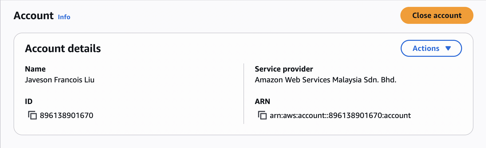
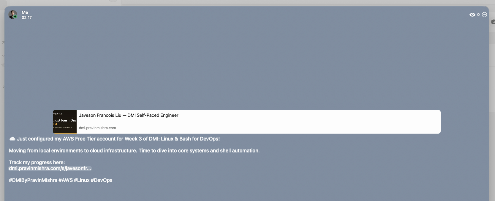

# Assignment 1 — AWS Free Tier Account Setup (EpicReads Cloud Onboarding)

Part of the DevOps Micro Internship (DMI) with Agentic AI

---

## Purpose

In this assignment, you will create and verify an AWS Free Tier account as part of onboarding EpicReads — an online bookstore moving to the cloud. You will demonstrate an understanding of AWS fundamentals, Free Tier services, and account setup by answering conceptual questions and capturing proof of a working AWS Console login.

---

# Task 1 — Understanding AWS & Free Tier

## Goal

Demonstrate understanding of AWS basics and Free Tier usage by answering the following questions in your own words (3–4 lines each).

### Answers

#### Question 1 — What is an AWS account, and why do you need it at this stage?

An AWS account is the root identity that grants access to Amazon Web Services and all its cloud resources. At this stage, it acts as the onboarding gateway for EpicReads to begin provisioning cloud infrastructure — compute, storage, networking — without managing physical hardware. It provides a billing boundary so all usage is tracked under a single entity, and it is the prerequisite for launching any EC2 instance, S3 bucket, or other service needed to host the bookstore in the cloud.

---

#### Question 2 — What is AWS Free Tier, and how long does it last?

AWS Free Tier is a program that lets new accounts use a defined set of AWS services at no cost, allowing teams to learn, prototype, and test before committing to paid usage. It has three tiers: 12-month free (available from account creation date), always-free (no expiry), and short-term trials (typically 30–60 days). For EpicReads, the 12-month tier covers the EC2 t2.micro and t3.micro instances needed to run the application server, making it the right choice for a proof-of-concept cloud migration.

---

#### Question 3 — Name three AWS Free Tier services and their free usage limits.

1. **Amazon EC2 (t2.micro / t3.micro)** — 750 hours per month for 12 months. Sufficient to run a single Linux server continuously for a full month without cost, which is enough to host the Nginx-served EpicReads site.
2. **Amazon S3** — 5 GB of standard storage, 20,000 GET requests, and 2,000 PUT requests per month for 12 months. Suitable for storing static assets like images and build artifacts for the bookstore.
3. **Amazon RDS (db.t2.micro / db.t3.micro)** — 750 hours per month for 12 months with 20 GB of storage. Covers a small managed database instance for EpicReads catalog and user data without upfront infrastructure cost.

---

# Task 2 — Create AWS Free Tier Account

## Goal

Create a valid AWS Free Tier account and sign in to the AWS Management Console.

> No screenshots required for this task. Completion is verified through Task 3.

---

# Task 3 — Verify AWS Account

## Goal

Confirm that your AWS account setup is complete by navigating to the Account section and capturing proof.

### Evidence

#### Screenshot 1 — AWS Account page showing account name (email may be blurred)

---

# Task 4 — Share Your AWS Cloud Onboarding Progress

## Goal

Share your AWS cloud onboarding progress on WhatsApp Status and provide evidence of the published status.

### Evidence

### Screenshot 2 — Published WhatsApp Status showing your AWS onboarding message and leaderboard progress link visible

---

# Submission Instructions

- Add all required screenshots in your GitHub repository submission
- Full name must be visible in required screenshots
- Do not expose sensitive information (keys, passwords, account IDs)
- Share your AWS onboarding progress on WhatsApp Status (Task 4)

---

# Completion Checklist

- [x] Task 1 answers written in own words
- [x] AWS Free Tier account created successfully
- [x] Signed in to AWS Management Console
- [x] Screenshot 1 of AWS Account page captured (full name visible, no sensitive data)
- [x] Task 4: AWS onboarding progress shared on WhatsApp Status
- [x] Screenshot 2 of published WhatsApp Status captured with leaderboard progress link visible
- [x] All required screenshots added to repository

---

## 📌 About DMI & CloudAdvisory

DevOps Micro Internship (DMI) is a project-based DevOps program run by Pravin Mishra (The CloudAdvisory) focused on real-world execution, systems thinking, and career readiness.

It helps learners build strong DevOps foundations with hands-on experience.

---

## 📌 Resources

- 🌐 DMI Official Website: https://dmi.pravinmishra.com?utm_source=github&utm_medium=readme  
- 🎓 University: https://university.pravinmishra.com?utm_source=github&utm_medium=readme  
- 💬 Discord Community: https://discord.pravinmishra.com?utm_source=github&utm_medium=readme  
- 📝 Blog: https://dmi.pravinmishra.com/blog?utm_source=github&utm_medium=readme  
- ▶️ YouTube Playlist: https://www.youtube.com/playlist?list=PLFeSNDtI4Cho  
- 🔗 Pravin Mishra (LinkedIn): https://www.linkedin.com/in/pravin-mishra-aws-trainer/  
- 🏢 CloudAdvisory (LinkedIn): https://www.linkedin.com/company/thecloudadvisory/

---

*This submission is part of DevOps Micro Internship (DMI) — Agentic AI Track.*