# Assignment 3 — Production Maintenance Drill (OPS Checklist)

Part of the DevOps Micro Internship (DMI) with Agentic AI

---

## Purpose

In this assignment, you will treat your already deployed React application (on Ubuntu VM with Nginx) as a live production system. You will perform structured operational checks covering network validation, service health, log analysis, resource monitoring, configuration verification, and incident simulation with recovery — mirroring real on-call DevOps responsibilities.

---

# Task 1 — Server Access & Networking Validation

## Goal

Verify that the deployed React application is reachable from the browser and confirm basic network connectivity of the Ubuntu VM.

### Evidence

#### Screenshot 1 — Browser showing the React app with your Full Name visible on the UI

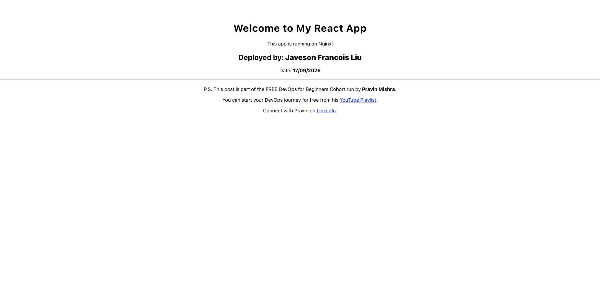

---

#### Screenshot 2 — Output of `ip a`

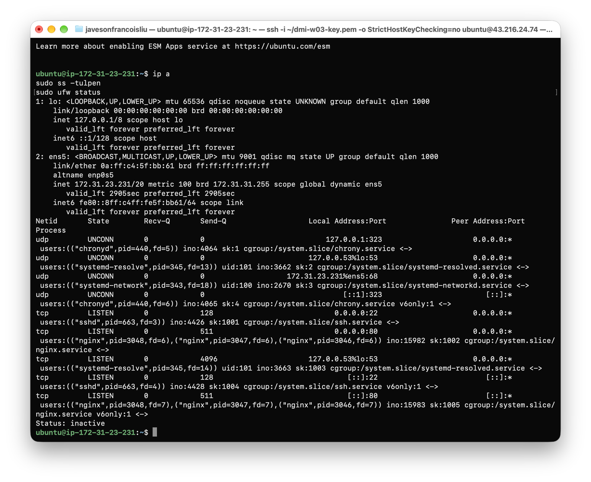

---

#### Screenshot 3 — Output of `sudo ss -tulpen`

---

#### Screenshot 4 — Output of `sudo ufw status`

---

### Notes

**1. What proves Nginx is listening on 0.0.0.0:80?**

The `sudo ss -tulpen` output shows a TCP LISTEN entry with `Local Address:Port` of `0.0.0.0:80`, and the Process column identifies it as `nginx` (pid=3046, 3047, 3048 — master and workers). This confirms Nginx has bound to port 80 on all interfaces and is actively accepting HTTP connections.

---

**2. What proves SSH is active on port 22?**

The `sudo ss -tulpen` output shows a TCP LISTEN entry with `Local Address:Port` of `0.0.0.0:22`, and the Process column identifies it as `sshd` (pid=663). This confirms the SSH daemon is running and accepting connections on port 22.

---

**3. Did you find any unexpected open ports? Explain briefly.**

No unexpected ports were found. The only LISTEN ports visible are 22 (SSH), 80 (Nginx/HTTP), and 53 (systemd-resolved for internal DNS). Port 53 is a standard loopback-only DNS resolver on Ubuntu — it is not exposed externally. Port 323 (chronyd) is UDP-only and used for NTP time synchronisation. All ports are expected system services.

---

# Task 2 — Service Health & Systemd Validation (Nginx)

## Goal

Verify that Nginx is properly installed, running, enabled at boot, and safely configured.

### Evidence

#### Screenshot 1 — Output of `systemctl status nginx --no-pager`

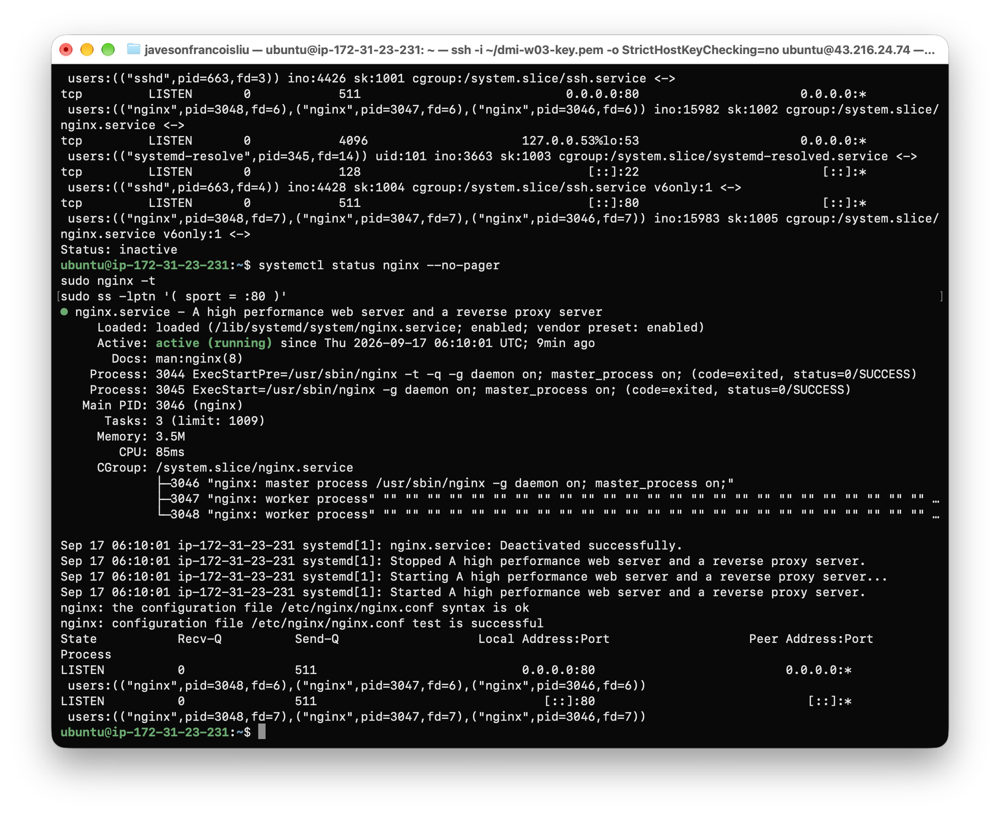

---

#### Screenshot 2 — Output of `sudo nginx -t`

---

#### Screenshot 3 — Output of `sudo ss -lptn '( sport = :80 )'`

---

### Notes

**1. What happens if Nginx fails to restart in production?**

If Nginx fails to restart, the web server process stops serving HTTP traffic on port 80. All incoming requests will immediately receive a connection refused error, making the application completely inaccessible to users. Systemd will log the failure and leave the service in a failed state, requiring manual intervention. In a production environment this means downtime until the issue is diagnosed and the service is recovered.

---

**2. What's your basic rollback plan?**

The immediate rollback plan is: (1) run `sudo nginx -t` to identify the configuration error before attempting a restart; (2) restore the last known-good configuration from a backup or version-controlled copy; (3) run `sudo nginx -t` again to confirm the restored config passes syntax validation; (4) run `sudo systemctl restart nginx` to bring the service back up; (5) verify with `curl -I http://localhost` that it returns 200 OK. For a longer-term strategy, configuration changes should be version-controlled and tested in a staging environment before being applied to production.

---

# Task 3 — Logs & Request Trace

## Goal

Verify real traffic flow and analyze logs to understand system behavior and errors.

### Evidence

#### Screenshot 1 — Output of `sudo tail -n 30 /var/log/nginx/access.log`

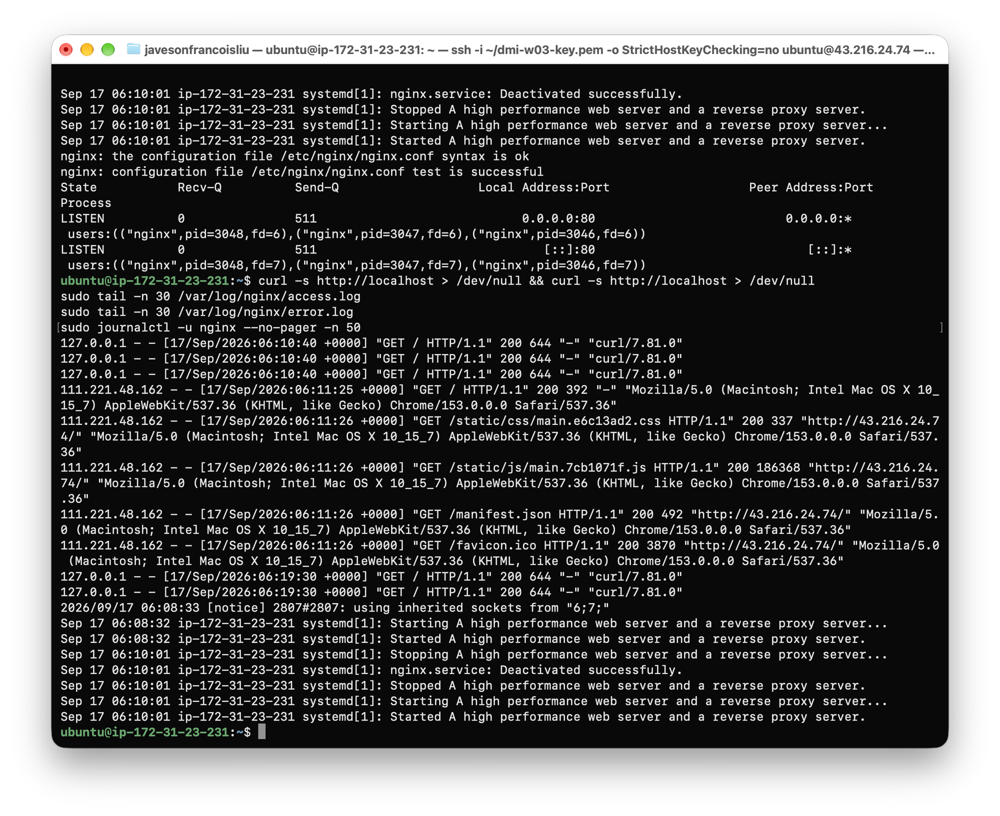

---

#### Screenshot 2 — Output of `sudo tail -n 30 /var/log/nginx/error.log`

---

#### Screenshot 3 — Output of `sudo journalctl -u nginx --no-pager -n 50`

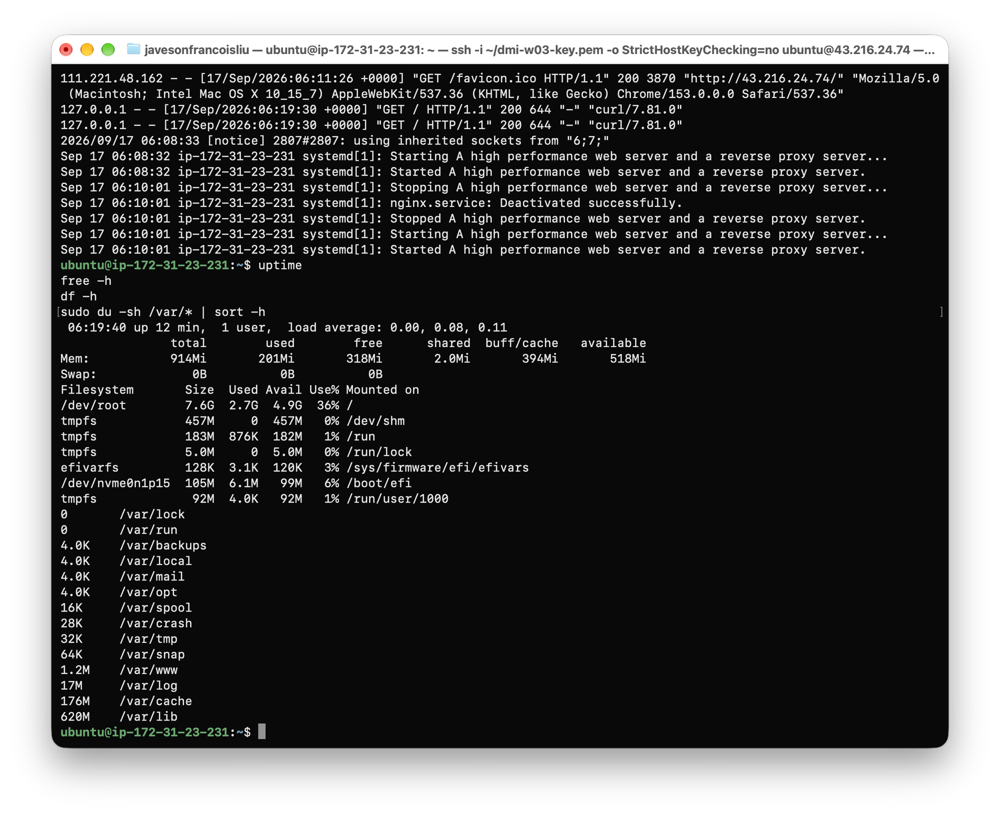

---

### Notes

**1. Were there any errors in the logs?**

No application errors were found. The error log contained only one informational `[notice]` entry: `2026/09/17 06:08:33 [notice] 2807#2807: using inherited sockets from "6;7;"`. This is not an error — it is a normal Nginx startup message indicating the master process inherited socket file descriptors from a previous process during a reload or restart cycle. No `[error]` or `[crit]` level entries were present.

---

**2. If there were no errors, what does that indicate about the system?**

An empty or notice-only error log indicates that Nginx has been handling all requests without any configuration issues, permission problems, upstream failures, or file-not-found errors during the observed period. It does not mean the system is permanently problem-free — errors can appear at any time if traffic patterns change or configuration is modified. It means the system was operating cleanly during this specific check window.

---

**3. Based on the access logs, were your curl requests visible in the log entries? What does that prove about traffic flow?**

Yes — the access log clearly shows `127.0.0.1 - - [17/Sep/2026:06:10:40 +0000] "GET / HTTP/1.1" 200 644 "-" "curl/7.81.0"` entries, corresponding to the `curl -s http://localhost` requests generated before reading the logs. This proves that HTTP traffic is flowing end-to-end through the server: curl sent a request, Nginx received and processed it, returned a 200 response, and recorded the transaction in the access log as expected.

---

# Task 4 — System Resource Health Check (Capacity Red Flags)

## Goal

Assess server capacity and detect potential performance or failure risks.

### Evidence

#### Screenshot 1 — Output of `uptime`

---

#### Screenshot 2 — Output of `free -h`

---

#### Screenshot 3 — Output of `df -h`

---

#### Screenshot 4 — Output of `sudo du -sh /var/* | sort -h`

---

### Notes

**1. Which resource looks most critical right now? (CPU/load, memory, or disk) Explain why.**

Memory is the most critical resource to watch on this instance. The `free -h` output shows the server has 914 MB total RAM with 201 MB used and only 318 MB free (the rest is in buff/cache). There is no swap configured (`Swap: 0B`). On a t3.micro with no swap, if memory consumption spikes — for example, due to a Node.js process or additional services being added — the kernel will immediately invoke the OOM killer and terminate processes without any swap buffer to absorb the spike. Disk usage is only 36% and CPU load is effectively zero, so memory is the primary constraint on this instance.

---

**2. What happens if disk becomes 100% full in a production server?**

When disk reaches 100% capacity, several critical failures occur simultaneously. Nginx stops writing to its access and error logs, losing all traffic visibility and making incident diagnosis impossible. Any application that writes files, temp data, or uploads will fail with "No space left on device" errors. System processes that need to write to disk — including the OS itself writing to `/tmp` or `/var` — will crash or hang. The SSH server may fail to write session data, locking you out of the server entirely. In short, the server becomes unstable, applications stop functioning, and the situation can escalate to a full outage requiring emergency intervention.

---

# Task 5 — Configuration & Deployment Verification

## Goal

Ensure the correct React build is deployed and Nginx is serving it properly.

### Evidence

#### Screenshot 1 — Output of `ls -lah /var/www/html | head -n 20`

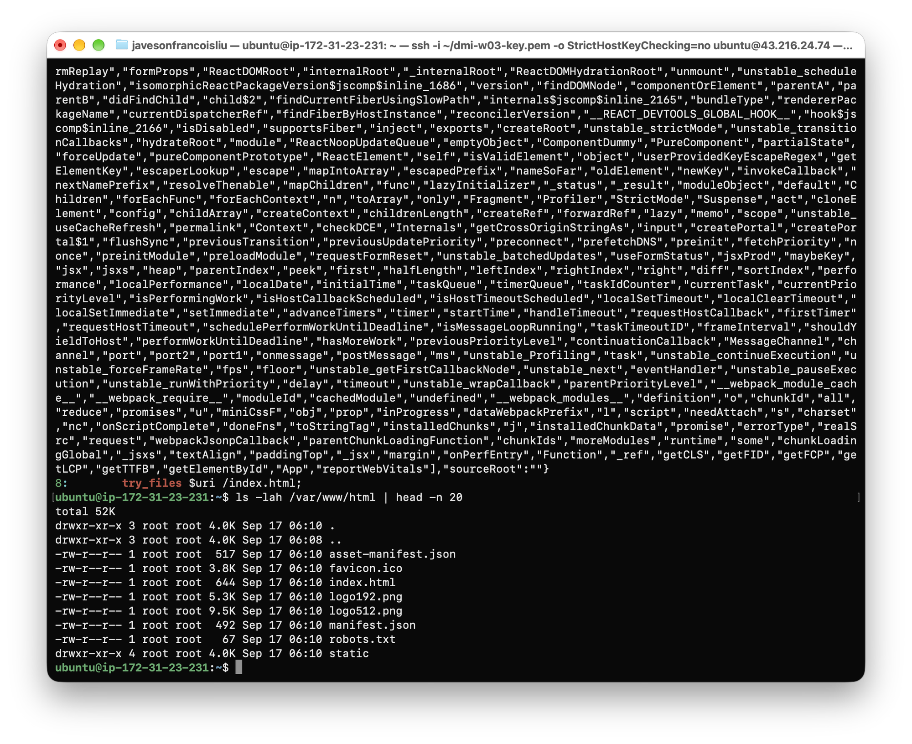

---

#### Screenshot 2 — Output of `grep -R "Deployed by" -n /var/www/html 2>/dev/null | head`

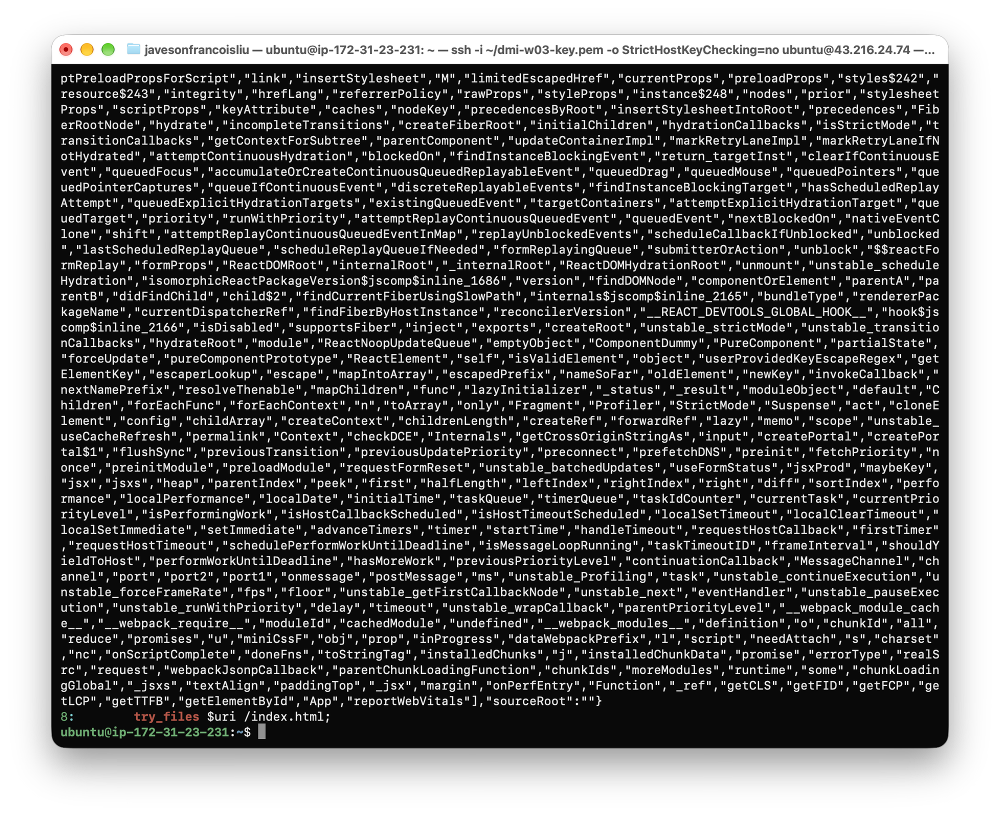

---

#### Screenshot 3 — Output of `grep -n "try_files" /etc/nginx/sites-available/default`

---

### Notes

**1. How do you confirm that the correct version of the application is deployed?**

Deployment is confirmed through three independent checks. First, `ls -lah /var/www/html` shows that `index.html` and the `static/` directory are present, confirming that a production React build was copied to the Nginx web root. Second, `grep -R "Deployed by" /var/www/html` finds the string "Deployed by Javeson Francois Liu" inside the bundled JavaScript, confirming that the personalized version of the application was built and deployed — not a generic or stale version. Third, `grep -n "try_files" /etc/nginx/sites-available/default` confirms that Nginx is configured with `try_files $uri /index.html`, which is required for React's client-side routing to work correctly on page refresh. Together, these three checks verify that the right build artifact is in the right location with the right server configuration.

---

# Task 6 — Nginx Configuration Failure Simulation

## Goal

Simulate a real-world Nginx misconfiguration and recover the service safely.

### Evidence

#### Screenshot 1 — Output of `sudo nginx -t` showing the syntax error (broken config)

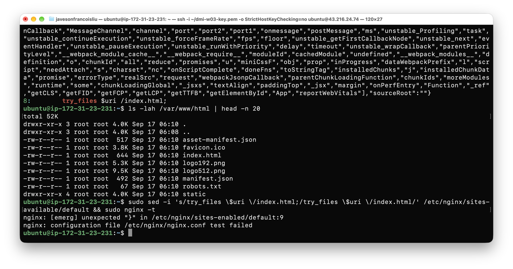

---

#### Screenshot 2 — Output of `sudo nginx -t` showing syntax ok (fixed config)

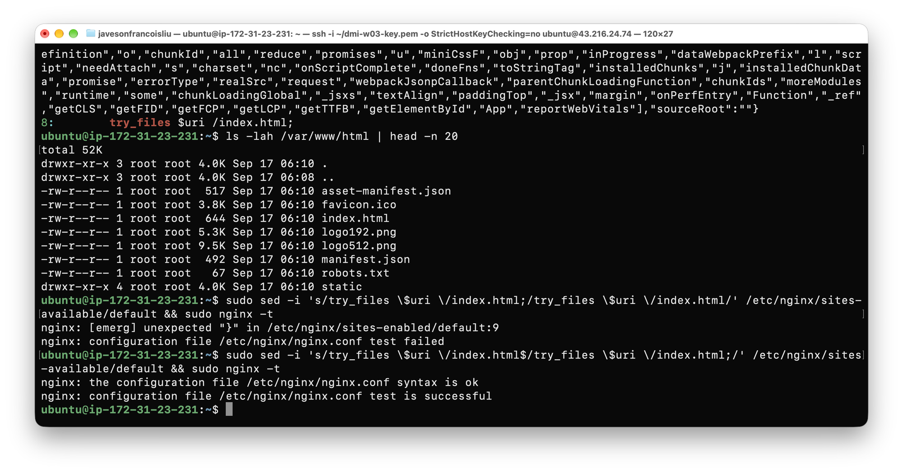

---

#### Screenshot 3 — Output of `curl -I http://43.216.24.74` confirming recovery (200 OK)

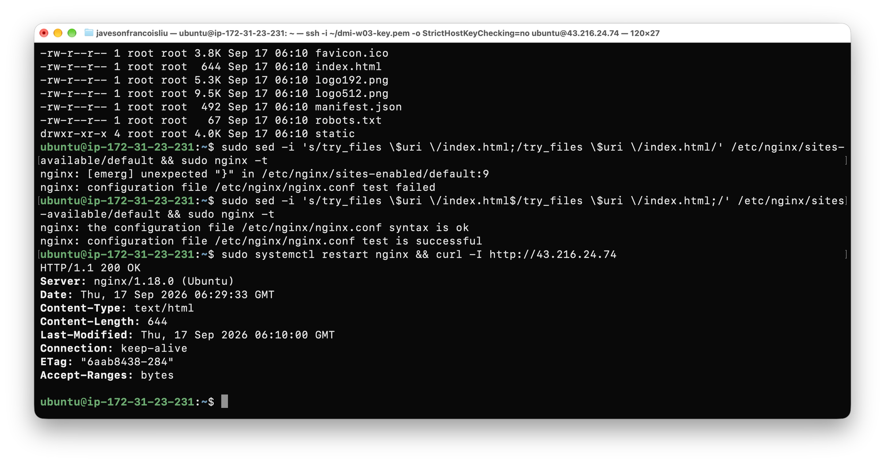

---

### Notes

**1. What caused the configuration failure?**

Removing the semicolon `;` from the end of the `try_files $uri /index.html` directive caused the configuration failure. In Nginx configuration syntax, every directive must end with a semicolon. Without it, the Nginx config parser cannot determine where the directive ends, resulting in a syntax error that prevents the configuration from loading.

---

**2. How did you fix the issue?**

The fix was to re-open the Nginx configuration file with `sudo nano /etc/nginx/sites-available/default` and restore the semicolon at the end of `try_files $uri /index.html;`. After saving the file, `sudo nginx -t` was run to validate the syntax, which returned "syntax is ok" and "test is successful". The service was then restarted with `sudo systemctl restart nginx` and verified with `curl -I http://43.216.24.74` returning HTTP 200 OK.

---

**3. How can you avoid this kind of issue in real production systems?**

In real production systems, configuration changes should never be made directly on the live server. The standard approach is to version-control all Nginx configuration files in a Git repository, make changes in a branch, test them in a staging environment, and only apply them to production after validation. Additionally, always run `sudo nginx -t` before applying any configuration change, and use configuration management tools such as Ansible or Terraform to enforce consistent, reviewed configuration across all servers. A deployment pipeline that runs `nginx -t` as a pre-flight check before reloading the service provides an automated safety net.

---

# Task 7 — Web Application Failure Simulation

## Goal

Simulate missing deployment content and recover the application safely.

### Evidence

#### Screenshot 1 — Output of `curl -I http://43.216.24.74` showing failure (non-200 response)

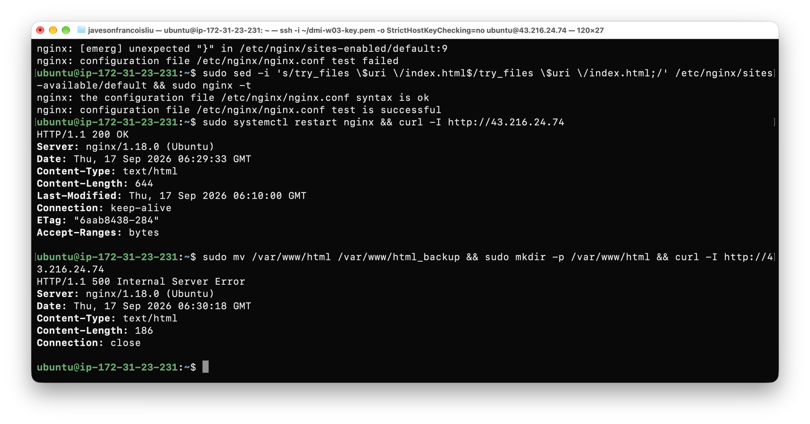

---

#### Screenshot 2 — Output of `curl -I http://43.216.24.74` confirming recovery (200 OK)

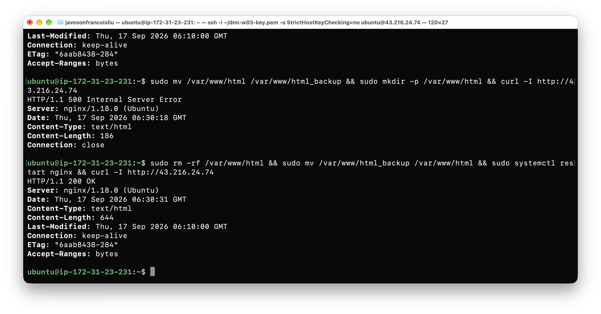

---

### Notes

**1. What caused the application to break in this scenario?**

Moving `/var/www/html` to `/var/www/html_backup` and replacing it with an empty directory caused the failure. Nginx found the `root` directory at `/var/www/html` but could not locate `index.html` inside the empty folder. With no files to serve and the `try_files` directive finding nothing to fall back to, Nginx returned `HTTP/1.1 500 Internal Server Error`. The empty directory existing is what causes a 500 rather than 404 — Nginx can read the directory but cannot process the request to completion.

---

**2. How did you fix the issue and restore the application?**

The fix was to remove the empty `/var/www/html` placeholder directory, restore the original deployment from the backup using `sudo mv /var/www/html_backup /var/www/html`, and then restart Nginx with `sudo systemctl restart nginx`. After the restart, `curl -I http://43.216.24.74` returned HTTP 200 OK, confirming the application was serving correctly again.

---

**3. What steps would you take to prevent this kind of issue in real production systems?**

In real production, the web root should never be modified directly on the live server. Deployments should use atomic swaps — building the new version in a separate directory, validating it, and then using a symlink switch (`ln -sfn /var/www/html_v2 /var/www/html`) so the change is instantaneous and the previous version remains as a fallback. Automated deployment pipelines should include health checks that verify the application returns 200 OK before considering a deployment successful. Infrastructure backups and snapshot policies ensure that even in worst-case scenarios, a known-good state can be restored quickly.

---

# Task 8 — Security & Reliability Review

## Goal

Review and reflect on the security and reliability practices applied during this assignment.

### Security & Reliability Notes

**1. Why is SSH key-based authentication more secure than sharing passwords?**

SSH key-based authentication uses asymmetric cryptography — a private key that never leaves your machine and a public key stored on the server. Even if an attacker intercepts the network traffic or compromises the server's public key list, they cannot derive the private key. Passwords, by contrast, are vulnerable to brute-force attacks, credential stuffing, phishing, and interception if transmitted over insecure channels. Keys are also longer and mathematically harder to guess than any humanly memorable password. Password-sharing additionally creates audit trail problems — you cannot tell which person used a shared password.

---

**2. Why should only required ports be open on a production server?**

Every open port is an exposed attack surface. A service listening on an unnecessary port can be targeted for exploitation, denial-of-service, or unauthorized access. Minimising open ports reduces the blast radius of any single vulnerability — an attacker who finds a flaw in a running service can only exploit it if the port is reachable. In the security principle of least privilege applied to networking, only traffic that is required for the application to function should be permitted. For this deployment, only ports 22 (SSH) and 80 (HTTP) are needed.

---

**3. Why is it important for Nginx to be enabled on boot?**

If Nginx is not enabled as a systemd service, it will not start automatically when the server reboots. Any reboot — whether planned maintenance, a kernel update, or an unexpected crash — would leave the application inaccessible until someone manually starts Nginx. In production, server reboots are routine, and auto-starting critical services ensures the application recovers automatically without requiring human intervention, reducing mean time to recovery (MTTR) and meeting availability SLAs.

---

**4. What are the risks of sharing secrets, keys, or credentials publicly?**

Publicly shared credentials are immediately actionable by anyone who finds them. Exposed AWS access keys have led to hundreds of thousands of dollars in fraudulent compute charges within hours of being committed to a public GitHub repository. SSH private keys allow full server access. API tokens can be used to exfiltrate data, send spam, or destroy cloud resources. Automated bots continuously scan public code repositories for credential patterns. Once a secret is public, it must be considered fully compromised and rotated immediately — even if it was only exposed for seconds.

---

**5. Why should cloud resources be stopped or terminated when they are no longer needed?**

Cloud resources are billed by usage. An EC2 instance left running accumulates compute charges every hour, even when idle. At scale, forgotten resources — "orphaned" instances, unattached EBS volumes, unused Elastic IPs — represent significant wasted spend. Beyond cost, running instances increase the attack surface: an idle server still receives network traffic and can be exploited if its software becomes outdated. Terminating resources when they are no longer needed reduces cost, shrinks the attack surface, and keeps cloud accounts clean and auditable.

---

# LinkedIn Post (Required)

## Evidence

#### LinkedIn Post URL

Paste your LinkedIn post URL here:

`https://lnkd.in/p/eR4N_y2P`

---

#### Screenshot — Published LinkedIn post

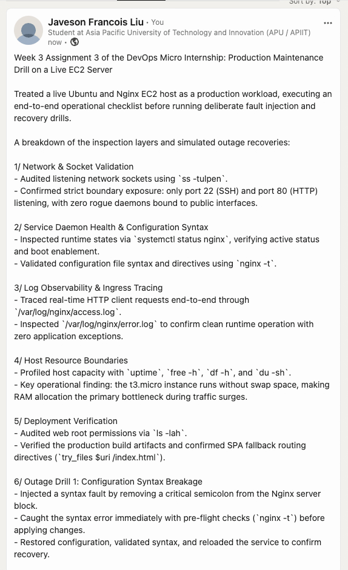

---

# Submission Instructions

- Add all required screenshots in your submission
- Full name must be visible in required screenshots
- Do not expose sensitive information (keys, passwords, account IDs)

---

# Completion Checklist

- [x] Task 1: Screenshots (browser, ip a, ss -tulpen, ufw status) + Notes answered
- [x] Task 2: Screenshots (nginx status, nginx -t, ss port 80) + Notes answered
- [x] Task 3: Screenshots (access log, error log, journalctl) + Notes answered
- [x] Task 4: Screenshots (uptime, free -h, df -h, du -sh) + Notes answered
- [x] Task 5: Screenshots (ls html, grep deployed by, grep try_files) + Notes answered
- [x] Task 6: Screenshots (nginx -t fail, nginx -t pass, curl recovery) + Notes answered
- [x] Task 7: Screenshots (curl failure, curl recovery) + Notes answered
- [x] Task 8: Security & Reliability Notes answered
- [x] LinkedIn post published and URL submitted
- [x] Full Name visible in all required screenshots
- [x] No sensitive data exposed

---

## 📌 About DMI & CloudAdvisory

DevOps Micro Internship (DMI) is a project-based DevOps program run by Pravin Mishra (The CloudAdvisory) focused on real-world execution, systems thinking, and career readiness.

It helps learners build strong DevOps foundations with hands-on experience.

---

## 📌 Resources

- 🌐 DMI Official Website: https://dmi.pravinmishra.com?utm_source=github&utm_medium=readme  
- 🎓 University: https://university.pravinmishra.com?utm_source=github&utm_medium=readme  
- 💬 Discord Community: https://discord.pravinmishra.com?utm_source=github&utm_medium=readme  
- 📝 Blog: https://dmi.pravinmishra.com/blog?utm_source=github&utm_medium=readme  
- ▶️ YouTube Playlist: https://www.youtube.com/playlist?list=PLFeSNDtI4Cho  
- 🔗 Pravin Mishra (LinkedIn): https://www.linkedin.com/in/pravin-mishra-aws-trainer/  
- 🏢 CloudAdvisory (LinkedIn): https://www.linkedin.com/company/thecloudadvisory/

---

*This submission is part of DevOps Micro Internship (DMI) — Agentic AI Track.*
