# Assignment 5 — Bash Script Automation Drill (OPS Checklist)

Part of the DevOps Micro Internship (DMI) with Agentic AI

---

## Purpose

In this assignment, you will practice Bash scripting by building a series of small automation scripts covering environment setup, variables, arrays, loops, file conditionals, if-else logic, and functions. These scripts form the foundation of real-world Linux automation used in DevOps, cloud, and production support environments.

---

# Task 1 — Bash Environment & Workspace Setup

## Goal

Verify that Bash is available on your system and create a clean workspace for this assignment.

### Evidence

#### Screenshot 1 — Output of `echo $SHELL` and `bash --version`

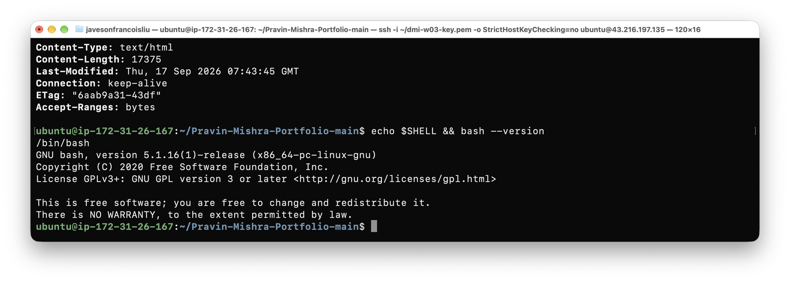

---

#### Screenshot 2 — Output of `pwd` and `ls -lah` showing the scripts directory

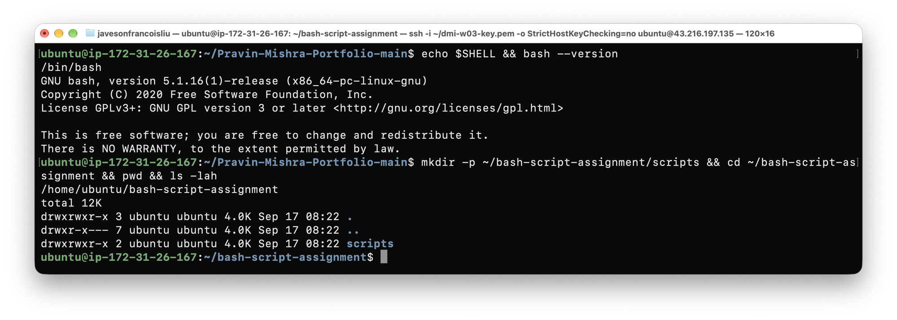

---

### Notes

Answer the following in your own words:

**1. What is Bash?**

Bash (Bourne Again Shell) is a command-line interpreter and scripting language that runs on Linux and macOS. It is the default interactive shell on most Linux distributions and allows users to run commands, write scripts, control program flow with conditionals and loops, and automate repetitive tasks. Bash extends the original Bourne shell (`sh`) with features like command history, tab completion, arrays, and arithmetic.

---

**2. What is the difference between shell and Bash?**

A shell is the general term for any program that interprets commands typed by the user and passes them to the operating system kernel. Bash is one specific implementation of a shell — the most widely used one on Linux. Other shells include `zsh`, `ksh`, `dash`, and `fish`. When you open a terminal on Ubuntu, you are running a shell, and on most Ubuntu systems that shell is Bash by default. The distinction is: shell is the category, Bash is one member of that category.

---

**3. Why is it important to confirm the Bash version before writing scripts?**

Bash features are not all available in every version. For example, associative arrays were introduced in Bash 4.0, and certain process substitution or regex features behave differently across versions. Older macOS systems shipped with Bash 3.2 by default. If you write a script using a feature from Bash 4 or 5 and it runs on a system with Bash 3, the script will fail with unexpected errors. Confirming the version ensures you only use features that are guaranteed to work in that environment and helps you document what the script requires.

---

# Task 2 — Your First Bash Script

## Goal

Create your first Bash script, make it executable, and run it from the terminal.

### Evidence

#### Screenshot 1 — Content of `first-script.sh`

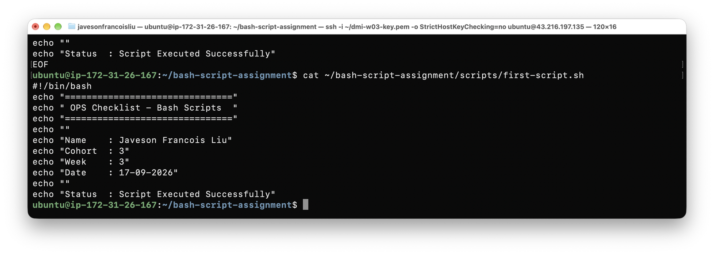

---

#### Screenshot 2 — Output of `./first-script.sh`

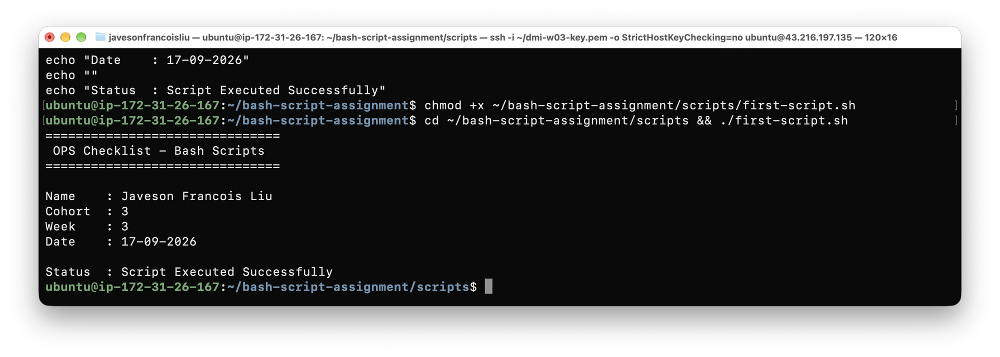

---

#### Screenshot 3 — Output of `ls -l first-script.sh` showing executable permission

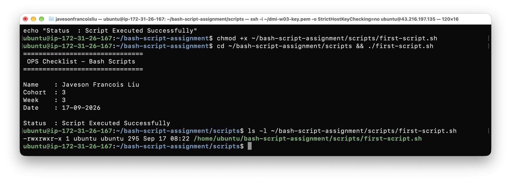

---

### Notes

Answer the following in your own words:

**1. What is the purpose of `#!/bin/bash`?**

`#!/bin/bash` is called the shebang line. It must appear as the very first line of a script. When the operating system executes the file, it reads the characters after `#!` to determine which interpreter to use. Without it, the system might use the default shell (which could be `sh` or `dash` on Ubuntu, not Bash), potentially causing scripts that rely on Bash-specific syntax to fail silently or with confusing errors. The shebang ensures the correct interpreter is always used regardless of which shell the user is currently logged into.

---

**2. Why do we use `chmod +x` before running a script?**

Linux files have three permission classes: owner, group, and others. By default, a newly created file does not have the execute bit set, which means the operating system will refuse to run it as a program. `chmod +x` adds the execute permission, telling the OS that this file is intended to be run as a script or program. Without it, attempting `./script.sh` returns a "Permission denied" error even if the file content is perfectly valid Bash.

---

**3. What is the difference between running a script using `./script.sh` and `bash script.sh`?**

`./script.sh` runs the file as an executable program, using whichever interpreter is specified in the shebang line (`#!/bin/bash`). The execute bit must be set for this to work. `bash script.sh` explicitly passes the file to the Bash interpreter regardless of the shebang line or execute permissions — Bash reads the file as input. In practice both execute the same script, but `./script.sh` is the production-grade approach because it respects the shebang and requires proper permissions to have been granted, mirroring how deployed scripts are actually invoked by cron jobs or other automation systems.

---

# Task 3 — Variables: User Information Script

## Goal

Use variables to store and display user-related information.

### Evidence

#### Screenshot 1 — Content of `user-info.sh`

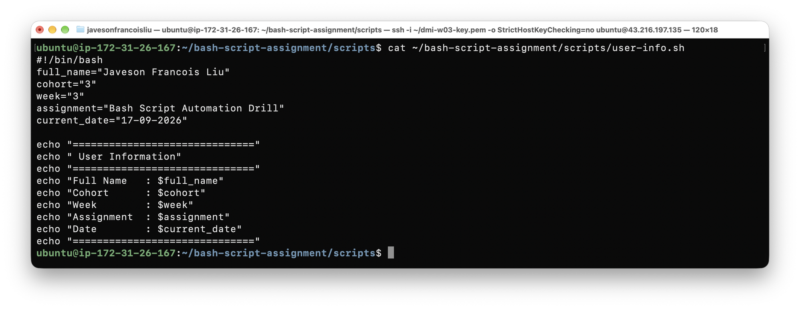

---

#### Screenshot 2 — Output of `./user-info.sh`

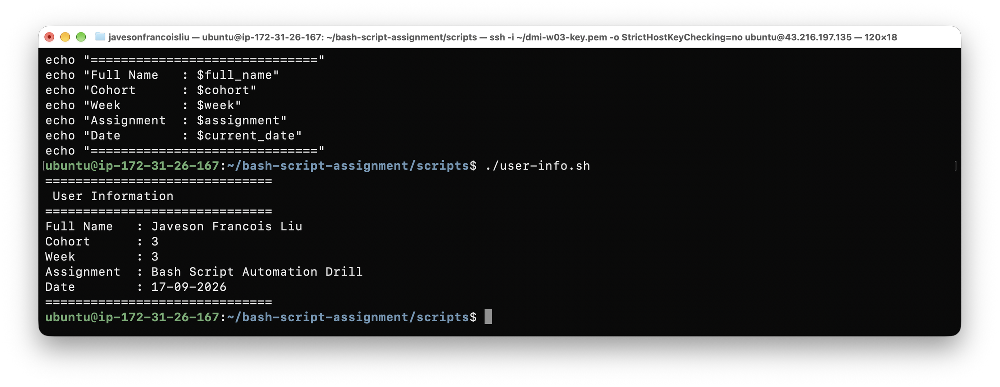

---

### Notes

Answer the following in your own words:

**1. What is a variable in Bash?**

A variable in Bash is a named container that stores a value — a string, a number, or a command output — so it can be referenced and reused throughout the script. Variables eliminate hardcoding by allowing a value to be defined once and used in many places. If the value needs to change, you update one assignment rather than every occurrence in the script.

---

**2. Why should we avoid spaces around the `=` sign when creating variables?**

In Bash, spaces around `=` are syntax errors. If you write `full_name = "Javeson"`, Bash interprets `full_name` as a command name and `= "Javeson"` as its arguments, resulting in a "command not found" error. The strict no-space rule exists because the Bash parser uses spaces to separate command names from their arguments — there is no ambiguity: `variable=value` is always assignment, while `command arg` is always a command invocation.

---

**3. How do you access the value stored inside a Bash variable?**

You prefix the variable name with a dollar sign: `$variable_name`. For example, if you declared `full_name="Javeson"`, you retrieve it with `echo "$full_name"`. The double quotes around `$full_name` are a best practice — they prevent word splitting and glob expansion if the value contains spaces or special characters. Without quotes, a variable containing spaces would be interpreted as multiple separate arguments.

---

# Task 4 — Arrays & Loops: Tools Checklist Script

## Goal

Use arrays and loops to print a checklist of tools used in Bash scripting.

### Evidence

#### Screenshot 1 — Content of `tools-checklist.sh`

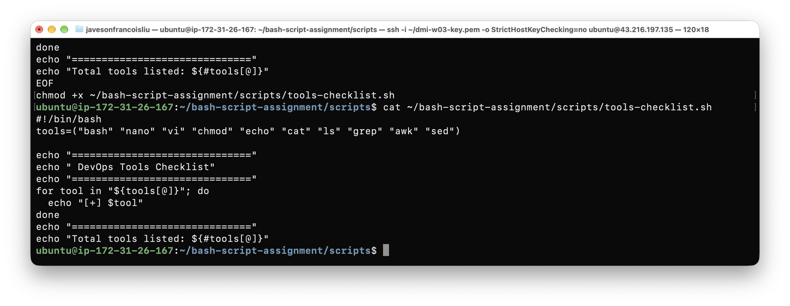

---

#### Screenshot 2 — Output of `./tools-checklist.sh`

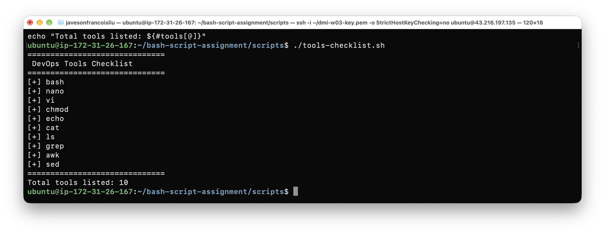

---

### Notes

Answer the following in your own words:

**1. What is an array in Bash?**

An array in Bash is a variable that holds multiple values indexed by position, starting at index 0. It is declared with parentheses: `tools=("bash" "nano" "chmod")`. Unlike a regular variable that holds one value, an array lets you group a collection of related items under a single name and access each element individually by its index, or iterate over all elements using a loop.

---

**2. Why are arrays useful in scripts?**

Arrays let you manage a list of items without creating a separate variable for each one. Instead of writing `tool1="bash"`, `tool2="nano"`, `tool3="chmod"`, you store all values in one array and loop over them with a single block of code. This makes scripts shorter, easier to maintain, and scalable — adding a new item only requires inserting one value into the array declaration, not modifying every part of the script that references individual variables.

---

**3. What does `"${tools[@]}"` mean?**

`${tools[@]}` expands to all elements of the `tools` array as separate words. The `@` is the subscript that means "all elements." The double quotes around it ensure that each element is treated as a single unit even if it contains spaces — without the quotes, an element like `"my tool"` would be split into two separate words during expansion. This is the safe, idiomatic way to iterate over array elements in Bash.

---

**4. What is the purpose of the `for` loop in this script?**

The `for` loop iterates over every element in the `tools` array one at a time, assigning each value to the loop variable `tool`, then executing the body of the loop (the `echo` statement) for that value. Without the loop, you would need to write one `echo` statement per tool. The loop makes the script automatically handle any number of tools without changing the loop logic — only the array contents need to be updated.

---

# Task 5 — Loops: Number Counter Script

## Goal

Use loops to repeat a task multiple times.

### Evidence

#### Screenshot 1 — Content of `counter.sh`

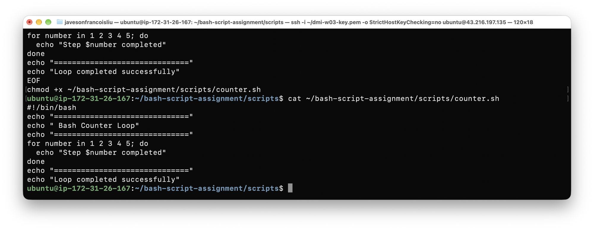

---

#### Screenshot 2 — Output of `./counter.sh`

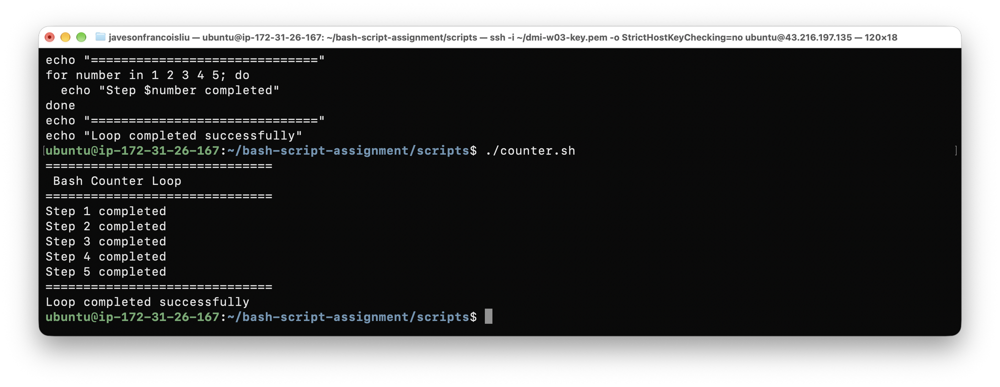

---

### Notes

Answer the following in your own words:

**1. What is a loop?**

A loop is a control structure that repeats a block of code multiple times. In Bash, the most common loops are `for` (iterates over a list of values), `while` (repeats as long as a condition is true), and `until` (repeats until a condition becomes true). Loops allow a script to perform the same action on many items without duplicating code.

---

**2. Why do we use loops in Bash scripting?**

Loops eliminate code duplication for repetitive tasks. Instead of writing the same command 100 times for 100 items, a loop executes that command once per iteration. In DevOps contexts, loops are used to check the health of multiple servers, process a list of log files, retry a command until it succeeds, or apply the same configuration to multiple directories. They are foundational to any non-trivial automation script.

---

**3. How many times did the loop run in your script?**

The loop ran 5 times — once for each value in the list `1 2 3 4 5`. Each iteration printed a "Step N completed" message, and after the loop finished, the final message "Loop completed successfully" was displayed.

---

**4. What would you change if you wanted the loop to run 10 times?**

Replace `for number in 1 2 3 4 5` with `for number in 1 2 3 4 5 6 7 8 9 10`, or more cleanly use Bash brace expansion: `for number in {1..10}`. The brace expansion form is preferred because it is more readable and easier to change — to run 100 times you would write `{1..100}` without listing every number.

---

# Task 6 — Files & Conditionals: File Validation Script

## Goal

Use file checks and conditionals to verify whether files and directories exist.

### Evidence

#### Screenshot 1 — Output of `ls -lah ../test-folder`

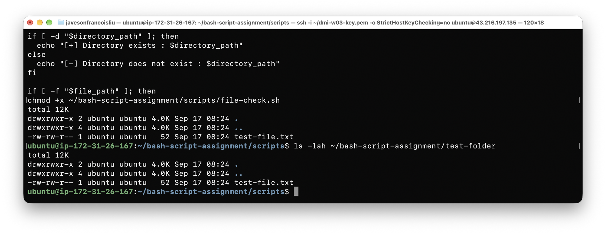

---

#### Screenshot 2 — Content of `file-check.sh`

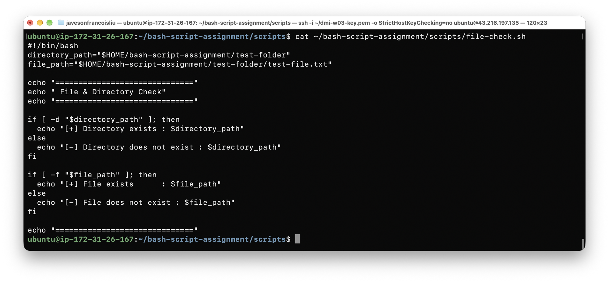

---

#### Screenshot 3 — Output of `./file-check.sh`

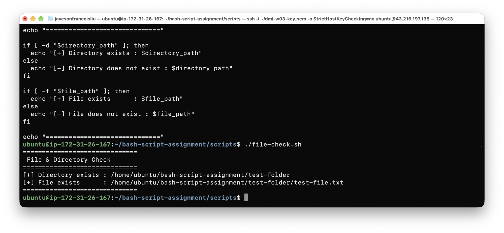

---

### Notes

Answer the following in your own words:

**1. What does `-d` check in Bash?**

`-d` is a file test operator that returns true if the given path exists and is a directory. In an `if [ -d "$path" ]` condition, Bash checks whether a directory (not a file) exists at that path. If the path is a regular file or does not exist at all, the condition evaluates to false.

---

**2. What does `-f` check in Bash?**

`-f` is a file test operator that returns true if the given path exists and is a regular file (not a directory, device, or symbolic link). In an `if [ -f "$path" ]` condition, Bash confirms that a readable, non-directory file exists at the specified location. This is used to verify that a configuration file, log file, or data file is present before attempting to read or process it.

---

**3. Why should file and directory paths be stored in variables?**

Storing paths in variables means the path is defined once at the top of the script. If the path changes — for example, if the deployment moves from `/test-folder` to `/opt/test-folder` — you update one variable assignment rather than every occurrence in the script body. It also makes the script more readable: `$directory_path` communicates intent clearly, whereas a repeated literal string buried in multiple `if` blocks is harder to scan and maintain.

---

**4. What happens if the file does not exist?**

When the file does not exist, the `-f` test returns false and the `else` branch executes, printing the "File does not exist" message. The script continues running normally — no crash or error occurs. This is intentional defensive scripting: the conditional handles both outcomes explicitly so the operator always gets clear feedback whether the file is present or missing, rather than the script failing silently or with a cryptic error.

---

# Task 7 — Conditionals: Pass or Retry Script

## Goal

Use if-else conditionals to make decisions based on a variable value.

### Evidence

#### Screenshot 1 — Content of `score-check.sh` with `score=85`

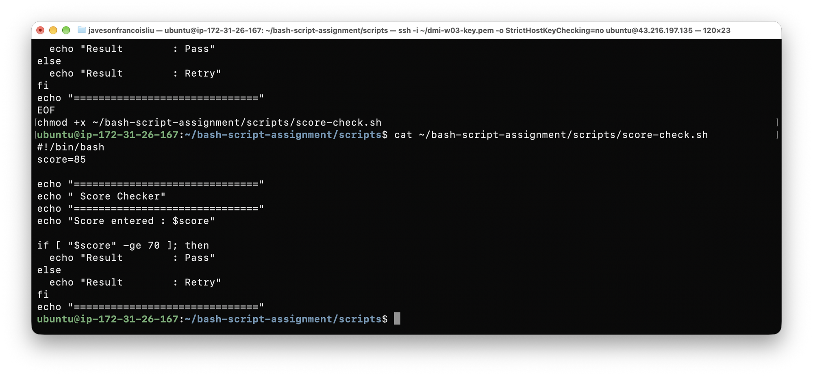

---

#### Screenshot 2 — Output showing `Result: Pass`

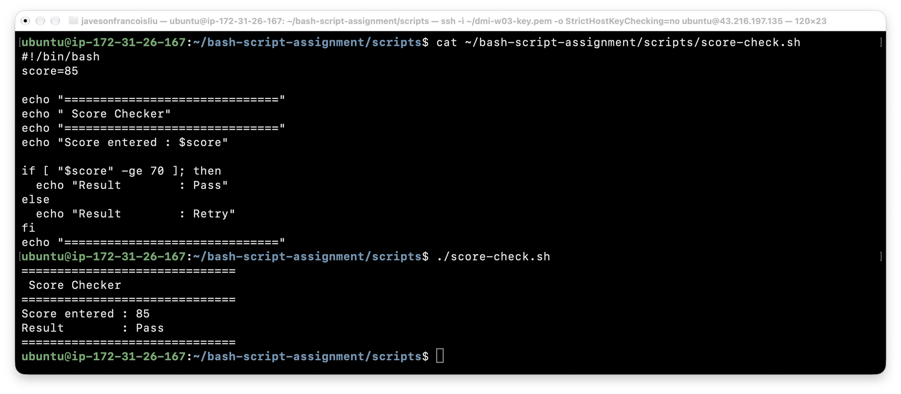

---

#### Screenshot 3 — Content of `score-check.sh` with `score=55`

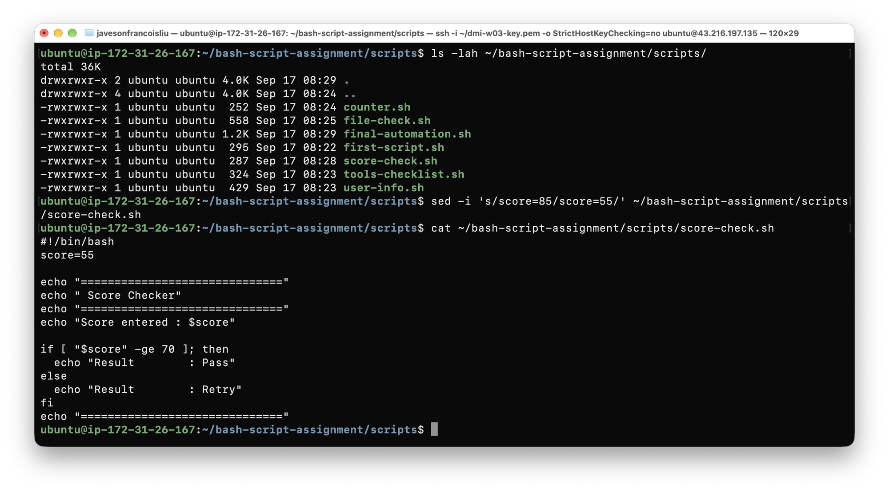

---

#### Screenshot 4 — Output showing `Result: Retry`

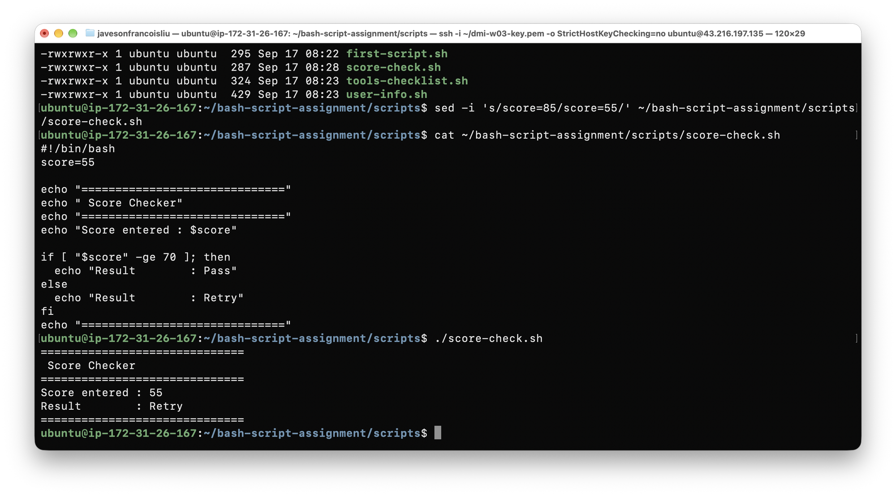

---

### Notes

Answer the following in your own words:

**1. What is the purpose of if-else in Bash?**

`if-else` allows a script to execute different code paths depending on whether a condition is true or false. Without it, a script can only execute commands in a fixed sequence. With `if-else`, the script can evaluate a value, a comparison, or a file state, and take the appropriate action for each outcome. In production automation, this is how scripts decide whether to send an alert, skip a step, retry an operation, or exit with an error code.

---

**2. What does `-ge` mean?**

`-ge` stands for "greater than or equal to" and is an arithmetic comparison operator used inside `[ ]` test expressions in Bash. Unlike `>=` which compares strings, `-ge` compares integers. `[ "$score" -ge 70 ]` evaluates to true if `$score` is numerically greater than or equal to 70. Other arithmetic operators are `-gt` (greater than), `-lt` (less than), `-le` (less than or equal to), `-eq` (equal), and `-ne` (not equal).

---

**3. Why should conditions be tested with different values?**

Testing with a single value only proves that one path works. A condition has at least two outcomes (true and false), and both branches must be verified to confirm the logic is correct. Testing with `score=85` confirms the Pass branch executes; testing with `score=55` confirms the Retry branch executes. In real automation scripts, untested branches can contain bugs that only surface in production, at the worst possible time. Boundary values (like `score=70` exactly) should also be tested to verify edge case behavior.

---

**4. How can conditionals help in automation scripts?**

Conditionals turn a static sequence of commands into an intelligent, self-directing script. An automation script can check whether a service is running before attempting a restart, verify a backup file exists before deleting the source, skip a deployment step if the build already succeeded, or send an alert only when disk usage exceeds a threshold. Without conditionals, scripts either fail on unexpected state or require human intervention for every decision. With conditionals, the same script handles both the happy path and failure cases automatically.

---

# Task 8 — Functions: Final Bash Automation Script

## Goal

Create a final Bash script using functions to organize reusable code.

### Evidence

#### Screenshot 1 — Content of `final-automation.sh`

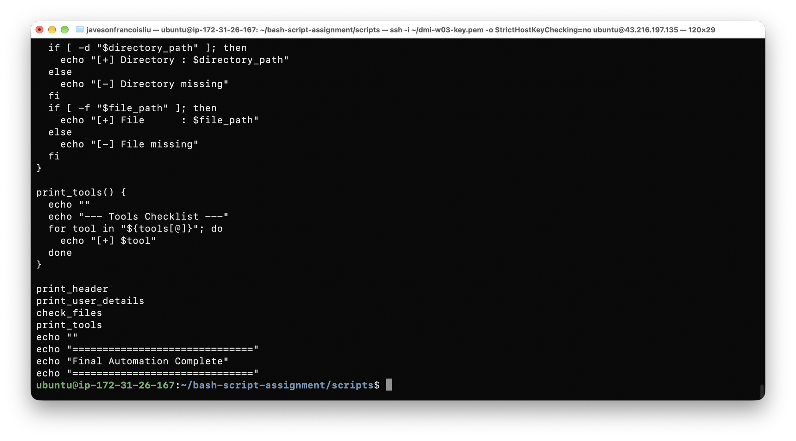

---

#### Screenshot 2 — Output of `./final-automation.sh`

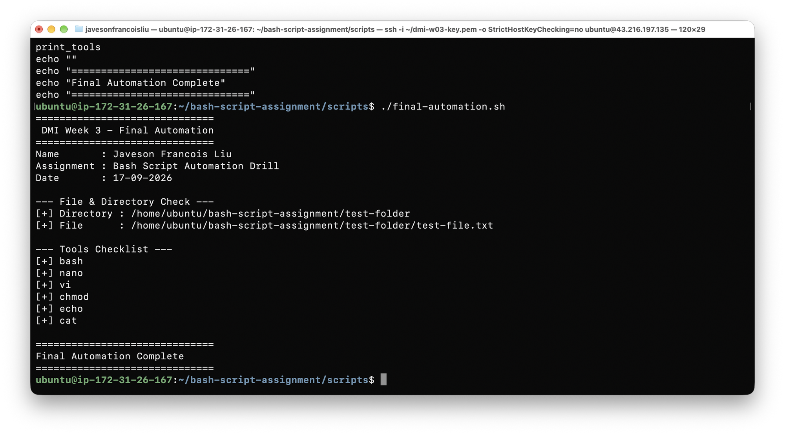

---

#### Screenshot 3 — Output of `ls -lah` showing all created scripts

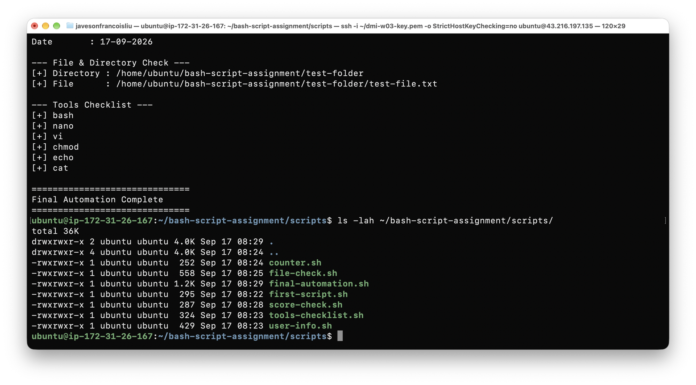

---

### Notes

Answer the following in your own words:

**1. What is a function in Bash?**

A function in Bash is a named block of code that can be defined once and called by name as many times as needed. It groups related commands under a label, separating distinct responsibilities into their own logical units. Functions are defined with the syntax `function_name() { commands; }` and called simply by writing the function name. They make scripts modular — each function does one thing clearly.

---

**2. Why are functions useful in scripts?**

Functions prevent code duplication and improve readability. If the same sequence of commands is needed in multiple places, writing it as a function means you maintain it in one location. When the logic needs to change, you update the function once and every call benefits automatically. Functions also make it easier to test individual parts of a script in isolation and to understand what a script does at a glance — reading a list of function calls at the bottom (`print_header`, `print_user_details`, `check_files`, `print_tools`) gives an immediate high-level picture of the script's flow.

---

**3. Which functions did you create in this script?**

Four functions were created:
- `print_header` — prints a formatted separator and the assignment name
- `print_user_details` — prints the full name and assignment name
- `check_files` — uses `-d` and `-f` conditionals to verify the test directory and file exist
- `print_tools` — loops over the tools array and prints each tool name

---

**4. How does this final script combine variables, arrays, loops, conditionals, files, and functions?**

The script demonstrates all six concepts working together. Variables (`full_name`, `assignment_name`, `directory_path`, `file_path`) store reusable values. An array (`tools`) holds a list of tool names. The `print_tools` function uses a `for` loop to iterate over the array. The `check_files` function uses file test conditionals (`-d`, `-f`) inside `if-else` blocks to verify that the test directory and file exist. All of this code is organized into four named functions, which are then called in sequence at the bottom of the script. This structure mirrors how real DevOps automation scripts are built: modular, readable, and able to handle both expected and unexpected states.

---

# LinkedIn Post (Required)

## Evidence

#### LinkedIn Post URL

Paste your LinkedIn post URL here:

`https://www.linkedin.com/posts/javeson-francois-liu-999135437_dmibypravinmishra-bash-linux-activity-7506269590411288576-neiG?utm_source=share&utm_medium=member_desktop&rcm=ACoAAG4wFkUBa3UKaFy_wDsgcorcmYbDo44e5-g`

---

#### Screenshot — Published LinkedIn post

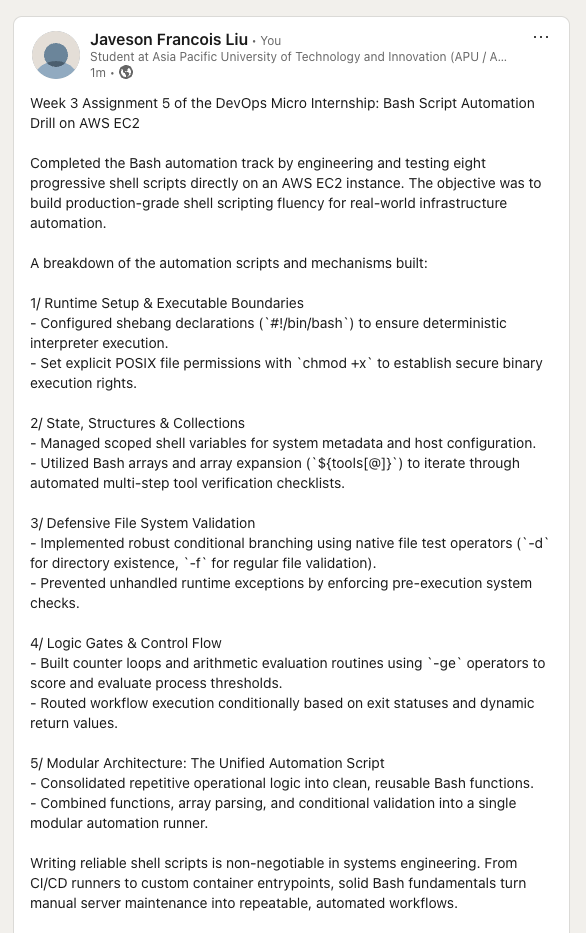

---

# Submission Instructions

- Add all required screenshots in your submission
- Full name must be visible in required screenshots
- All script files must be created and run successfully
- Required notes must be answered clearly for every task
- Do not expose sensitive information (keys, passwords, credentials)

---

# Completion Checklist

- [x] Task 1: Environment setup verified, workspace created (Screenshots 1–2, Notes answered)
- [x] Task 2: First script created, executed, permissions verified (Screenshots 1–3, Notes answered)
- [x] Task 3: Variables script created and run (Screenshots 1–2, Notes answered)
- [x] Task 4: Arrays and loops script created and run (Screenshots 1–2, Notes answered)
- [x] Task 5: Counter loop script created and run (Screenshots 1–2, Notes answered)
- [x] Task 6: File validation script created and run (Screenshots 1–3, Notes answered)
- [x] Task 7: Pass/Retry conditional script tested with both values (Screenshots 1–4, Notes answered)
- [x] Task 8: Final automation script created and run (Screenshots 1–3, Notes answered)
- [x] All scripts run without errors
- [x] Full Name visible in all required screenshots
- [x] LinkedIn post published and URL submitted
- [x] No sensitive data exposed

---

## 📌 About DMI & CloudAdvisory

DevOps Micro Internship (DMI) is a project-based DevOps program run by Pravin Mishra (The CloudAdvisory) focused on real-world execution, systems thinking, and career readiness.

It helps learners build strong DevOps foundations with hands-on experience.

---

## 📌 Resources

- 🌐 DMI Official Website: https://dmi.pravinmishra.com?utm_source=github&utm_medium=readme  
- 🎓 University: https://university.pravinmishra.com?utm_source=github&utm_medium=readme  
- 💬 Discord Community: https://discord.pravinmishra.com?utm_source=github&utm_medium=readme  
- 📝 Blog: https://dmi.pravinmishra.com/blog?utm_source=github&utm_medium=readme  
- ▶️ YouTube Playlist: https://www.youtube.com/playlist?list=PLFeSNDtI4Cho  
- 🔗 Pravin Mishra (LinkedIn): https://www.linkedin.com/in/pravin-mishra-aws-trainer/  
- 🏢 CloudAdvisory (LinkedIn): https://www.linkedin.com/company/thecloudadvisory/

---

*This submission is part of DevOps Micro Internship (DMI) — Agentic AI Track.*
