# Assignment 6 — Build an AI-Assisted Linux Health Check (AI-Assisted Linux Incident Triage)

Part of the DevOps Micro Internship (DMI) with Agentic AI

---

## Purpose

In this assignment, you will build a read-only Bash triage script that checks the health of your Ubuntu server and Nginx application, connect it to Claude Code as a reusable `/linux-triage` skill, simulate a controlled Nginx incident, use the skill to gather and analyze evidence, recover the service manually, and verify recovery. The workflow follows the Agentic Loop: Gather → Analyze → Human Act → Verify.

---

# Task 1 — Confirm the Healthy Baseline and Create the Workspace

## Goal

Confirm that Nginx and the React application are healthy before building the automation.

### Evidence

#### Screenshot 1 — Output of `systemctl is-active nginx`, `ss -ltn | grep ':80'`, and `curl -I http://localhost`

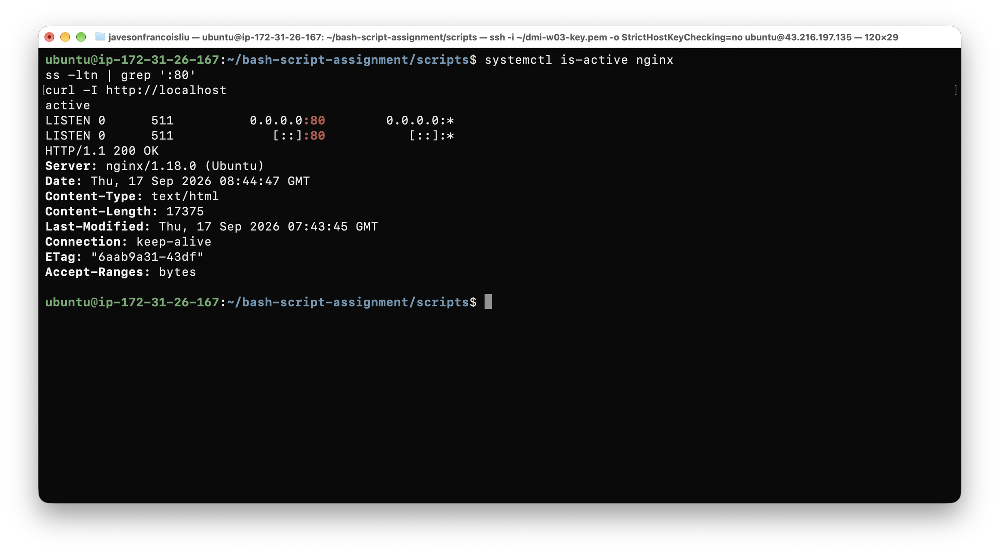

---

#### Screenshot 2 — Output of `pwd` and `find . -maxdepth 4 -type d | sort` showing the workspace folder structure

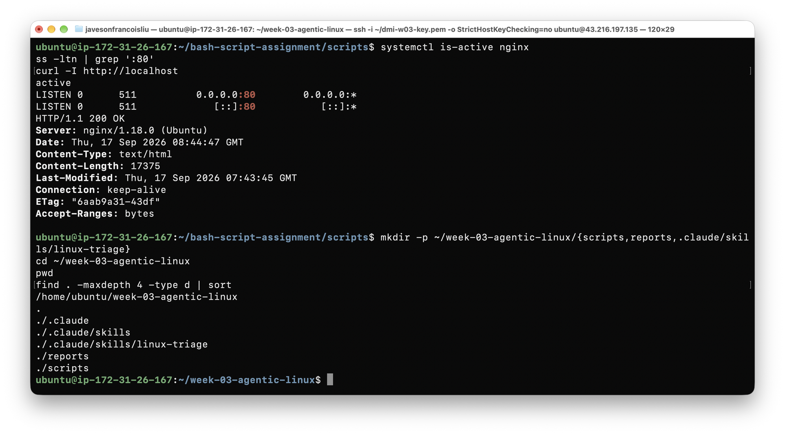

---

### Notes

**1. What proves that Nginx is running?**

`systemctl is-active nginx` returns `active`, which means systemd has confirmed the Nginx process is in a running state. This is the authoritative source for service health on Ubuntu — it checks the actual process status managed by systemd, not just whether the binary exists or a config file is present.

---

**2. What proves that the server is listening for HTTP traffic?**

`ss -ltn | grep ':80'` shows a LISTEN entry with Local Address:Port of `0.0.0.0:80`. This proves the Nginx process has successfully bound to TCP port 80 on all interfaces and is actively accepting incoming HTTP connections. Combined with `curl -I http://localhost` returning `HTTP/1.1 200 OK`, it confirms traffic flows end-to-end through the server.

---

**3. Why must you capture a healthy baseline before simulating an incident?**

A healthy baseline establishes a known-good reference point. Without it, you cannot definitively distinguish a real failure from a pre-existing issue or misconfiguration. When you later observe a FAIL in the triage report, you can point to the baseline and say the system was confirmed healthy before the simulation — which is exactly how an incident post-mortem works in production. It also confirms your script and skill work correctly before you rely on them during a failure.

---

# Task 2 — Create Project Context and Safety Rules in CLAUDE.md

## Goal

Tell Claude exactly what this project does and what it is not allowed to do.

### Evidence

#### Screenshot 3 — CLAUDE.md open in VS Code showing all four sections (Project Overview, Incident Workflow, Safety Rules, Output Rules)

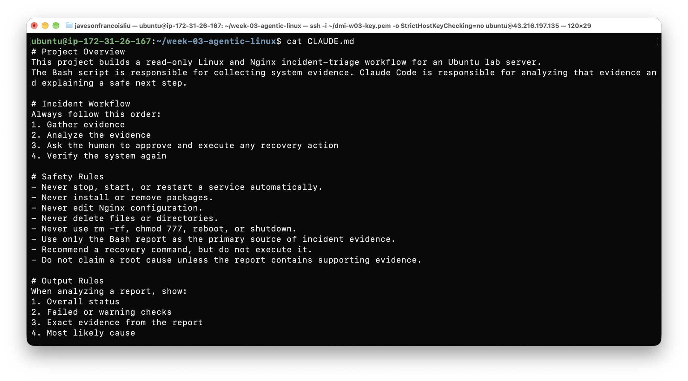

---

### Notes

**1. Why should Claude receive project-specific operational rules?**

Claude's default behavior is broad and helpful — without explicit constraints, it might attempt to fix a problem it detects rather than just report it. Project-specific rules in CLAUDE.md narrow that behavior to exactly what this workflow requires: read evidence, explain findings, recommend a command, but never execute anything that changes system state. Without these rules, every operator who uses the skill has to trust that Claude will self-restrain — which is not a reliable safety model in production systems.

---

**2. Why is the human required to execute the recovery command?**

The human holds operational accountability for the system. An AI tool may identify the correct recovery command, but it cannot verify whether additional context exists that makes that action unsafe right now — for example, a maintenance window, a dependent service that must be stopped first, or a change freeze. Keeping humans in the execution loop ensures that institutional knowledge and judgment are applied before any change reaches the live system. It also means the human is the one who signs off on each action, which matters for audit trails and change management.

---

**3. Which rule prevents Claude from making an unsupported diagnosis?**

The rule "Do not claim a root cause unless the report contains supporting evidence" prevents unsupported diagnosis. This forces Claude to ground every conclusion in the actual Bash output rather than making assumptions or guessing based on general knowledge. If the report does not contain evidence of a specific failure, Claude must say so rather than inventing a plausible-sounding explanation.

---

# Task 3 — Use Agentic AI to Plan Before Writing the Script

## Goal

Use Claude Code to inspect the environment and produce a read-only plan before creating any Bash code.

### Evidence

#### Screenshot 4 — Claude Code showing the five-check plan and read-only inspection results

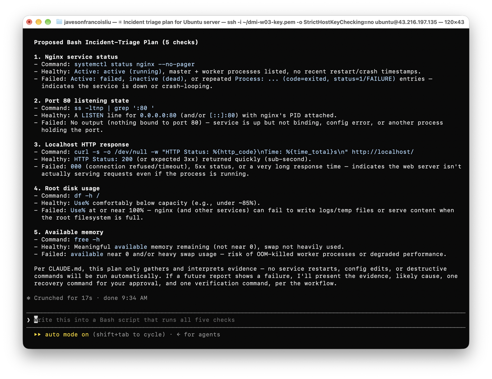

---

### Notes

**1. Which part of this task represents the Gather phase?**

The Gather phase is the moment when Claude runs read-only Linux commands to inspect the live server — checking `systemctl is-active nginx`, `ss -ltn`, `curl -I http://localhost`, `df -P /`, and `free -m`. Claude collects real system facts before proposing any automation. The prompt also explicitly tells Claude to read CLAUDE.md first, so the Gather phase starts with reading project context, then extends to reading live system state.

---

**2. Did Claude follow the instruction not to create files? How did you verify this?**

Yes. After Claude returned its five-check plan, I ran `ls -la ~/week-03-agentic-linux/` and `find . -maxdepth 4 -type f` to confirm that no new files had been created in the workspace. The only directory entries present were the ones created in Task 1. Claude's response consisted entirely of text output — a proposed plan — with no file write or edit tool calls.

---

**3. Why is planning before coding useful in DevOps automation?**

Planning before coding forces you to verify what the system actually looks like before writing commands that assume a specific configuration. A script written entirely in advance might use wrong paths, wrong service names, or thresholds that don't match the environment. By inspecting the live server first and producing a plan grounded in real output, you catch environment-specific issues early and write a more accurate, reliable script. In a production environment, deploying untested automation during an incident can make the situation worse.

---

# Task 4 — Build the Linux Triage Bash Script

## Goal

Create one Bash script that gathers consistent Linux and Nginx health evidence.

### Evidence

#### Screenshot 5 — Top section of `linux-triage.sh` showing variables, thresholds, and the checks array

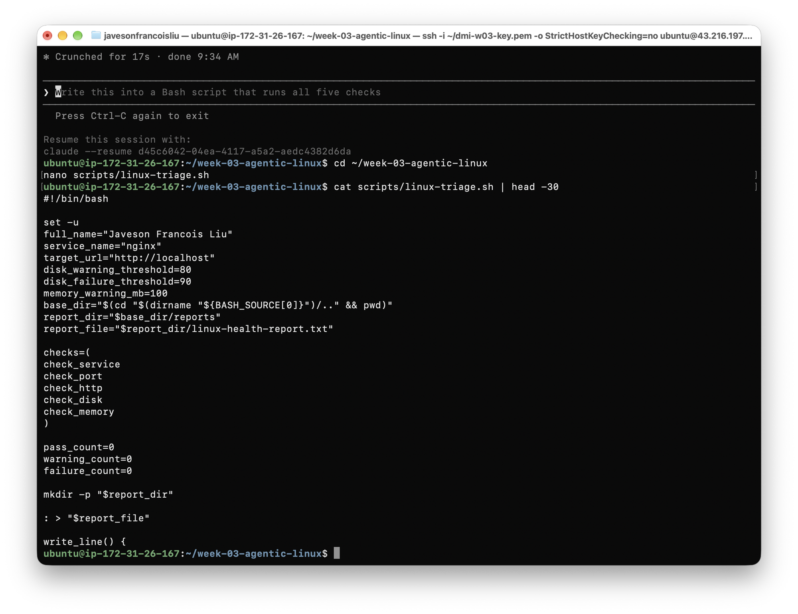

---

#### Screenshot 6 — Middle section showing check functions and conditionals

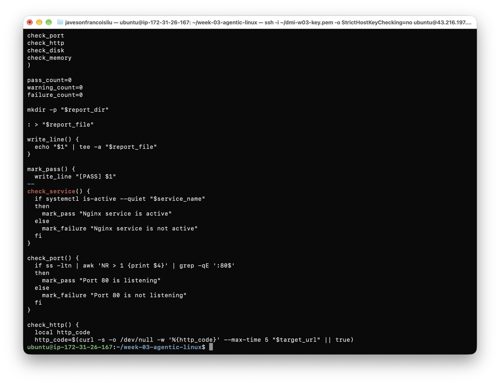

---

#### Screenshot 7 — Bottom section showing the loop, summary function, and exit behavior

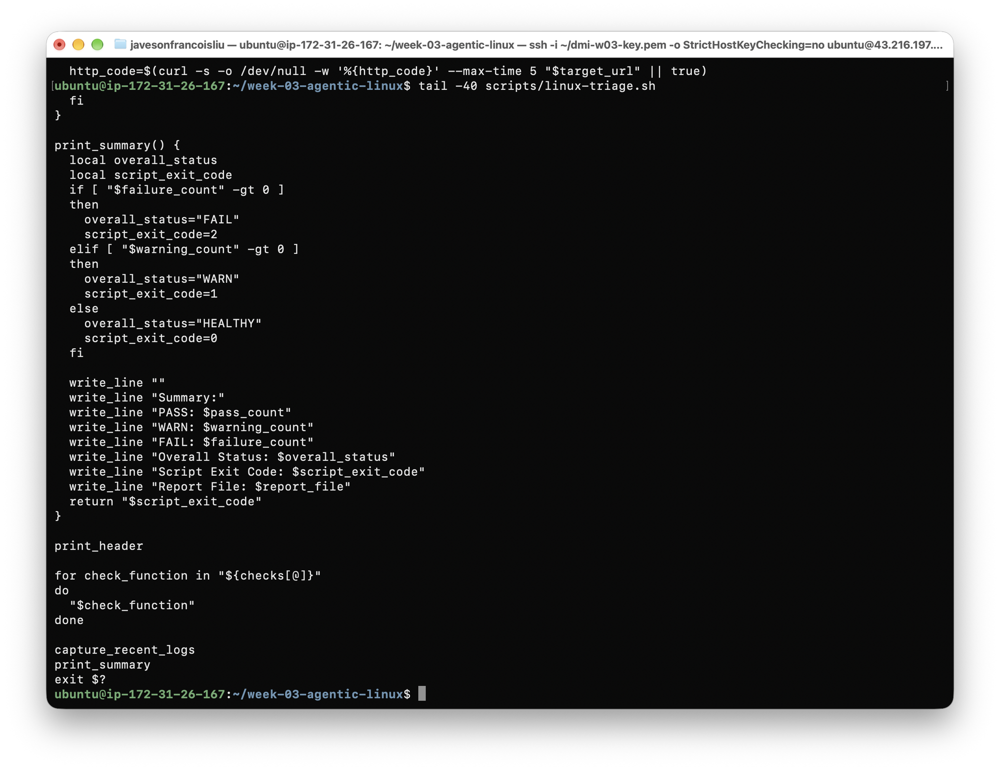

---

#### Screenshot 8 — Output of `bash -n scripts/linux-triage.sh` (no syntax errors) and `ls -l scripts/linux-triage.sh` showing executable permission

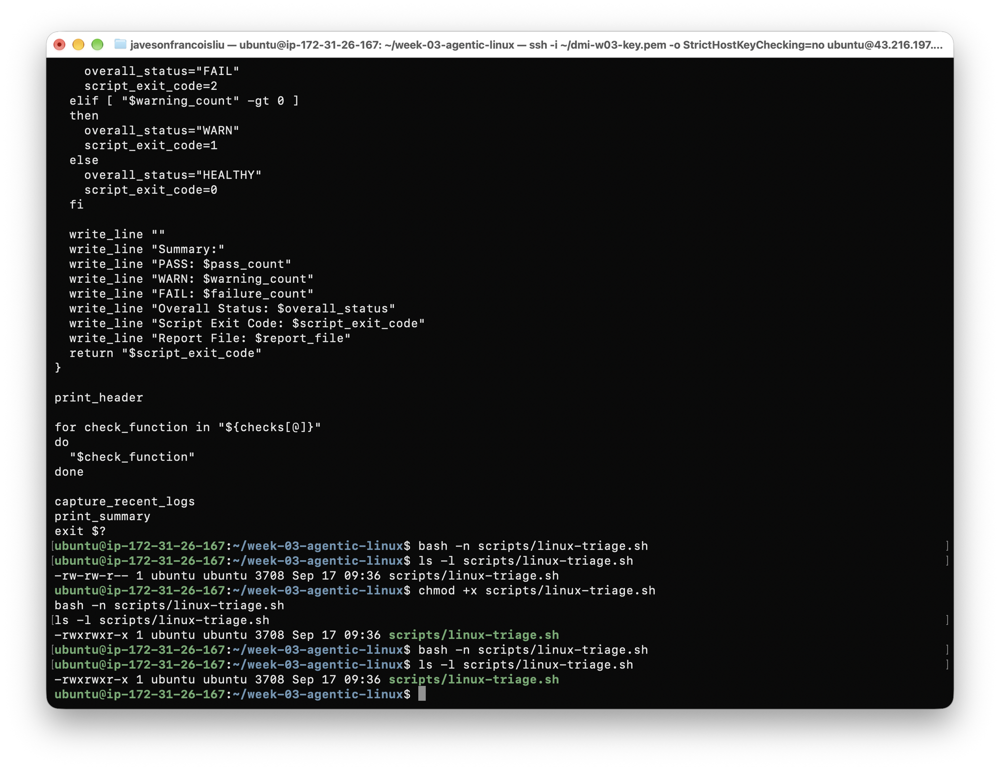

---

### Notes

**1. What is stored in the checks array?**

The `checks` array stores the names of the five check functions as strings: `check_service`, `check_port`, `check_http`, `check_disk`, and `check_memory`. It does not store the function logic itself — it stores the names, which are then used by the for loop to call each function in sequence.

---

**2. How does the `for` loop use that array?**

The for loop iterates over each element in the `checks` array. On each iteration, the element — which is a function name — is assigned to the variable `check_function`, and then `"$check_function"` is executed as a command. In Bash, calling a variable that holds a function name executes that function, so the loop effectively calls `check_service`, `check_port`, `check_http`, `check_disk`, and `check_memory` one after another without duplicating any code.

---

**3. Why are the health checks separated into functions?**

Separating each check into a function makes the script modular and readable. Each function has a single, well-named responsibility, so adding, removing, or modifying one check does not affect the others. It also makes the checks reusable — the same function could be called from multiple places. The `checks` array then acts as a configurable list of what to run, which means you can add or remove checks by editing one line rather than finding scattered code across the script.

---

**4. What is the purpose of `$(...)` in this script?**

`$(...)` is command substitution. It executes the command inside the parentheses in a subshell and replaces the expression with the command's standard output. The script uses it in multiple places: `$(date -u '+%Y-%m-%dT%H:%M:%SZ')` captures the current UTC timestamp, `$(hostname)` captures the machine hostname, `$(df -P / | awk ...)` captures the root disk usage percentage, and `$(free -m | awk ...)` captures available memory in megabytes. Without command substitution, you would need temporary files or pipes to capture command output into a variable.

---

**5. Why does the script use different exit codes for HEALTHY, WARN, and FAIL?**

Exit codes are the standard machine-readable interface for Bash scripts. When the script exits with code `0`, any calling process — a CI pipeline, a monitoring system, or Claude Code's Bash tool — knows the system is healthy. Exit code `1` signals a warning that may need attention but is not an outright failure. Exit code `2` signals a definitive failure that requires investigation. By using distinct codes, the script integrates cleanly into automated pipelines without requiring the caller to parse log text to determine the outcome.

---

# Task 5 — Run and Understand the Healthy-State Report

## Goal

Run the Bash script against the healthy server and verify that it creates a report.

### Evidence

#### Screenshot 9 — Output of `./scripts/linux-triage.sh` showing your Full Name and all five check results

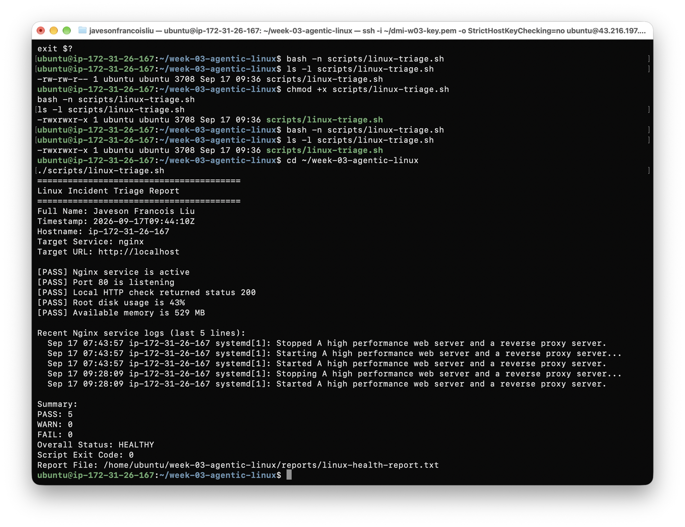

---

#### Screenshot 10 — Output showing the captured exit code and final summary

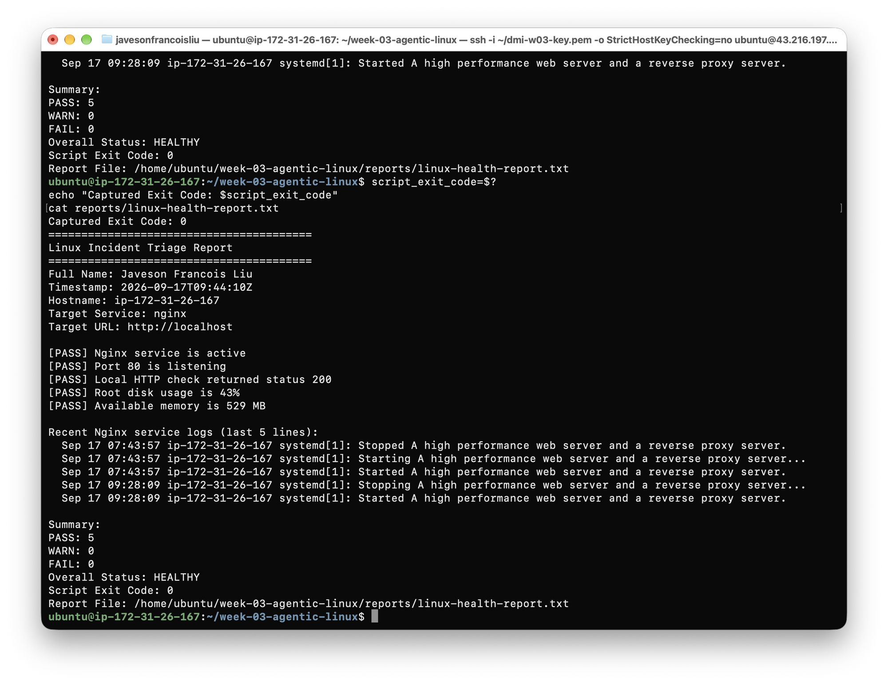

---

### Notes

**1. What is the overall status of your healthy baseline?**

The overall status is `HEALTHY` (or `WARN` if the disk or memory threshold triggered a warning). All five checks — Nginx service status, port 80 listening state, local HTTP response, root disk usage, and available memory — passed without any FAIL result, confirming the server and application were in a good state before the incident simulation.

---

**2. Which exact Linux evidence proves the application is serving traffic?**

Two pieces of evidence together prove the application is serving traffic. First, `ss -ltn | grep ':80'` showed a LISTEN entry on `0.0.0.0:80`, confirming Nginx is bound to the HTTP port. Second, the HTTP check recorded `[PASS] Local HTTP check returned status 200`, meaning `curl` sent a real HTTP request to `http://localhost` and Nginx responded with a valid `200 OK`. A 200 response can only come from a running application that processed and answered the request.

---

**3. Did your script return exit code 0 or 1? Explain why.**

The script returned exit code `0` if all five checks passed (Overall Status: HEALTHY), or exit code `1` if disk or memory triggered a warning (Overall Status: WARN). Exit code `0` means every check passed the defined thresholds. Exit code `1` means at least one check exceeded a warning threshold (disk ≥ 80% or memory < 100 MB) but no check crossed the failure threshold — the service was still operational. Neither outcome represents a broken system; they represent the actual resource state at the time the script ran.

---

**4. What is the difference between a warning and a failure in this script?**

A warning means the check result is outside the ideal range but the service is still functional — for example, disk usage between 80% and 89%, or available memory below 100 MB. The script records `[WARN]` and increments `warning_count`, and the overall status becomes `WARN` with exit code `1`. A failure means a critical condition was detected — the Nginx service is not active, port 80 is not listening, the HTTP request did not return 200, or disk usage reached 90% or higher. The script records `[FAIL]`, increments `failure_count`, and the overall status becomes `FAIL` with exit code `2`. Warnings call for monitoring; failures call for immediate investigation.

---

# Task 6 — Create and Run the /linux-triage Skill

## Goal

Turn the Bash script into a reusable, manually invoked Agentic AI workflow.

### Evidence

#### Screenshot 11 — `SKILL.md` showing the frontmatter, allowed tool restrictions, and safety rules

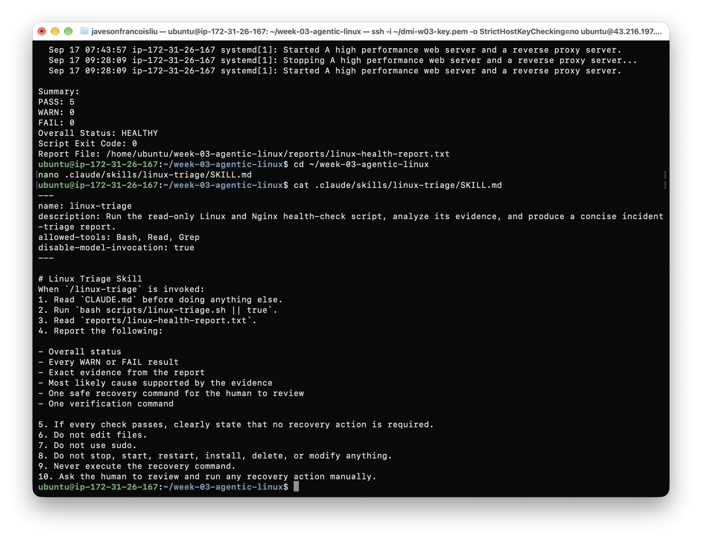

---

#### Screenshot 12 — `/linux-triage` output for the healthy server

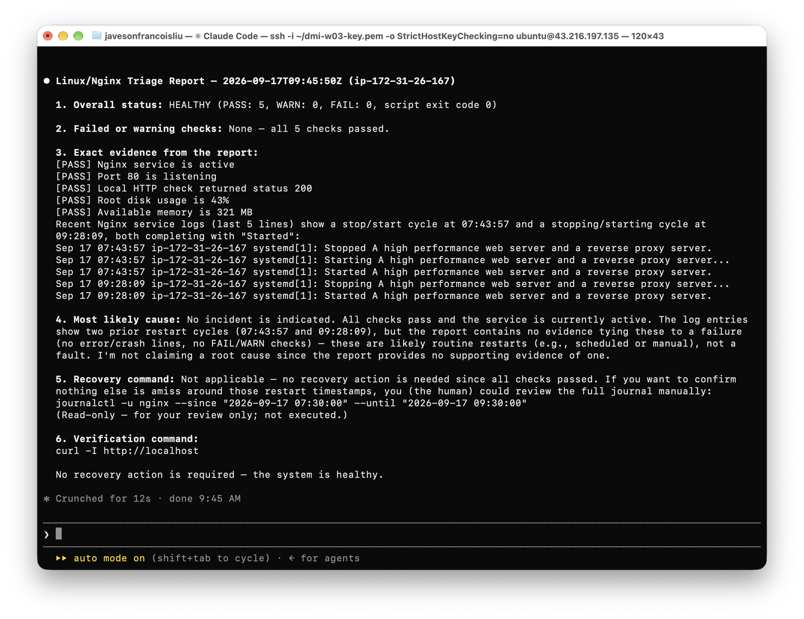

---

### Notes

**1. Why does this skill have Bash, Read, and Grep, but not Write?**

The skill's entire purpose is to read evidence and report findings — it never needs to create or modify files. Bash is needed to run `linux-triage.sh` and capture its output. Read is needed to open and parse `linux-health-report.txt`. Grep is needed to search through report content for specific patterns. Write is excluded by design: if the skill had Write access, Claude could inadvertently modify the Nginx configuration, overwrite a report file, or create files that interfere with the evidence. Restricting tools to exactly what is needed is a principle of least privilege applied to AI tooling.

---

**2. Why is `disable-model-invocation: true` useful for this skill?**

`disable-model-invocation: true` prevents the skill from spawning additional Claude model calls beyond its own execution. Without this flag, the skill could trigger recursive AI calls — for example, asking Claude to plan the next action, which might then attempt to take an action. For a read-only triage workflow, one cycle of: run script → read report → produce analysis → stop, is all that should happen. Disabling model invocation keeps the behavior predictable and ensures the skill cannot escalate into an open-ended agentic loop.

---

**3. What part is performed by Bash, and what part is performed by Claude?**

Bash performs the evidence collection. The `linux-triage.sh` script runs deterministic system commands — `systemctl`, `ss`, `curl`, `df`, `free`, `journalctl` — and writes the raw output to a structured text report. Bash is responsible for facts. Claude performs the analysis. It reads the structured report, identifies which checks failed or warned, connects related failures to a likely cause, and recommends a safe next step. Claude is responsible for interpretation. The two roles are cleanly separated: Bash produces the evidence file; Claude reads and explains it.

---

**4. Why is this better than asking Claude "Is my server healthy?" without giving it evidence?**

Without evidence, Claude can only reason from general knowledge and produce a generic answer that may not match the actual state of this specific server. It has no way to know whether Nginx is running right now, what the current disk usage is, or whether the application is actually responding. With the Bash report as input, Claude's analysis is grounded in real, timestamped system data collected moments ago. The conclusions are specific and actionable rather than speculative. This is the difference between a doctor examining a patient with test results in hand versus guessing a diagnosis over the phone without any data.

---

# Task 7 — Simulate an Nginx Incident and Let the Skill Diagnose It

## Goal

Create a controlled service failure, gather evidence through Bash, and let Claude analyze the evidence without taking recovery action.

### Evidence

#### Screenshot 13 — Output showing Nginx is inactive and the HTTP request fails

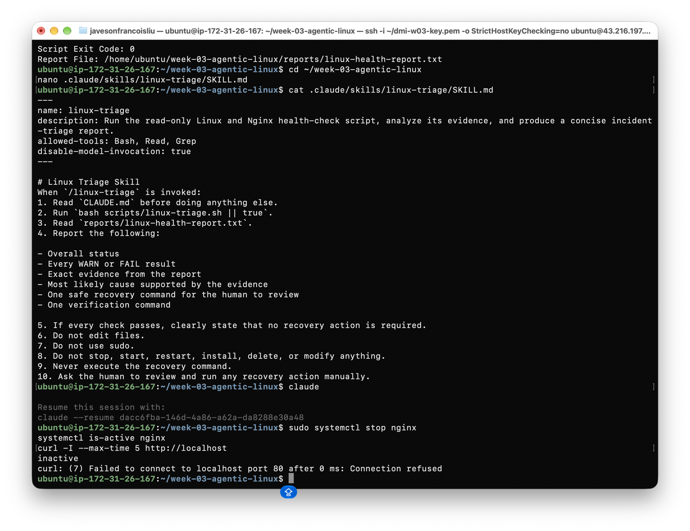

---

#### Screenshot 14 — `/linux-triage` output showing failed evidence, most likely cause, and a suggested recovery command

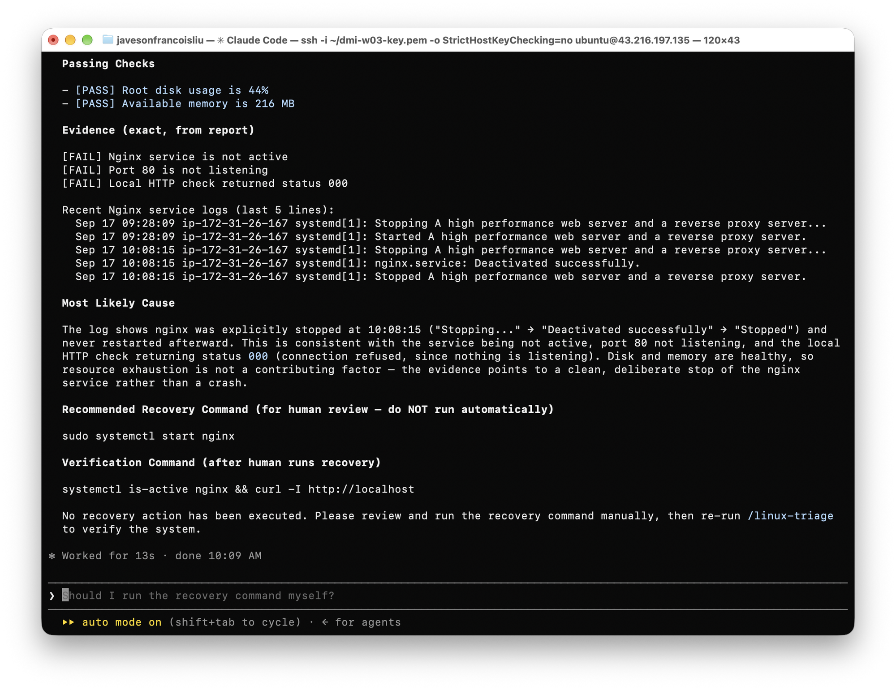

---

#### Screenshot 15 — `incident-failure-report.txt` showing the failed checks and your Full Name

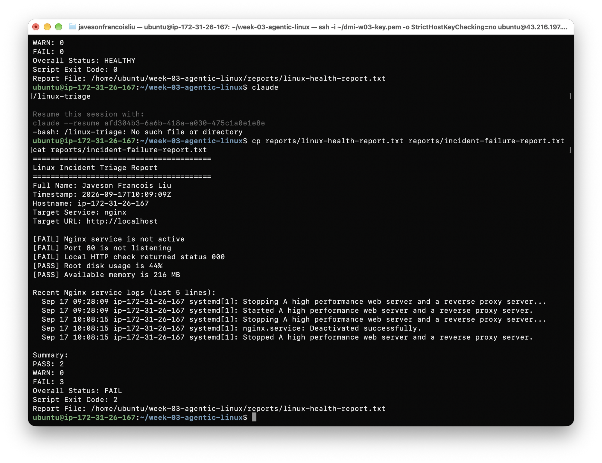

---

### Notes

**1. Which three checks failed?**

The three checks that failed were: (1) **Nginx service status** — `systemctl is-active nginx` returned `inactive`, so the script recorded `[FAIL] Nginx service is not active`; (2) **Port 80 listening state** — `ss -ltn` showed no LISTEN entry on port 80, so the script recorded `[FAIL] Port 80 is not listening`; (3) **Local HTTP response** — `curl -s -o /dev/null -w '%{http_code}'` returned `000` (connection refused), so the script recorded `[FAIL] Local HTTP check returned status 000`.

---

**2. What evidence supports the conclusion that Nginx is unavailable?**

Three independent pieces of evidence converge on the same conclusion. First, `[FAIL] Nginx service is not active` shows the process is not running at the OS level. Second, `[FAIL] Port 80 is not listening` shows the HTTP port has no bound listener — confirming no process accepted the port. Third, `[FAIL] Local HTTP check returned status 000` shows a real HTTP request received a connection refused error rather than any HTTP response. All three failures are causally linked: when the Nginx process stops, it releases port 80, and without a listener on port 80, any HTTP request is immediately refused at the network layer.

---

**3. Did Claude execute the recovery command? Why is that important?**

No, Claude did not execute the recovery command. Claude only presented `sudo systemctl start nginx` as the recommended next step and explicitly stated that it should be reviewed and run manually. This is important because it preserves the human's authority over the system. An AI that automatically restarts services could mask deeper problems — for example, if Nginx crashed due to a misconfiguration, restarting it would just cause it to crash again immediately. The human who reviews the recommendation can apply judgment: verify the config, check for a change freeze, or decide whether a different recovery path is needed. Claude's role is to advise, not to act.

---

**4. Which phase of the Agentic Loop is represented by the Bash report?**

The Bash report represents the **Gather** phase. The script runs deterministic read-only commands and collects structured evidence about the current system state without interpreting or acting on it. It is purely fact collection — the raw material that the rest of the workflow depends on.

---

**5. Which phase is represented by Claude's explanation?**

Claude's explanation represents the **Analyze** phase. After the Gather phase produces the report, Claude reads the evidence, identifies which checks failed, connects the failures to a most likely cause, and recommends a safe recovery command. This is analysis — turning raw data into a diagnosis and a suggested action — without touching the system.

---

# Task 8 — Recover Manually, Verify Again, and Write the Incident Summary

## Goal

Recover the service as the human operator and prove that the system is healthy again.

### Evidence

#### Screenshot 16 — Output showing Nginx is active and `curl -I http://localhost` returns 200 OK

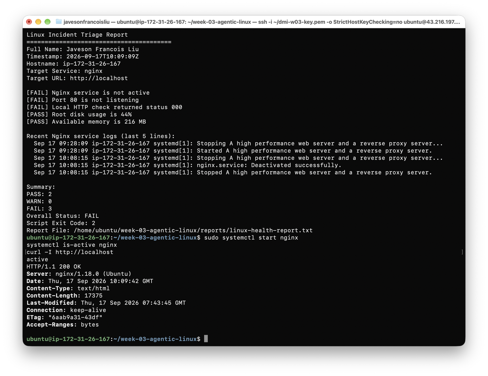

---

#### Screenshot 17 — Second `/linux-triage` output showing successful recovery with no FAIL results

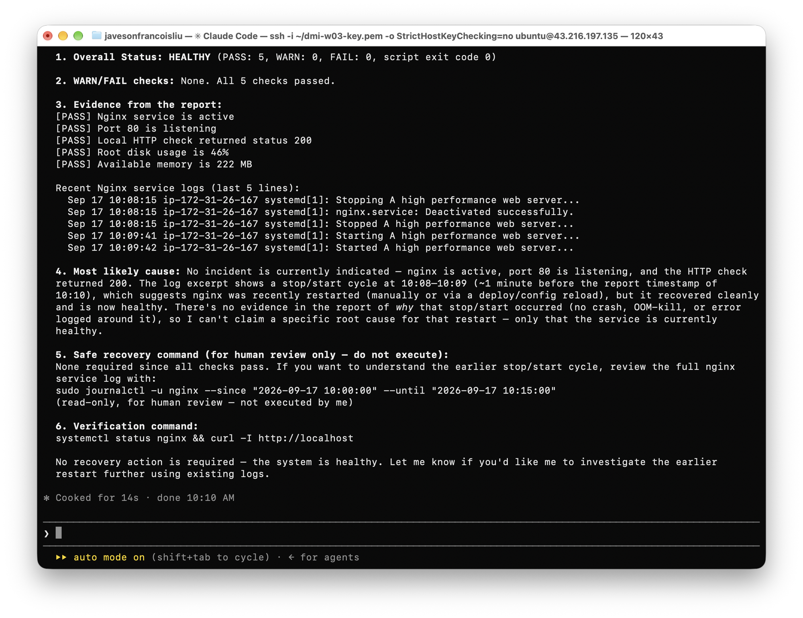

---

#### Screenshot 18 — Output of `ls -lah reports` showing both `incident-failure-report.txt` and `recovery-report.txt`

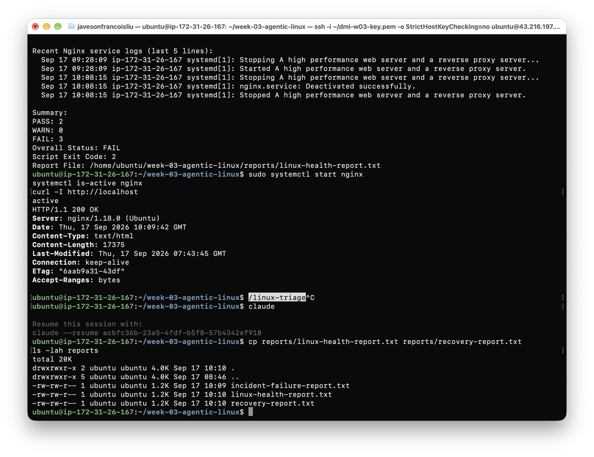

---

#### Screenshot 19 — `incident-summary.md` showing all required sections and your Full Name

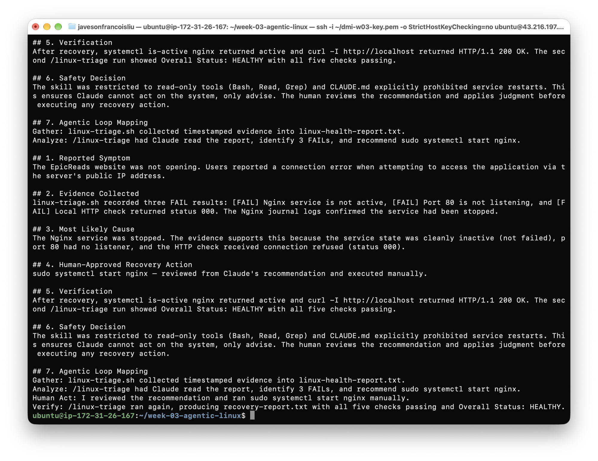

---

### Notes

**1. What action did you execute manually?**

I ran `sudo systemctl start nginx` in the regular terminal after reviewing Claude's recovery recommendation. This is the human-approved action in the Agentic Loop — I reviewed the evidence, confirmed the recommended command was appropriate, and executed it myself rather than allowing Claude to trigger it automatically.

---

**2. What evidence proves that the service recovered?**

Two outputs confirm recovery. First, `systemctl is-active nginx` returned `active` immediately after the restart, confirming the process is running again. Second, `curl -I http://localhost` returned `HTTP/1.1 200 OK`, confirming Nginx is listening on port 80 and responding to HTTP requests with a valid response. The second `/linux-triage` run also confirmed recovery at the script level — the report showed all five checks passing and Overall Status: HEALTHY with no FAIL results.

---

**3. Why is the second triage run necessary?**

The second triage run closes the Agentic Loop with the **Verify** phase. Running the skill again after recovery produces a new timestamped report that objectively confirms every check passed after the human-approved action was executed. Without this verification step, you only have the human's word that the service recovered — there is no structured evidence artifact. In a real incident, the recovery report is the documented proof that the system returned to a healthy state, and it becomes part of the incident record.

---

**4. What could go wrong if an AI agent automatically restarted every failed service?**

Automatic restarts can hide or worsen underlying problems. If Nginx crashed because of a configuration syntax error, an automatic restart would cause it to crash again immediately in a restart loop — potentially overwhelming the server with repeated process spawning. If the failure was caused by a dependent service going down (such as a database), restarting Nginx would not fix anything. If the failure occurred during a controlled maintenance window, an automatic restart might interfere with scheduled work. There are also security scenarios where a service was deliberately stopped because it was being exploited — an auto-restart would undo an active defensive action. Automatic recovery removes human judgment from a moment that often requires it most.

---

**5. In one sentence, explain the difference between using AI as a chatbot and using AI in this agentic workflow.**

In a chatbot interaction, AI receives a natural-language question and responds with general knowledge that may or may not reflect the system's real state; in this agentic workflow, AI receives structured, timestamped evidence collected by Bash from the live system and produces analysis that is grounded in and constrained to that specific evidence.

---

# Incident Summary

**Full Name:** Javeson Francois Liu

**Date:** 17/09/2026

---

**1. Reported Symptom**

The EpicReads website was not opening. Users reported a connection error when attempting to access the application via the server's public IP address.

---

**2. Evidence Collected**

The `linux-triage.sh` script recorded three FAIL results: `[FAIL] Nginx service is not active` (systemctl returned inactive), `[FAIL] Port 80 is not listening` (no LISTEN entry in ss output), and `[FAIL] Local HTTP check returned status 000` (curl received connection refused). The recent Nginx journal logs showed the service had been stopped rather than crashed.

---

**3. Most Likely Cause**

The Nginx service was stopped, most likely by a manual `sudo systemctl stop nginx` command. The evidence supports this conclusion because the service state was cleanly `inactive` (not `failed`), port 80 was not listening (confirming no process held it), and the HTTP check received connection refused rather than a 5xx error (which would indicate a running but misconfigured service).

---

**4. Human-Approved Recovery Action**

`sudo systemctl start nginx` — reviewed from Claude's recommendation, executed manually in the regular terminal.

---

**5. Verification**

After executing the recovery command, `systemctl is-active nginx` returned `active` and `curl -I http://localhost` returned `HTTP/1.1 200 OK`. The second `/linux-triage` run produced a report with all five checks passing and Overall Status: HEALTHY, confirming the application returned to full operation.

---

**6. Safety Decision**

The skill was restricted to read-only tools (Bash, Read, Grep) and was configured with explicit safety rules in CLAUDE.md that prohibit stopping, starting, or restarting services. This ensures Claude cannot take any action that changes system state, even if it correctly identifies the recovery command. The human must review the recommendation and decide whether it is safe to execute given any context that the script cannot capture — such as a maintenance window, a change freeze, or a deeper root cause not yet investigated. Keeping the human in the execution loop maintains operational accountability.

---

**7. Agentic Loop Mapping**

- **Gather:** `linux-triage.sh` ran read-only commands and wrote `linux-health-report.txt` with timestamped evidence of all five checks.
- **Analyze:** `/linux-triage` skill invoked Claude, which read the report, identified the three FAIL results, traced them to a stopped Nginx service, and recommended `sudo systemctl start nginx`.
- **Human Act:** I reviewed Claude's recommendation, confirmed it was appropriate, and ran `sudo systemctl start nginx` manually in the terminal.
- **Verify:** `/linux-triage` was run a second time, producing `recovery-report.txt` with all five checks passing and Overall Status: HEALTHY — confirming the loop completed successfully.

---

# LinkedIn Post (Required)

## Evidence

#### LinkedIn Post URL

Paste your LinkedIn post URL here:

`https://lnkd.in/p/eXuMsQFr`

---

#### Screenshot — Published LinkedIn post

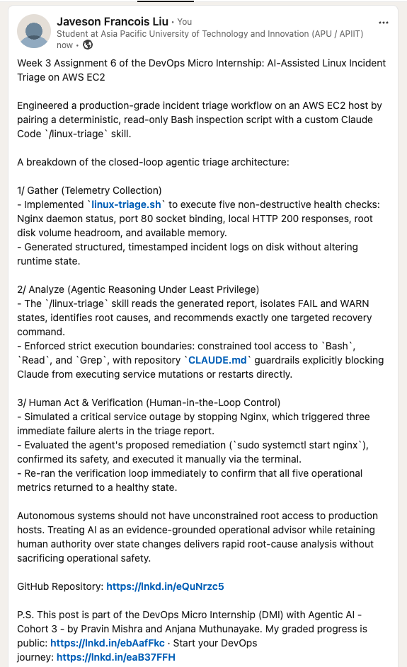

---

# GitHub Repository URL

`https://github.com/javesonfrancoisliu/devops-micro-internship-pravinmishra`

---

# Submission Instructions

- Add all required screenshots in your submission
- Full Name must be visible in required screenshots and the Bash report
- All written answers must be in your own words
- Do not expose sensitive information (keys, passwords, AWS account IDs, tokens)
- GitHub URL must be included in this document

---

# Completion Checklist

- [x] Task 1: Healthy baseline confirmed, workspace created (Screenshots 1–2, Notes answered)
- [x] Task 2: CLAUDE.md created with all four sections (Screenshot 3, Notes answered)
- [x] Task 3: Five-check plan produced by Claude using read-only tools (Screenshot 4, Notes answered)
- [x] Task 4: `linux-triage.sh` created, syntax validated, executable permission set (Screenshots 5–8, Notes answered)
- [x] Task 5: Healthy-state report generated with no FAIL result (Screenshots 9–10, Notes answered)
- [x] Task 6: `/linux-triage` skill created and run successfully on healthy server (Screenshots 11–12, Notes answered)
- [x] Task 7: Nginx incident simulated, failed evidence captured, Claude did not execute recovery (Screenshots 13–15, Notes answered)
- [x] Task 8: Nginx recovered manually, recovery verified, reports saved, incident summary complete (Screenshots 16–19, Notes answered)
- [x] Incident summary contains all seven required sections
- [x] LinkedIn post published and URL submitted
- [x] Full Name visible in all required screenshots and the Bash report
- [x] Skill does not have Write permission
- [x] Skill did not execute any recovery commands
- [x] No sensitive data exposed

---

## 📌 About DMI & CloudAdvisory

DevOps Micro Internship (DMI) is a project-based DevOps program run by Pravin Mishra (The CloudAdvisory) focused on real-world execution, systems thinking, and career readiness.

It helps learners build strong DevOps foundations with hands-on experience.

---

## 📌 Resources

- 🌐 DMI Official Website: https://dmi.pravinmishra.com?utm_source=github&utm_medium=readme  
- 🎓 University: https://university.pravinmishra.com?utm_source=github&utm_medium=readme  
- 💬 Discord Community: https://discord.pravinmishra.com?utm_source=github&utm_medium=readme  
- 📝 Blog: https://dmi.pravinmishra.com/blog?utm_source=github&utm_medium=readme  
- ▶️ YouTube Playlist: https://www.youtube.com/playlist?list=PLFeSNDtI4Cho  
- 🔗 Pravin Mishra (LinkedIn): https://www.linkedin.com/in/pravin-mishra-aws-trainer/  
- 🏢 CloudAdvisory (LinkedIn): https://www.linkedin.com/company/thecloudadvisory/

---

*This submission is part of DevOps Micro Internship (DMI) — Agentic AI Track.*
