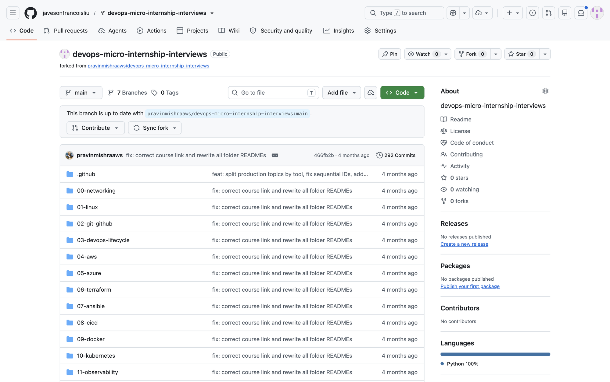
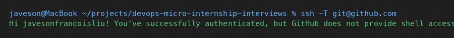
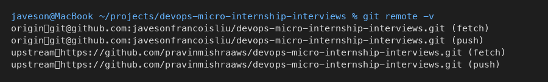
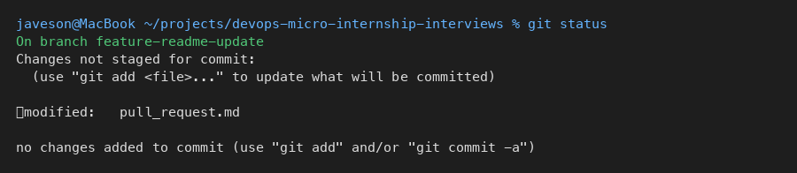
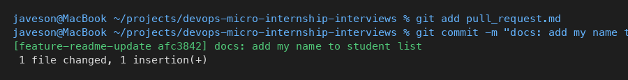
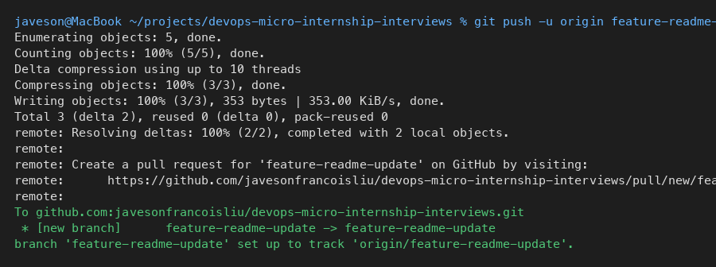
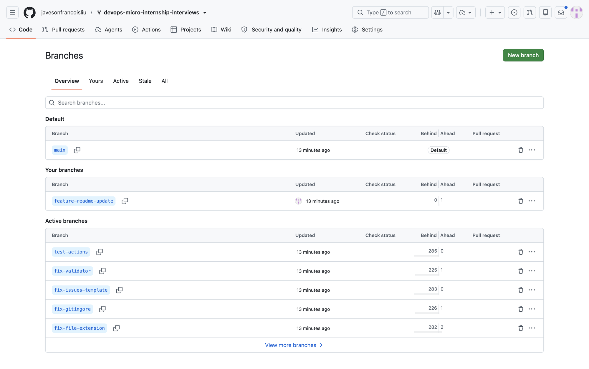
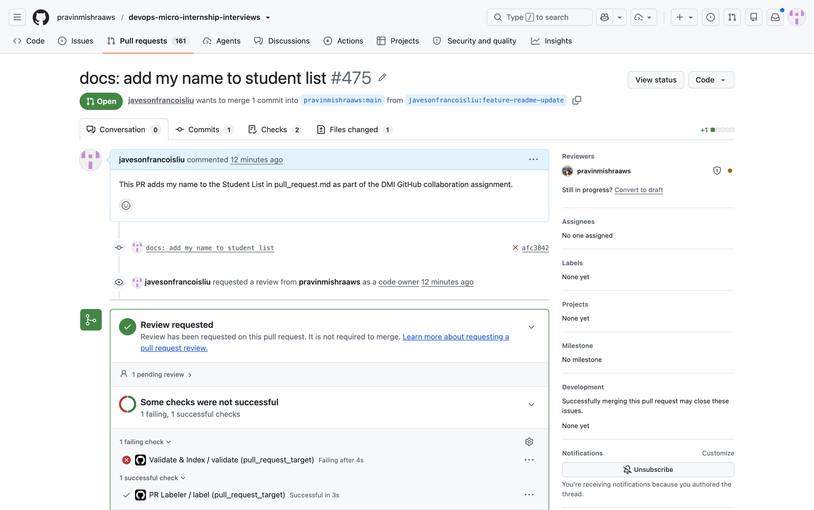

# Assignment 5 — Open-Source Collaboration: Fork, Sync & Pull Request

Part of the DevOps Micro Internship (DMI) with Agentic AI

---

## Purpose

In this assignment, I contributed one small documentation change to a shared repository using a standard open-source collaboration workflow: fork, clone, feature branch, commit, sync with upstream, push, and open a Pull Request.

---

# Task 0 — Fork the Upstream Repository

## Goal

Create a copy of the upstream repository under my GitHub account.

### Evidence

#### Screenshot 1 — Fork page with username and repository name visible in the browser URL



**Fork URL:** https://github.com/javesonfrancoisliu/devops-micro-internship-interviews

---

# Task 1 — Authenticate GitHub from the Terminal

## Goal

Confirm SSH authentication is working from the terminal.

### Evidence

#### Screenshot 2 — Output of `ssh -T git@github.com` showing successful authentication



---

# Task 2 — Clone Your Fork Locally and Configure Remotes

## Goal

Create a local working copy where `origin` points to my fork and `upstream` points to the original repository.

### Commands used

```bash
git clone git@github.com:javesonfrancoisliu/devops-micro-internship-interviews.git
cd devops-micro-internship-interviews
git remote add upstream https://github.com/pravinmishraaws/devops-micro-internship-interviews.git
git remote -v
```

### Evidence

#### Screenshot 3 — Output of `git remote -v` showing origin and upstream correctly



---

# Task 3 — Create a Feature Branch and Make Your Change

## Goal

Create `feature-readme-update`, add my entry to `pull_request.md`, and commit with the required message.

### Entry added

```
Javeson Francois Liu — Cohort 3
```

### Commands used

```bash
git checkout -b feature-readme-update
# edited pull_request.md — appended entry at end of Student List
git status
git add pull_request.md
git commit -m "docs: add my name to student list"
git log --oneline -3
```

### Evidence

#### Screenshot 4 — `git status` showing `pull_request.md` modified before staging



---

#### Screenshot 5 — `git commit` output



---

# Task 4 — Synchronize with Upstream and Push to Your Fork

## Goal

Fetch upstream, merge into local main, rebase feature branch, push to origin.

### Commands used

```bash
git fetch upstream
git checkout main
git merge upstream/main
git checkout feature-readme-update
git rebase main
git push -u origin feature-readme-update
```

### Evidence

#### Screenshot 6 — Output of `git push -u origin feature-readme-update`



---

#### Screenshot 7 — Fork on GitHub showing `feature-readme-update` branch



---

# Task 5 — Create a Pull Request to Upstream

## Goal

Open a Pull Request from `feature-readme-update` in my fork to `main` in the upstream repository.

### Pull Request Details

| Field | Value |
|---|---|
| Base repository | `pravinmishraaws/devops-micro-internship-interviews` |
| Base branch | `main` |
| Head repository | `javesonfrancoisliu/devops-micro-internship-interviews` |
| Compare branch | `feature-readme-update` |
| PR Title | `docs: add my name to student list` |
| PR URL | https://github.com/pravinmishraaws/devops-micro-internship-interviews/pull/475 |

### Evidence

#### Screenshot 8 — Pull Request page showing correct base/head repositories and title



---

#### Screenshot 9 — Successfully created Pull Request with PR #475 visible


---

# Submission Instructions

- Fork URL: https://github.com/javesonfrancoisliu/devops-micro-internship-interviews
- Pull Request URL: https://github.com/pravinmishraaws/devops-micro-internship-interviews/pull/475
- Screenshots 1–9 included above

---

## LinkedIn Post

Paste LinkedIn Post URL here: ___________________________

Paste screenshot of LinkedIn post here:

---

# Completion Checklist

- [x] Upstream repository forked to GitHub account (Screenshot 1)
- [x] GitHub SSH authentication confirmed (Screenshot 2)
- [x] Fork cloned locally
- [x] `origin` points to my fork (Screenshot 3)
- [x] `upstream` points to `pravinmishraaws/devops-micro-internship-interviews` (Screenshot 3)
- [x] `feature-readme-update` branch created and used
- [x] Only `pull_request.md` modified
- [x] Entry added at end of Student List
- [x] Required commit message `docs: add my name to student list` used
- [x] Local main synchronized with `upstream/main`
- [x] Feature branch rebased and pushed to origin (Screenshots 6–7)
- [x] Pull Request targets correct upstream repo and main branch (Screenshots 8–9)
- [x] Screenshots 1–9 included and readable
- [ ] Mandatory LinkedIn post completed and linked
- [x] No PAT, password, private key, or authentication secret exposed

---

## 📌 About DMI & CloudAdvisory

DevOps Micro Internship (DMI) is a project-based DevOps program run by Pravin Mishra (The CloudAdvisory) focused on real-world execution, systems thinking, and career readiness.

It helps learners build strong DevOps foundations with hands-on experience.

---

## 📌 Resources

- 🌐 DMI Official Website: https://dmi.pravinmishra.com?utm_source=github&utm_medium=readme  
- 🎓 University: https://university.pravinmishra.com?utm_source=github&utm_medium=readme  
- 💬 Discord Community: https://discord.pravinmishra.com?utm_source=github&utm_medium=readme  
- 📝 Blog: https://dmi.pravinmishra.com/blog?utm_source=github&utm_medium=readme  
- ▶️ YouTube Playlist: https://www.youtube.com/playlist?list=PLFeSNDtI4Cho  
- 🔗 Pravin Mishra (LinkedIn): https://www.linkedin.com/in/pravin-mishra-aws-trainer/  
- 🏢 CloudAdvisory (LinkedIn): https://www.linkedin.com/company/thecloudadvisory/

---

*This submission is part of DevOps Micro Internship (DMI) — Agentic AI Track.*
