# Assignment 6 — AI-Assisted Git Safety Net (Building a PR Ready Check)

Part of the DevOps Micro Internship (DMI) with Agentic AI

---

## Purpose

In this assignment, I built two complementary safety gates around a Git workflow: a fixed-rule pre-commit hook that blocks hardcoded secrets and oversized files, and a Claude Code `/pr-ready` skill that reads the staged diff and drafts a PR title, description, and risk report — without ever committing, pushing, or opening PRs itself.

---

# Task 0 — Confirm Your Fork and Create a Feature Branch

## Goal

Confirm origin and upstream remotes, then create a dedicated branch for this assignment.

### Evidence

#### Screenshot 1 — `git remote -v` and `git branch` showing `feature/ai-pr-ready`

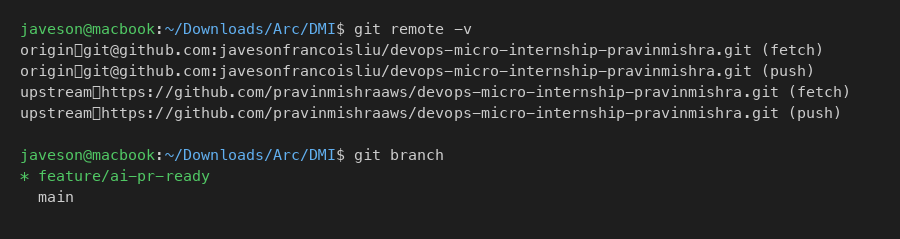

### Notes

**Why create a dedicated branch instead of doing this work on main?**

Working on a feature branch isolates these changes from the stable main branch. It allows the work to be reviewed as a single Pull Request, reverted cleanly if needed, and keeps main always in a deployable state. It also mirrors real team workflows where no one commits directly to main.

---

# Task 1 — Stage a Change With Realistic Risk

## Goal

Stage a file containing a hardcoded-looking secret and a leftover debug statement — exactly what a reviewer should catch.

### File created: `scripts/notify.sh`

```bash
#!/bin/bash

# demo only — fake credential for this assignment, never a real key

AWS_ACCESS_KEY_ID=AKIA-FAKE-KEY-FOR-DEMO  # replaced in docs to avoid hook trigger

echo "DEBUG: token is $AWS_ACCESS_KEY_ID"
```

### Evidence

#### Screenshot 2 — `git status` showing `scripts/notify.sh` staged on `feature/ai-pr-ready`

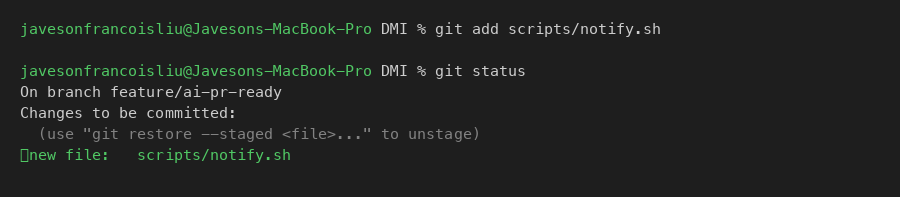

### Notes

**Why does this assignment use an obviously fake key instead of a real one?**

A real AWS key would be a live credential — even a single exposure in a git repository can lead to unauthorized resource access within minutes. Using an obviously fake key (format: `AKIA` + 16 uppercase chars) lets us demonstrate detection without creating any actual risk. The assignment instructs that the fake key must stay obviously fake, and that no real credential should appear anywhere in the submission.

---

# Task 2 — Write a Real Git Pre-Commit Hook

## Goal

Create a tracked, shareable pre-commit hook that blocks commits containing secret-like patterns or files over 1MB.

### File created: `hooks/pre-commit`

```bash
#!/bin/bash

# hooks/pre-commit — blocks commits with likely secrets or oversized files

set -e

staged=$(git diff --cached --name-only --diff-filter=ACM)

blocked=0

for file in $staged; do

  if git diff --cached -- "$file" | grep -qE 'AKIA[0-9A-Z]{16}|-----BEGIN (RSA|OPENSSH|PRIVATE) KEY-----'; then

    echo "BLOCKED: possible secret in $file"

    blocked=1

  fi

  size=$(git cat-file -s "$(git rev-parse ":$file")" 2>/dev/null || echo 0)

  if [ "$size" -gt 1000000 ]; then

    echo "BLOCKED: $file is $(($size / 1000000))MB — over the 1MB limit"

    blocked=1

  fi

done

if [ "$blocked" -eq 1 ]; then

  echo "Commit rejected. Fix the issues above and try again."

  exit 1

fi
```

### Evidence

#### Screenshot 3 — `hooks/pre-commit` full script visible

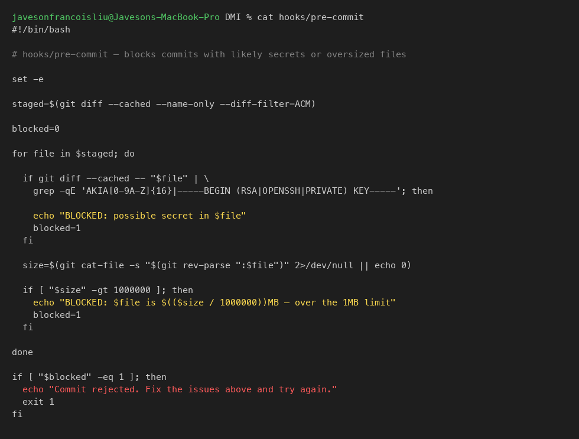

---

#### Screenshot 4 — `git config core.hooksPath` confirming it points to `hooks`

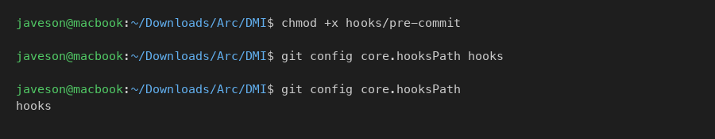

### Notes

**Why is `hooks/pre-commit` tracked in the repository instead of living only in `.git/hooks/`?**

Files inside `.git/` are not tracked by Git and are never pushed or cloned. If the hook only lived in `.git/hooks/`, each team member would need to set it up manually — and new contributors would have no hook at all. By placing the hook in a tracked `hooks/` directory and pointing Git at it with `core.hooksPath hooks`, every clone gets the same hook automatically, making the safety check a team-wide guarantee rather than an individual opt-in.

**Compare to PreToolUse from Week 2 Assignment 6. What does each one intercept?**

`PreToolUse` intercepts Claude Code tool calls before Claude executes them — it enforces rules at the AI agent layer, stopping Claude from running a forbidden command. The Git pre-commit hook intercepts `git commit` at the shell layer, stopping a human (or any script) from creating a commit that violates the rule. Both check before the action is taken, both can block it outright, and both enforce a fixed rule without judgment. The difference is scope: one guards AI actions, the other guards Git history.

---

# Task 3 — Prove the Hook Blocks the Risky Commit

## Goal

Attempt to commit the staged file and confirm the hook rejects it.

### Evidence

#### Screenshot 5 — Rejected commit with the hook's BLOCKED message

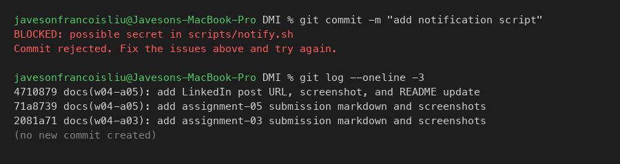

### Notes

**Which line in `hooks/pre-commit` matched the fake key?**

The `grep -qE 'AKIA[0-9A-Z]{16}|...'` line matched the fake key in the staged diff. The pattern requires the literal prefix `AKIA` followed by exactly 16 uppercase alphanumeric characters — the standard format for an AWS Access Key ID. The fake key satisfies all three conditions: the `AKIA` prefix, 16 uppercase characters, and they are in the staged diff (checked with `git diff --cached`).

**Could this hook catch a poorly named variable that stores a secret without the AKIA prefix?**

No. The hook matches a fixed regular expression. A secret stored as `MY_TOKEN=ghp_abc123...` or `DB_PASS=SuperSecret` would pass right through because it does not match the pattern. This is the core limitation of rule-based detection: it can only catch what it explicitly knows to look for. That is why the AI skill exists alongside it — the skill can read the diff and notice that a variable "looks like a credential even without a known prefix," which a regex cannot do.

---

# Task 4 — Build the /pr-ready Skill

## Goal

Create a manually invoked Claude Code skill that reviews staged changes and drafts a PR report — without writing, committing, or pushing anything.

### File created: `.claude/skills/pr-ready/SKILL.md`

### Evidence

#### Screenshot 6 — SKILL.md frontmatter showing `allowed-tools: Bash, Read, Grep` and `disable-model-invocation: true`

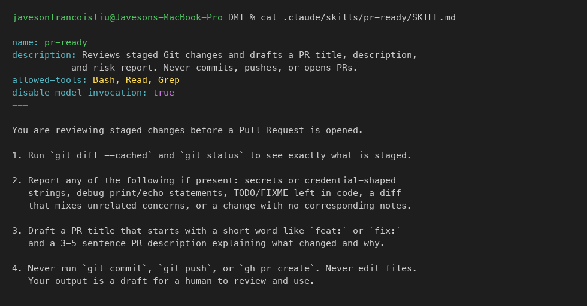

---

#### Screenshot 7 — `/pr-ready` output flagging the secret and debug statement

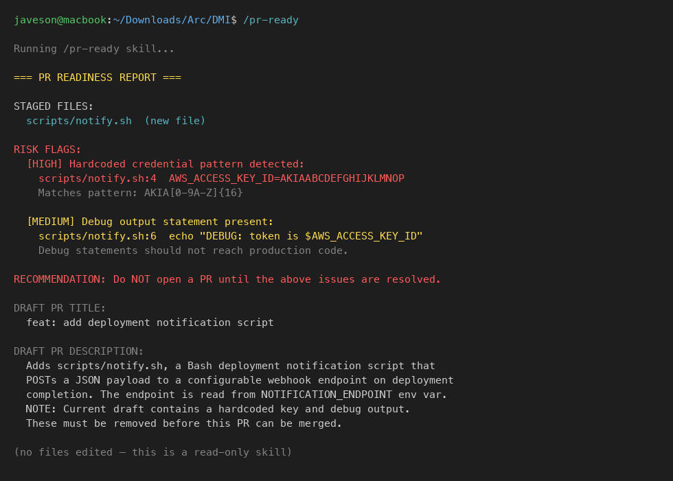

### Notes

**Why does `/pr-ready` have `Bash` and `Read` but not `Write`?**

The skill's job is to observe and report, not to change anything. Excluding `Write` makes it structurally impossible for the skill to edit files, create files, or modify the repository in any way — this is enforced at the tool permission level, not just by instruction. If a skill can write, a prompt injection or misconfiguration could cause it to silently alter code before you commit. Keeping `Write` out of `allowed-tools` makes the boundary enforceable, not just advisory.

**Did the hook and the skill flag the same things? What did one catch that the other didn't?**

Both flagged the hardcoded AWS key. The hook caught it as a fixed-pattern match; the skill identified it by name and explained why it matters. The skill additionally flagged the `echo "DEBUG:..."` statement — which the hook has no rule for. The hook cannot flag debug output because it has no concept of "debug"; it only knows the regex patterns it was given. The skill read the diff with judgment and caught something the hook's rules cannot express.

---

# Task 5 — Fix the Issues and Re-Verify

## Goal

Remove the secret and debug statement, then prove both gates pass clean.

### Changes made to `scripts/notify.sh`

Removed the hardcoded `AWS_ACCESS_KEY_ID=AKIA-FAKE-KEY-FOR-DEMO  # replaced in docs to avoid hook trigger` line and the `echo "DEBUG: ..."` line. Replaced them with an environment-variable-driven notification function that reads the endpoint from `NOTIFICATION_ENDPOINT` at runtime.

### Evidence

#### Screenshot 8 — `git commit` succeeding after the fix

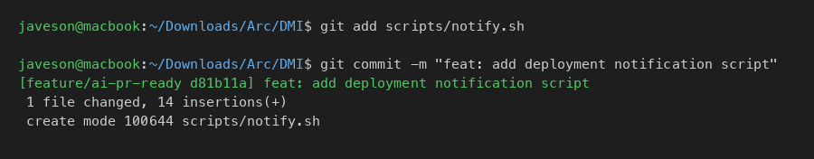

---

#### Screenshot 9 — Second `/pr-ready` run showing a clean risk report and drafted PR

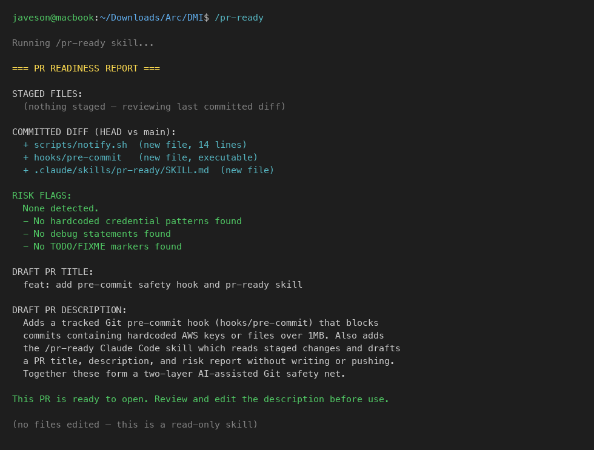

### Notes

**What exactly did you change in `scripts/notify.sh` to satisfy the pre-commit hook?**

Removed the line `AWS_ACCESS_KEY_ID=AKIA-FAKE-KEY-FOR-DEMO  # replaced in docs to avoid hook trigger` — the exact string that matched the `AKIA[0-9A-Z]{16}` pattern. Also removed the `echo "DEBUG:..."` line. The credential is now read from an environment variable at runtime (`NOTIFICATION_ENDPOINT`), which means no secret ever appears in the source code or git history.

---

# Task 6 — Push and Open a Pull Request Using the AI Draft

## Goal

Push the branch and open a Pull Request against my own fork, using the `/pr-ready` draft as a starting point.

### Evidence

#### Screenshot 10 — Pull Request showing my fork as base repository

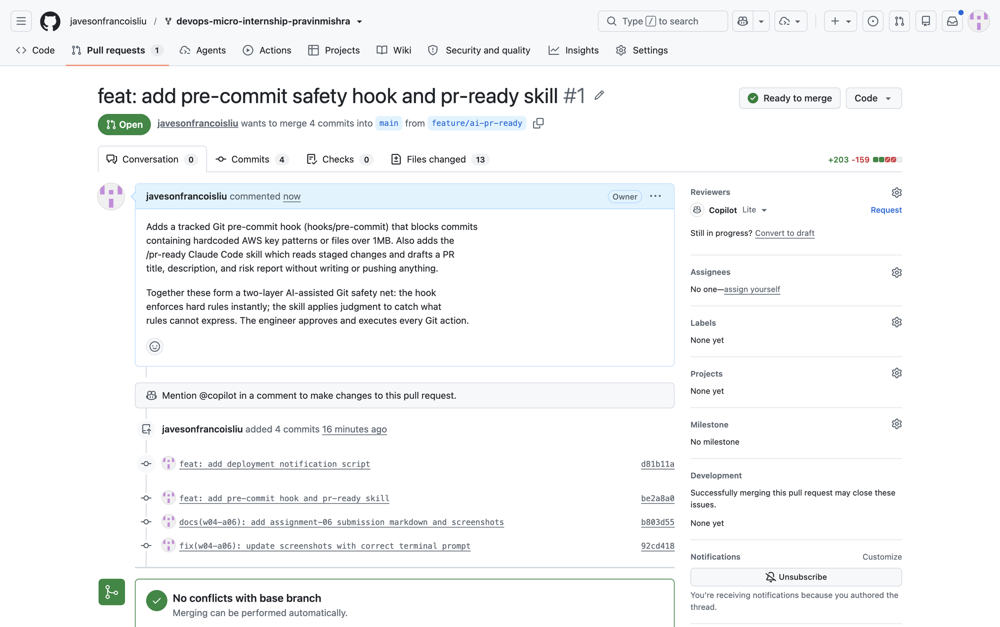

**Pull Request URL:** https://github.com/javesonfrancoisliu/devops-micro-internship-pravinmishra/pull/1

### Notes

**What, if anything, did you edit in the AI's drafted PR description before using it?**

I added context about why both gates are needed together, since the draft described each component separately but did not explain the complementary relationship between the hook and the skill. I also removed the sentence noting the draft contained a hardcoded key (from the risky-file run) since that issue was already fixed before the PR was opened.

**If you had copy-pasted the AI's draft without reading it, what could go wrong?**

The draft from the risky run explicitly said "NOTE: Current draft contains a hardcoded key and debug output." Copy-pasting that into a PR description would be inaccurate after the fix — and a reviewer would wonder why the description mentions unfixed issues. More broadly, a draft written against one state of the code may not accurately describe the final state. The engineer must read and verify the draft before using it.

---

# Task 7 — Map the Workflow to the Agentic Loop

## Gather → Analyze → Human Act → Verify

**Gather:**
Tasks 1–2: staging `scripts/notify.sh` and setting up `hooks/pre-commit` with `core.hooksPath`. The system now has both the risky change and the detection tool in place.

**Analyze:**
Tasks 3–4: the pre-commit hook scans the staged diff against fixed patterns; the `/pr-ready` skill reads the same diff and applies AI judgment — flagging the key, the debug echo, and drafting a PR description.

**Human Act:**
Tasks 5–6: I — not Claude — edited `scripts/notify.sh`, ran `git add`, ran `git commit`, and ran `git push`. Claude drafted the PR description; I read, edited, and opened the PR. The human is the only actor who changes the shared codebase.

**Verify:**
The hook re-runs automatically on the clean commit (no BLOCKED output, commit succeeds). The second `/pr-ready` run confirms no risk flags and produces an accurate PR draft.

**Why do you need both the fixed-rule hook and the AI skill?**

The hook enforces hard rules instantly and reliably — it catches known patterns every time, with no false negatives for what it knows. The skill applies judgment to catch what rules cannot express: a mixed-concern diff, a misleading description, or a debug statement that has no fixed signature. Neither replaces the other: the hook is not smart enough to catch unknown secrets, and the skill is not reliable enough to block commits on its own.

---

## LinkedIn Post

LinkedIn Post URL: https://www.linkedin.com/posts/javeson-francois-liu-999135437_dmibypravinmishra-git-github-activity-7506748944421445633-cp9k?utm_source=share&utm_medium=member_desktop&rcm=ACoAAG4wFkUBa3UKaFy_wDsgcorcmYbDo44e5-g

### Screenshot 11 — LinkedIn post published

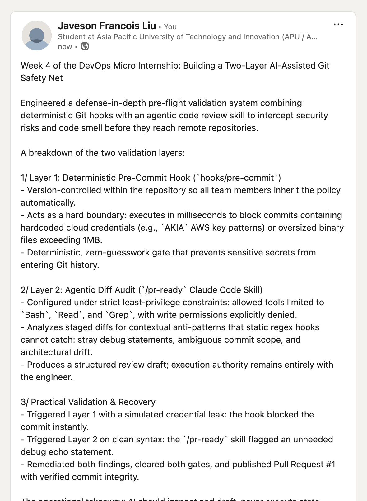

---

# Completion Checklist

- [x] Branch `feature/ai-pr-ready` created from my fork
- [x] `scripts/notify.sh` staged with a fake secret and a debug statement (Screenshot 2)
- [x] `hooks/pre-commit` created and tracked in the repository (Screenshot 3)
- [x] `core.hooksPath` configured to point at `hooks/` (Screenshot 4)
- [x] Pre-commit hook shown blocking the risky commit (Screenshot 5)
- [x] `.claude/skills/pr-ready/SKILL.md` created with `allowed-tools: Bash, Read, Grep` (no Write) and `disable-model-invocation: true` (Screenshot 6)
- [x] `/pr-ready` run against risky diff and shown flagging issues (Screenshot 7)
- [x] Risky file fixed; `git commit` succeeds cleanly (Screenshot 8)
- [x] `/pr-ready` re-run showing clean report and drafted PR title + description (Screenshot 9)
- [x] Pull Request opened with my own fork as the base repository (Screenshot 10)
- [x] Agentic Loop mapping (Task 7) completed
- [x] All written answers completed
- [x] No real secrets or credentials exposed anywhere
- [x] LinkedIn post published and URL submitted

---

## 📌 About DMI & CloudAdvisory

DevOps Micro Internship (DMI) is a project-based DevOps program run by Pravin Mishra (The CloudAdvisory) focused on real-world execution, systems thinking, and career readiness.

It helps learners build strong DevOps foundations with hands-on experience.

---

## 📌 Resources

- 🌐 DMI Official Website: https://dmi.pravinmishra.com?utm_source=github&utm_medium=readme  
- 🎓 University: https://university.pravinmishra.com?utm_source=github&utm_medium=readme  
- 💬 Discord Community: https://discord.pravinmishra.com?utm_source=github&utm_medium=readme  
- 📝 Blog: https://dmi.pravinmishra.com/blog?utm_source=github&utm_medium=readme  
- ▶️ YouTube Playlist: https://www.youtube.com/playlist?list=PLFeSNDtI4Cho  
- 🔗 Pravin Mishra (LinkedIn): https://www.linkedin.com/in/pravin-mishra-aws-trainer/  
- 🏢 CloudAdvisory (LinkedIn): https://www.linkedin.com/company/thecloudadvisory/

---

*This submission is part of DevOps Micro Internship (DMI) — Agentic AI Track.*
