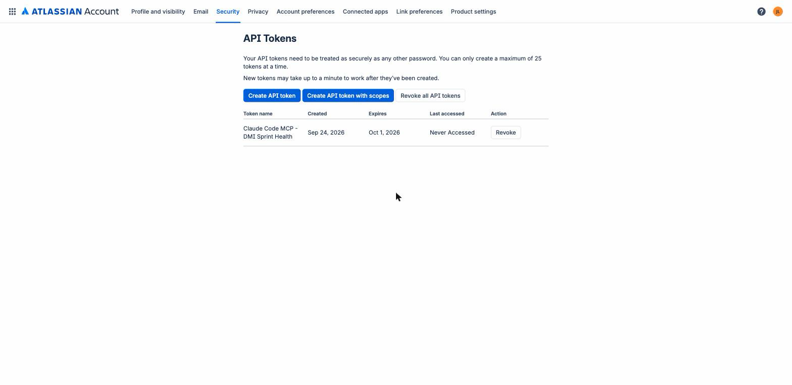
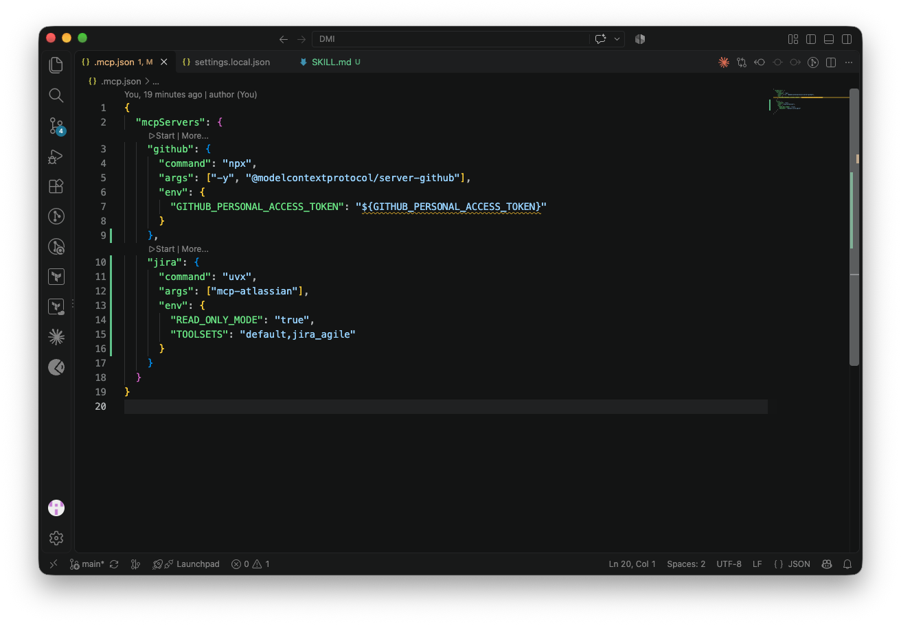
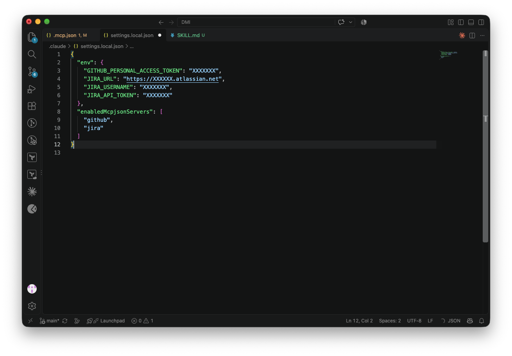
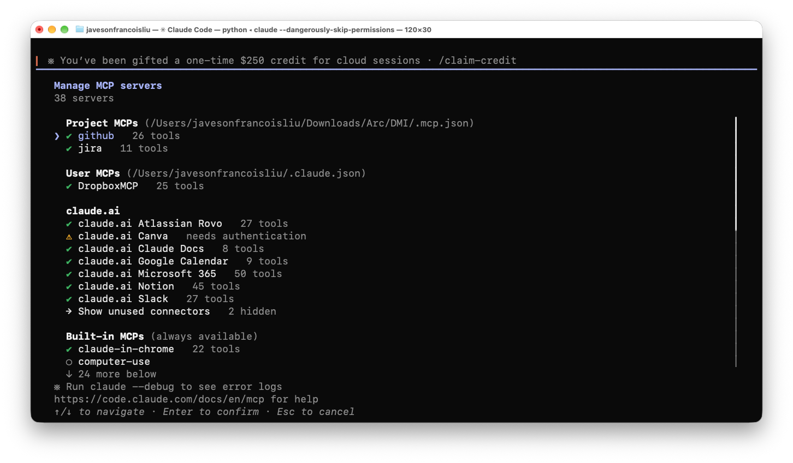
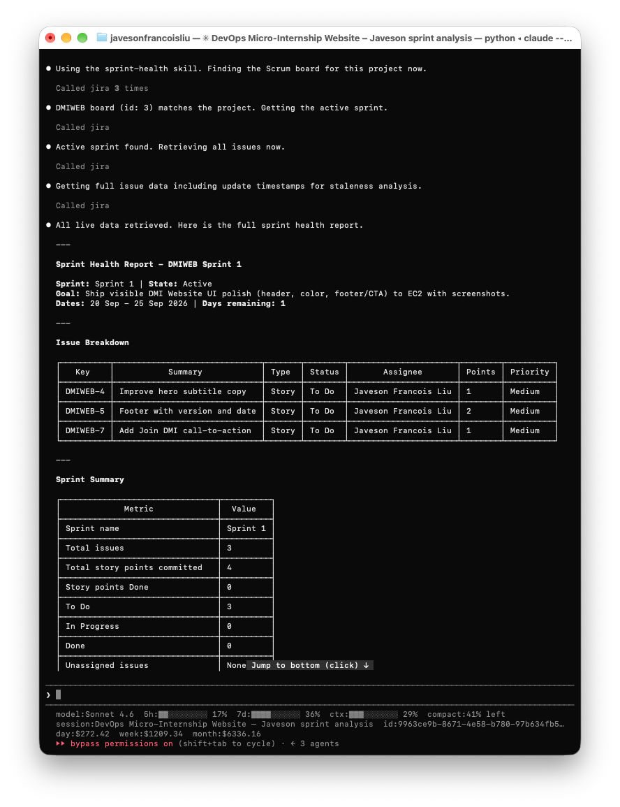
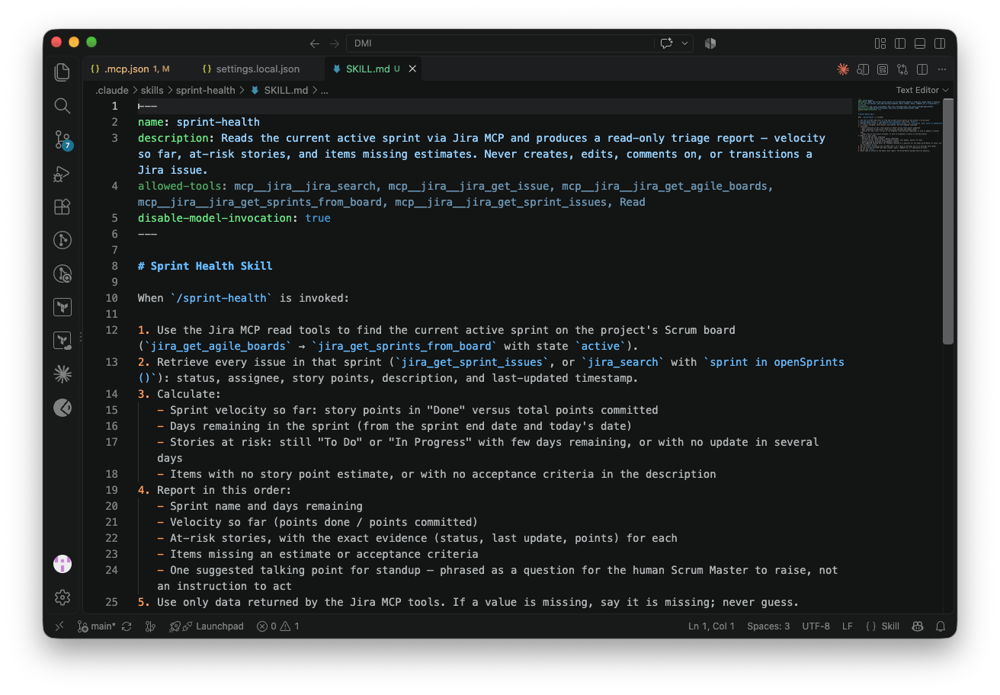
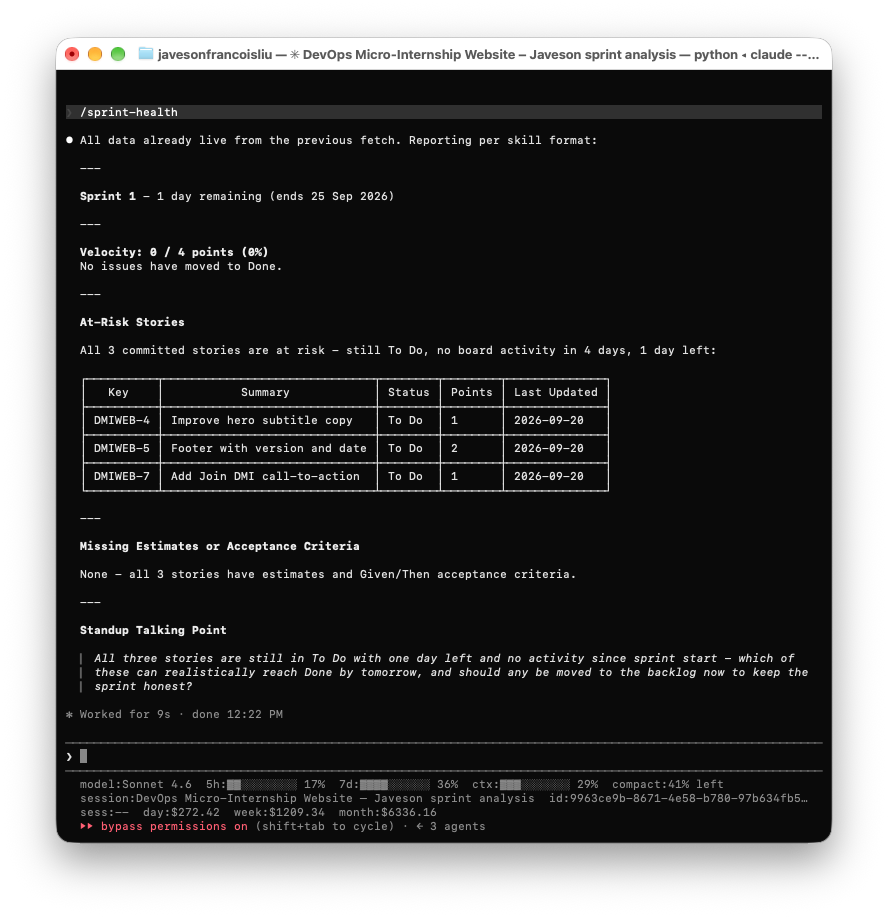
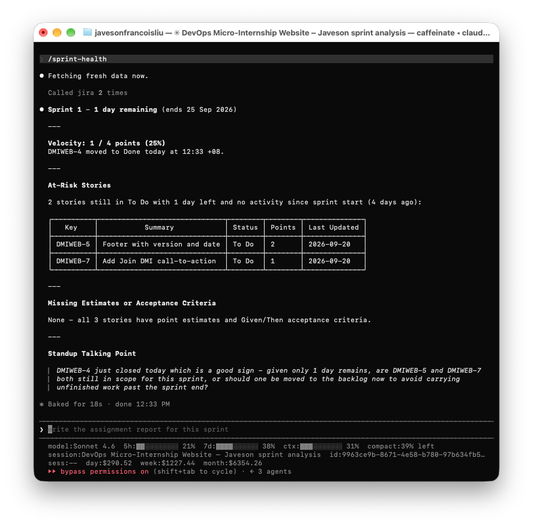
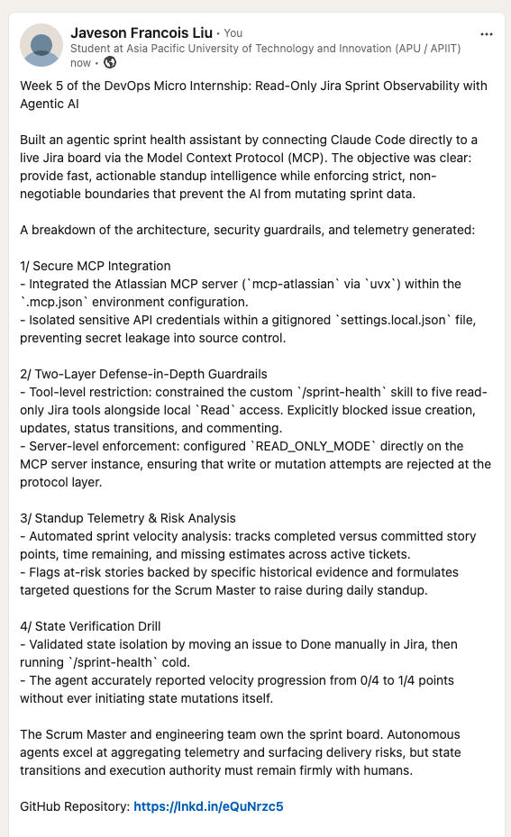

# Assignment 5 — AI-Assisted Sprint Health Report via Jira MCP

Part of the DevOps Micro Internship (DMI) with Agentic AI

---

## Purpose

In this assignment, you will connect Claude Code to your Jira board through an MCP server, the same way you connected it to GitHub in Week 2, and build a read-only `/sprint-health` skill. The skill reads your current sprint through Jira's API and reports sprint velocity, stories at risk of missing the sprint, and items missing an estimate — but it must never create, edit, comment on, or transition a single ticket itself. You will prove that boundary holds by making a real change on the board yourself and confirming the skill only ever reports, never acts.

---

# Task 1 — Create a Jira API Token

## Goal

Generate an API token from your Atlassian account that the MCP server will use to authenticate with your Jira site. Do not screenshot the token value itself.

### Evidence

#### Screenshot 1 — Jira API token creation confirmation page showing the token name, with the token value not visible

### Notes You Must Write (Very Important):

Why does the MCP server need your site URL and account email in addition to the token?

The API token alone does not say *where* or *who*. `JIRA_URL` tells the server which Jira Cloud site to call, because every Atlassian site has its own domain (mine is `celaracantika98-1789839230135.atlassian.net`) and the same token could belong to someone with access to many sites. Jira Cloud's REST API uses Basic authentication, where the username is the account email and the password is the API token, so `JIRA_USERNAME` is what ties the token to my Atlassian account. The server then acts with exactly my permissions on that one site.

---

# Task 2 — Create .mcp.json at the Project Root

## Goal

Create or update `.mcp.json` at your project root with a Jira MCP server block, following the same shape as the GitHub MCP server you configured in Week 2.

### Evidence

#### Screenshot 2 — `.mcp.json` open in VS Code showing the Jira server configuration

### Notes You Must Write (Very Important):

Compare this jira block to the github block from Week 2 Assignment 5. The GitHub server ran via npx (a Node.js package); this one runs via uvx (a Python package) — what stays exactly the same shape despite that difference, and why doesn't Claude Code care which language a given MCP server is written in?

The shape is identical: a server name (`github` / `jira`), a `command`, an `args` list, and an `env` object. Only the launcher changes (`npx` runs a Node.js package, `uvx` runs a Python package). Claude Code does not care about the language because it never loads the server's code: it just starts the command as a child process and talks to it over the MCP protocol (JSON-RPC messages on stdin/stdout). Any program that speaks MCP looks the same to Claude Code.

My `jira` block also adds two non-secret settings to `env`: `READ_ONLY_MODE: "true"` (the server blocks every POST/PUT/PATCH/DELETE to Jira) and `TOOLSETS: "default,jira_agile"` (loads the board and sprint tools, which `mcp-atlassian` keeps off by default).

---

# Task 3 — Add Your Credentials to settings.local.json

## Goal

Add your Jira site URL, account email, and API token to `.claude/settings.local.json`, and confirm that file is listed in `.gitignore` so it is never committed.

### Evidence

#### Screenshot 3 — `settings.local.json` open in VS Code showing the `env` section, with the actual token value blurred or covered

### Notes You Must Write (Very Important):

Why must JIRA_API_TOKEN live in settings.local.json and never in .mcp.json?

`.mcp.json` is committed to GitHub so anyone who clones the repo gets the same server setup; anything inside it is public. The API token acts as my Atlassian account, so whoever holds it can read (and, without read-only mode, change) everything I can in Jira. `settings.local.json` is per-machine and listed in `.gitignore` (verified with `git check-ignore -v .claude/settings.local.json` → `.gitignore:2`), so the secret stays on my laptop and never reaches a commit.

---

# Task 4 — Verify the Connection with /mcp

## Goal

Restart Claude Code and confirm the Jira MCP server shows as connected.

### Evidence

#### Screenshot 4 — `/mcp` output showing `jira: connected`

---

# Task 5 — Run a Live Query to Prove Real Board Data

## Goal

Ask Claude to list the issues in your current active sprint through the Jira MCP connection, and confirm the result matches what you see on your live board in the browser.

### Evidence

#### Screenshot 5 — Claude's response showing the live sprint issue list retrieved via Jira MCP

### Notes You Must Write (Very Important):

How did you confirm this was real board data and not something Claude guessed?

I checked it three ways. First, the response showed Claude calling the `jira` MCP tools ("Called jira") before answering, not answering from memory. Second, the details could only come from my own site: issue keys DMIWEB-4, DMIWEB-5 and DMIWEB-7, my exact Sprint 1 goal text, and 4 story points. Third, I opened the DevOps Micro-Internship Website – Javeson board in the browser and confirmed the same three stories, statuses (all To Do), points and assignee.

---

# Task 6 — Build the /sprint-health Skill

## Goal

Create a `/sprint-health` skill restricted to read-only Jira tools plus `Read`, with no issue-mutating tools and no `Write`. Run it and confirm it produces a report covering sprint velocity, at-risk stories, and items missing an estimate.

### Evidence

#### Screenshot 6 — `SKILL.md` frontmatter showing `allowed-tools` limited to read-only Jira tools plus `Read`, with `disable-model-invocation: true`

#### Screenshot 7 — `/sprint-health` output showing the full triage report against your real sprint

### Notes You Must Write (Very Important):

1. Which Jira MCP tools does this skill's allowed-tools list include, and which mutating tools (create issue, update issue, transition issue, add comment) does it deliberately exclude?

**Included (read-only):** `jira_search`, `jira_get_issue`, `jira_get_agile_boards`, `jira_get_sprints_from_board`, `jira_get_sprint_issues`, plus `Read`. The brief lists `jira_get_sprint` and `jira_get_board`, but those names do not exist in `mcp-atlassian` 0.23.1 (checked against its tools reference), so I used the real board/sprint tools instead.

**Deliberately excluded (mutating):** `jira_create_issue`, `jira_update_issue`, `jira_transition_issue` and `jira_add_comment`, plus every other write tool (`jira_assign_issue`, `jira_delete_issue`, `jira_add_issues_to_sprint`, `jira_update_sprint`, and so on), and `Write`. As a second layer, `READ_ONLY_MODE=true` makes the server itself refuse writes: `/mcp` lists only 11 Jira tools, all read-only.

2. Why does a Scrum Master need this restriction more than almost any other role in this course?

The Scrum Master is accountable for the board being an honest picture of the sprint. Burndown, velocity and the Sprint Review all come from ticket status, so a ticket moved or closed without a person deciding it corrupts the numbers the whole team plans with. The API token also acts as *my* account, so any change the AI made would appear in the history as if I made it; the audit trail could no longer tell my decisions from the tool's. A developer's mistake affects one ticket; a Scrum Master tool with write access could silently rewrite the state of the entire sprint.

---

# Task 7 — Prove the Skill Never Mutates the Board

## Goal

Manually update one ticket on your board in the browser (for example, move a story to "Done" or add a missing estimate), then run `/sprint-health` again and confirm the new report reflects your change — proving the skill only ever reads live state and never wrote to the board itself.

### Evidence

#### Screenshot 8 — Second `/sprint-health` run showing the report now reflects your manual board change

### Notes You Must Write (Very Important):

Map this assignment to Gather → Analyze → Human Act → Verify from Week 3 Assignment 6. Which step did you perform manually in the browser, and why must that step stay human?

- **Gather:** `/sprint-health` pulls the active sprint and its issues through the Jira MCP read tools.
- **Analyze:** it calculates velocity (0/4), days remaining (1) and at-risk stories, and suggests one standup question.
- **Human Act:** I opened the board in the browser myself and moved DMIWEB-4 to Done.
- **Verify:** a fresh `/sprint-health` run showed velocity 1/4 (25%) and DMIWEB-4 gone from the at-risk list.

Human Act must stay human because moving a story to Done is a claim that the work meets the Definition of Done, and changing scope is a team decision. Those need judgment and accountability that belong to a person, not a report generator. Keeping the skill read-only means the report can advise, but only a human can change the board.

---

# LinkedIn Post (Required)

#### LinkedIn Post URL

`https://www.linkedin.com/posts/javeson-francois-liu-999135437_dmibypravinmishra-agenticai-claudecode-share-7508746517768445952-hMMk`

---

#### LinkedIn Screenshot — Published LinkedIn post

---

# Submission Instructions

Complete all tasks in sequence.

Your submission must include:
- All 8 required screenshots
- All the required notes

**Submission notes:**
- GitHub repo: https://github.com/javesonfrancoisliu/devops-micro-internship-pravinmishra
- Committed files: [`.mcp.json`](../.mcp.json) (Jira server block) and [`.claude/skills/sprint-health/SKILL.md`](../.claude/skills/sprint-health/SKILL.md)
- `.claude/settings.local.json` is listed in `.gitignore` (line 2) and is **not** committed; verified with `git check-ignore -v .claude/settings.local.json`
- No token value appears in any screenshot or commit

---

# Completion Checklist

- [x] Task 1: Jira API token created, value never screenshotted (Screenshot 1)
- [x] Task 2: `.mcp.json` has the Jira server block (Screenshot 2)
- [x] Task 3: Credentials stored in `settings.local.json`, token blurred, file gitignored (Screenshot 3)
- [x] Task 4: `/mcp` shows the Jira server connected (Screenshot 4)
- [x] Task 5: Live query returned real sprint data, verified against the browser (Screenshot 5)
- [x] Task 6: `/sprint-health` skill created with correct read-only `allowed-tools`, and produced a full report (Screenshots 6–7)
- [x] Task 7: A manual board change was reflected in a second `/sprint-health` run (Screenshot 8)
- [x] Skill never created, edited, transitioned, or commented on any issue
- [x] Reflection answered (Notes)
- [x] No API token value exposed

---

## 📌 About DMI & CloudAdvisory

DevOps Micro Internship (DMI) is a project-based DevOps program run by Pravin Mishra (The CloudAdvisory) focused on real-world execution, systems thinking, and career readiness.

It helps learners build strong DevOps foundations with hands-on experience.

---

## 📌 Resources

- 🌐 DMI Official Website: https://dmi.pravinmishra.com?utm_source=github&utm_medium=readme  
- 🎓 University: https://university.pravinmishra.com?utm_source=github&utm_medium=readme  
- 💬 Discord Community: https://discord.pravinmishra.com?utm_source=github&utm_medium=readme  
- 📝 Blog: https://dmi.pravinmishra.com/blog?utm_source=github&utm_medium=readme  
- ▶️ YouTube Playlist: https://www.youtube.com/playlist?list=PLFeSNDtI4Cho  
- 🔗 Pravin Mishra (LinkedIn): https://www.linkedin.com/in/pravin-mishra-aws-trainer/  
- 🏢 CloudAdvisory (LinkedIn): https://www.linkedin.com/company/thecloudadvisory/

---

*This submission is part of DevOps Micro Internship (DMI) — Agentic AI Track.*
