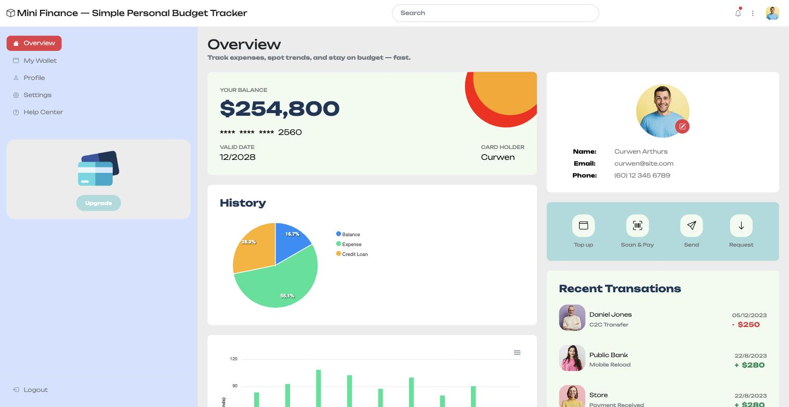
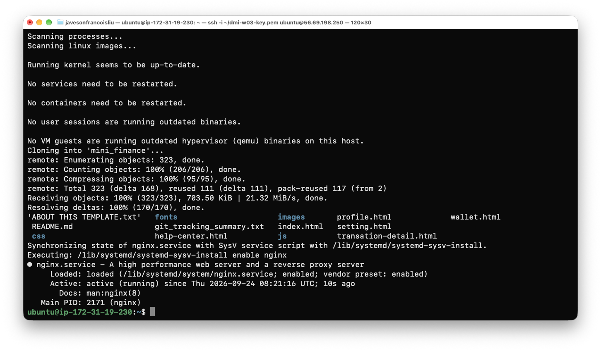

# Assignment 3 — Deploy Mini Finance Website on AWS Virtual Machine

Part of the DevOps Micro Internship (DMI) with Agentic AI

---

## Purpose

In this assignment, you will deploy the Mini Finance static HTML website on an AWS EC2 Linux virtual machine. You will launch the server, configure network access, connect through SSH, install a web server, deploy the GitHub source files, and confirm the website is reachable through the EC2 public IP.

---

# Task 1 — Launch and Secure an EC2 Linux Instance

## Goal

Launch an Amazon Linux 2 or Ubuntu EC2 instance in a public subnet, and configure its security group to allow SSH (22) and HTTP (80).

> No screenshot required for this task. Completion is verified through Task 4.

---

# Task 2 — Connect via SSH and Install a Web Server

## Goal

Connect to the instance using SSH and install Nginx or Apache.

> No screenshot required for this task. Completion is verified through Task 4.

---

# Task 3 — Clone and Deploy the Mini Finance Site

## Goal

Clone the Mini Finance repository (`https://github.com/pravinmishraaws/mini_finance.git`) and copy the site files to the web server's root directory.

> No screenshot required for this task. Completion is verified through Task 4.

---

# Task 4 — Start the Web Server and Verify the Website

## Goal

Start the web server and confirm the Mini Finance website is accessible through the EC2 public IP.

### Evidence

### Screenshots Required

Take one screenshot showing the Mini Finance website running in the browser.

**Screenshot 1 - Mini Finance website served from the EC2 public IP**



**Supporting evidence - SSH session: repo cloned, files copied to `/var/www/html`, Nginx `active (running)`**



---

#### Public IP URL

Paste the public IP address of your EC2 instance here (e.g. `http://3.91.105.10`):

**http://56.69.198.250**

| Item | Value |
|---|---|
| Instance | `dmi-w06-a03` (`t3.micro`, Ubuntu 22.04 LTS) |
| Region / AZ | `ap-southeast-5` (Malaysia) / `ap-southeast-5b` |
| Subnet | Public subnet (auto-assign public IPv4 enabled) |
| Security group | `dmi-w06-a03-sg`: SSH 22 from my IP only (`/32`), HTTP 80 from `0.0.0.0/0` |
| Web server | Nginx 1.18.0, enabled at boot |
| Web root | `/var/www/html` (Mini Finance files copied from the cloned repo) |

### Commands Used

```bash
ssh -i ~/dmi-w03-key.pem ubuntu@56.69.198.250
sudo apt update && sudo apt install -y nginx git
git clone https://github.com/pravinmishraaws/mini_finance.git
sudo rm -rf /var/www/html/* && sudo cp -r mini_finance/* /var/www/html/ && ls /var/www/html
sudo systemctl enable --now nginx && systemctl status nginx --no-pager | head -5
```

### Verification

- `curl -I http://56.69.198.250/` returns `200 OK` with `Server: nginx/1.18.0 (Ubuntu)`
- Page title: `Mini Finance — Simple Personal Budget Tracker`
- CSS (`css/bootstrap.min.css`, `css/tooplate-mini-finance.css`) and images (`images/social/*.png`) all return `200`, so styling and assets load

### Note

SSH is restricted to my own IP instead of `0.0.0.0/0`. When my ISP/VPN IP changed mid-task, SSH timed out; I added the new `/32` rule rather than opening port 22 to the world.

---

# Submission Instructions

- Add the required screenshot in your submission
- Include the EC2 Public IP URL
- Do not expose private keys, passwords, or account IDs

---

# Completion Checklist

- [x] EC2 instance launched in a public subnet with SSH (22) and HTTP (80) allowed
- [x] Connected to the instance via SSH
- [x] Web server (Nginx or Apache) installed
- [x] Mini Finance repository cloned and files copied to the web server root
- [x] Web server started and website verified in the browser (Screenshot 1)
- [x] EC2 Public IP URL included
- [x] No sensitive data exposed

---

## 📌 About DMI & CloudAdvisory

DevOps Micro Internship (DMI) is a project-based DevOps program run by Pravin Mishra (The CloudAdvisory) focused on real-world execution, systems thinking, and career readiness.

It helps learners build strong DevOps foundations with hands-on experience.

---

## 📌 Resources

- 🌐 DMI Official Website: https://dmi.pravinmishra.com?utm_source=github&utm_medium=readme  
- 🎓 University: https://university.pravinmishra.com?utm_source=github&utm_medium=readme  
- 💬 Discord Community: https://discord.pravinmishra.com?utm_source=github&utm_medium=readme  
- 📝 Blog: https://dmi.pravinmishra.com/blog?utm_source=github&utm_medium=readme  
- ▶️ YouTube Playlist: https://www.youtube.com/playlist?list=PLFeSNDtI4Cho  
- 🔗 Pravin Mishra (LinkedIn): https://www.linkedin.com/in/pravin-mishra-aws-trainer/  
- 🏢 CloudAdvisory (LinkedIn): https://www.linkedin.com/company/thecloudadvisory/

---

*This submission is part of DevOps Micro Internship (DMI) — Agentic AI Track.*