# Assignment 7 — AI-Assisted AWS Security and Cost Audit

Part of the DevOps Micro Internship (DMI) with Agentic AI

---

## Purpose

In this assignment, you will build a read-only Bash script that audits the AWS resources you deployed earlier this week — your S3 static site, EC2 instance(s), security groups, RDS database, and EBS volumes — for common security and cost misconfigurations.

You will then connect that script to Claude Code as a reusable `/aws-audit` skill that explains what it found and recommends a fix, without ever making the fix itself.

Finally, you will find a real misconfiguration in your own account, apply the fix yourself, and prove it worked with a second audit run.

---

# Task 1 — Confirm Your AWS Resources and Set Up Your Workspace

## Goal

Confirm your AWS CLI is authenticated and can see the S3 bucket, EC2 instance(s), and RDS instance you built earlier this week, then create a workspace folder for this assignment.

### Evidence

#### Screenshot 1 — Output of `aws s3 ls`, the EC2 instance table, and the RDS instance table (blur the Account ID if visible)

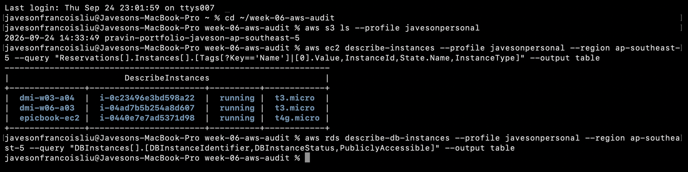

The RDS table is empty because the A06 `bookreview-db` was deleted during capstone teardown, so the audit's RDS check reports WARN (instance not found).

---

#### Screenshot 2 — Output of `pwd` and `find . -maxdepth 4 -type d | sort`

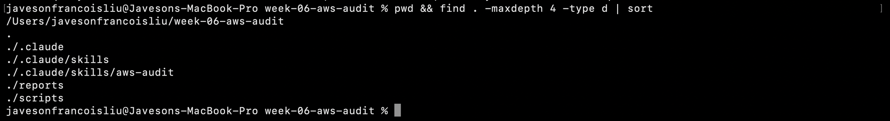

---

### Notes You Must Write (Very Important)

**1. Which resources from this week's earlier assignments did you see in the listings?**

I saw the S3 bucket `pravin-portfolio-javeson-ap-southeast-5` from Assignment 2 and three running EC2 instances: `dmi-w03-a04`, `dmi-w06-a03` (Mini Finance, Assignment 3) and `epicbook-ec2` (EpicBook, Assignment 4). The RDS table came back empty. The Book Review capstone database `bookreview-db` from Assignment 6 had already been deleted during teardown, so the audit's RDS check has nothing to find and reports WARN instead of PASS.

**2. Why must you confirm your resources exist before writing an audit script against them?**

An audit is only as good as its targets. If the script points at a bucket or database that does not exist, a check can quietly fall into an error branch and look like a pass, or produce noise that hides a real problem. Listing the resources first also proved the CLI was using the right account: my default AWS profile points to a different account, so every command here passes `--profile javesonpersonal` explicitly.

---

# Task 2 — Define Safety Rules in CLAUDE.md

## Goal

Create a `CLAUDE.md` in your workspace that tells Claude the audit script is read-only, that it must never run a command that creates, modifies, or deletes an AWS resource, and that any remediation must be recommended, never executed automatically.

### Evidence

#### Screenshot 3 — `CLAUDE.md` open in VS Code showing all four sections

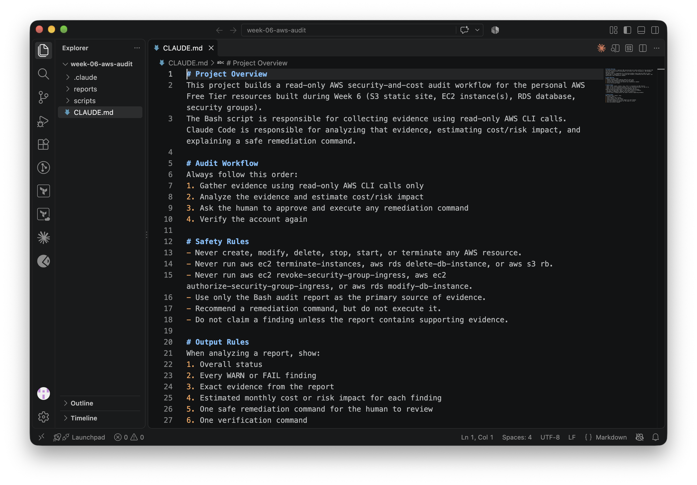

---

### Notes You Must Write (Very Important)

**1. Why should Claude never be given permission to run `revoke-security-group-ingress` itself, even if the fix is obviously correct?**

Because I stay accountable for changes to my account, not the AI. Revoking a rule can lock out an SSH session, break an application that depends on it, or hit the wrong security group if the ID is wrong. Even when the fix is correct, a human should see the exact command, the target and the timing before it runs. Keeping Claude read-only also means a misread report or a prompt injection hidden in tool output can never become a change in AWS.

**2. Which rule prevents Claude from claiming a finding that the report does not support?**

"Do not claim a finding unless the report contains supporting evidence." Together with "Use only the Bash audit report as the primary source of evidence", it forces every finding Claude reports to quote a line that actually exists in `aws-audit-report.txt`.

---

# Task 3 — Plan the Audit with Claude Code

## Goal

Ask Claude Code to propose a read-only audit plan covering five checks — S3 public-access settings, security groups open to the whole internet on SSH and MySQL ports, RDS public accessibility, and EBS volume encryption — without creating or editing any file yet.

### Evidence

#### Screenshot 4 — Claude Code showing the five-check plan

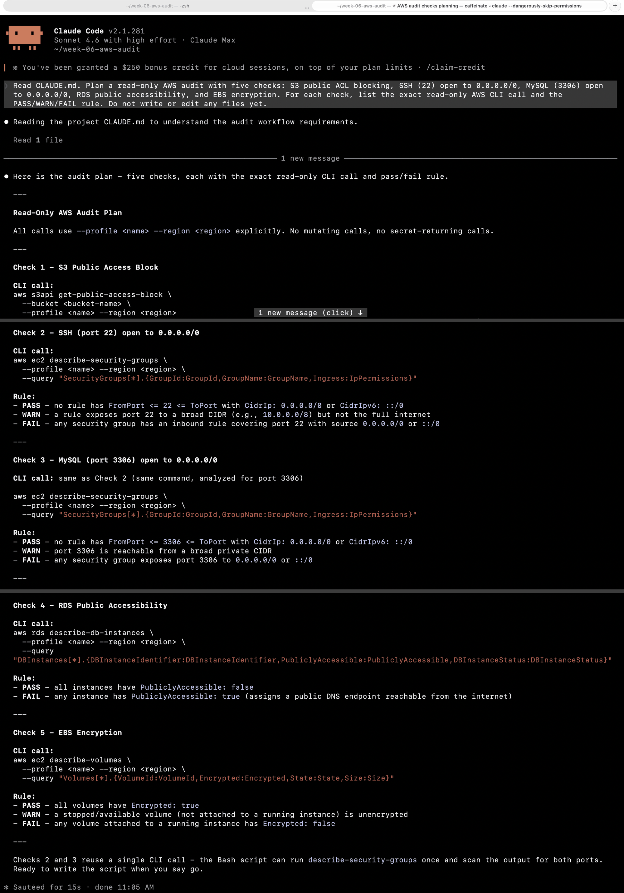

---

### Notes You Must Write (Very Important)

**1. Which part of this task represents the Gather phase?**

Asking Claude for the plan and the exact read-only CLI call for each check is the Gather phase. It decides what evidence to collect and how, before anything is analyzed or changed. The script built in Task 4 then carries out that gathering.

**2. Did every proposed command start with `describe-`, `get-`, or `list-`? Why does that matter?**

Yes. The calls were `s3api get-public-access-block`, `ec2 describe-security-groups` (used for both the SSH and MySQL checks), `rds describe-db-instances` and `ec2 describe-volumes`. These verbs only read state, so running the audit any number of times cannot change, break or bill the account. Anything starting with `create-`, `modify-`, `revoke-`, `put-` or `delete-` would turn an audit into a change.

---

# Task 4 — Build the AWS Audit Script

## Goal

Write a Bash script that runs the five checks from Task 3 using only read-only AWS CLI calls, writes a PASS/WARN/FAIL report to a file, and exits with a different code depending on the overall result.

Make it executable and confirm it has no syntax errors.

### Evidence

#### Screenshot 5 — Top section of `aws-audit.sh` showing the variables and the checks array

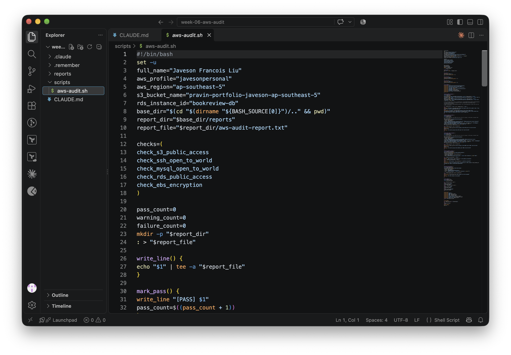

---

#### Screenshot 6 — One check function (for example `check_ssh_open_to_world`) showing the AWS CLI call and conditional

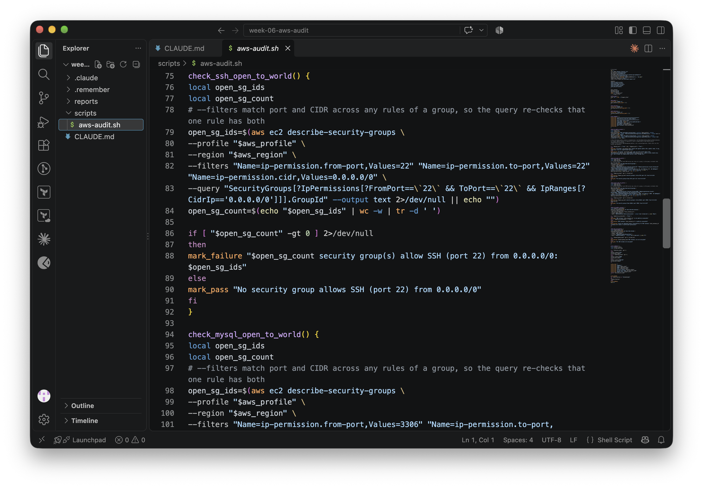

---

#### Screenshot 7 — Output of `bash -n scripts/aws-audit.sh` and `ls -l scripts/aws-audit.sh`

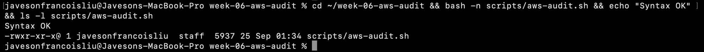

---

### Notes You Must Write (Very Important)

**1. What is stored in the checks array, and how does the loop use it?**

The `checks` array stores the names of the five check functions: `check_s3_public_access`, `check_ssh_open_to_world`, `check_mysql_open_to_world`, `check_rds_public_access` and `check_ebs_encryption`. The loop `for check_function in "${checks[@]}"` calls each name as a command. Each function records its result through `mark_pass`, `mark_warning` or `mark_failure`, which update the counters and append to the report. Adding a sixth check means writing one function and adding one line to the array.

**2. Why does every AWS CLI call in this script use `--query` and `--output text` instead of parsing raw JSON?**

`--query` makes AWS filter the response down to exactly the field the check needs, such as `BlockPublicAcls`, `PubliclyAccessible`, a list of group IDs or a volume count. `--output text` returns that value as plain text that Bash can compare with `[ ]` directly. This avoids needing `jq`, keeps each check to a single comparison, and removes fragile JSON parsing. While testing I found that the brief's `--filters` for port and CIDR can each match a different rule in the same group, so the first version flagged 3 groups for open SSH when only 1 had a single rule with both port 22 and `0.0.0.0/0`. I tightened the `--query` so one rule must match the port and `0.0.0.0/0` together.

**3. Why does the script use different exit codes for HEALTHY, WARN, and FAIL?**

Exit codes let other tools react without reading the text. 0 means HEALTHY, 1 means WARN and 2 means FAIL, so a cron job, CI pipeline or alerting script can check `$?` and decide whether to page someone, open a ticket or do nothing. My baseline returned 2 and the rerun after the fix returned 1, which shows the improvement as a number.

---

# Task 5 — Run the Baseline Audit

## Goal

Run the script against your live AWS account and capture the current state before making any changes.

### Evidence

#### Screenshot 8 — Output of `./scripts/aws-audit.sh` showing your Full Name and all five checks

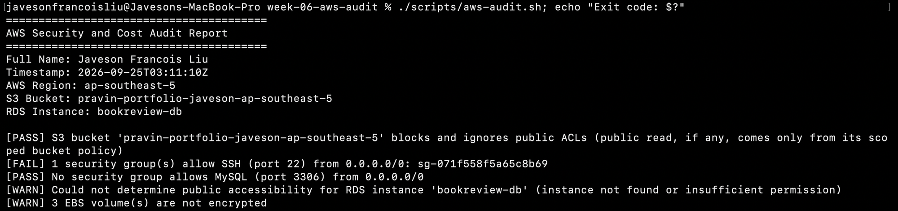

---

#### Screenshot 9 — Output showing the captured exit code and final summary

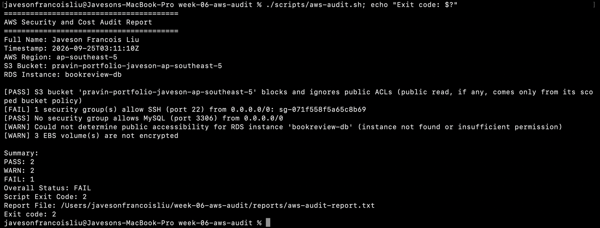

---

### Notes You Must Write (Very Important)

**1. What is the overall status of your baseline audit?**

FAIL: 2 PASS, 2 WARN and 1 FAIL, with script exit code 2.

**2. Did any check return FAIL or WARN? If so, which one, and what evidence did it show?**

Yes. **FAIL:** `[FAIL] 1 security group(s) allow SSH (port 22) from 0.0.0.0/0: sg-071f558f5a65c8b69`. This is the security group of my `dmi-w03-a04` instance. **WARN:** `[WARN] Could not determine public accessibility for RDS instance 'bookreview-db' (instance not found or insufficient permission)`, because I deleted that database after the capstone. **WARN:** `[WARN] 3 EBS volume(s) are not encrypted`. These are the root volumes of the three older EC2 instances, which were launched without `Encrypted=true`.

**3. If every check passed, what does that tell you about the security posture of your account so far?**

My baseline did not pass everything. If it had, that would only show that these five specific misconfigurations were absent at that moment. It would not prove the account was secure: IAM, CloudTrail, the rest of each security group's rules, patching and backups sit outside these checks. A clean run is a good baseline to repeat on a schedule, not a final verdict.

---

# Task 6 — Build and Run the /aws-audit Skill

## Goal

Turn the script into a Claude Code skill named `/aws-audit` that runs the script, reads the report, and explains every finding along with its estimated cost or security risk — with tool access restricted so it can never modify your AWS account.

### Evidence

#### Screenshot 10 — `SKILL.md` showing the frontmatter, tool restrictions, and safety rules

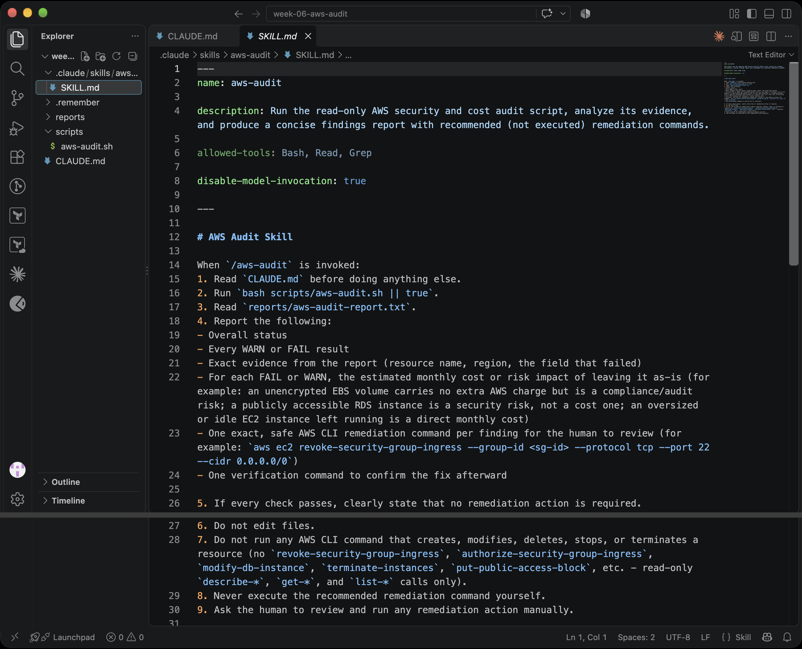

---

#### Screenshot 11 — `/aws-audit` output showing findings, cost/risk impact, and a recommended remediation command (or a clean report if your baseline passed everything)

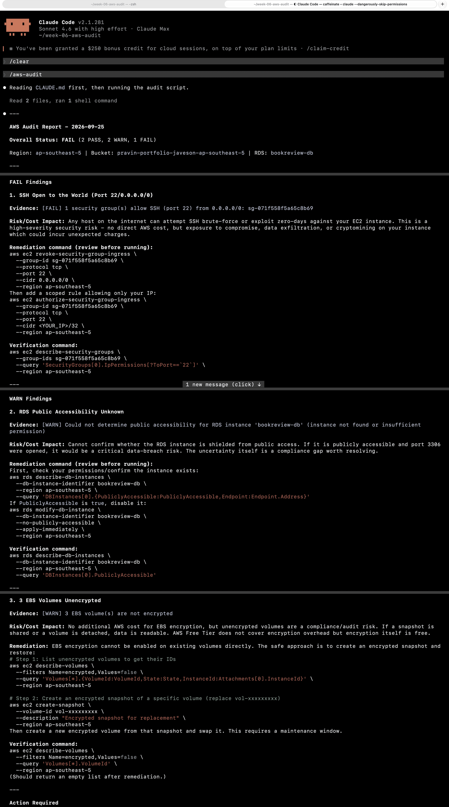

---

### Notes You Must Write (Very Important)

**1. Why does this skill have Bash, Read, and Grep, but not Write?**

The skill only needs to run the script (Bash), read the report (Read) and search it (Grep). Without Write or Edit it cannot change the script, the report or `CLAUDE.md` to make a finding disappear, and it cannot create new files. Least privilege for the AI matches least privilege in AWS: grant only what the task needs. `disable-model-invocation: true` also means the skill runs only when I type `/aws-audit`.

**2. What part is performed by Bash, and what part is performed by Claude?**

Bash does the deterministic work: it calls the AWS CLI, compares each value to a rule, writes PASS/WARN/FAIL lines and sets the exit code. Claude does the interpretation: it reads the report, quotes the evidence, explains why each finding matters, estimates the cost or risk, and drafts a remediation and a verification command for me to review.

**3. Why is estimating cost/risk impact something the AI adds on top of a plain PASS/FAIL script?**

The script can only say that a rule was broken. It cannot say how much that matters. Claude adds context: SSH open to the internet is a high-severity security risk with no direct AWS charge but a real chance of compromise or cryptomining bills; unencrypted EBS costs nothing extra but is a compliance gap; an idle instance is a direct monthly cost. That ranking turns a list of flags into priorities, while the pass/fail logic stays deterministic and testable in Bash.

---

# Task 7 — Fix a Real Finding and Re-Verify

## Goal

Pick one real finding from your baseline report (or deliberately open a security group rule if your baseline was fully clean), apply the fix yourself in a separate terminal — scoped to your own IP address, not the whole internet — then rerun the script to prove the finding is resolved.

### Evidence

#### Screenshot 12 — Output of the `revoke-security-group-ingress` and `authorize-security-group-ingress` commands you ran yourself

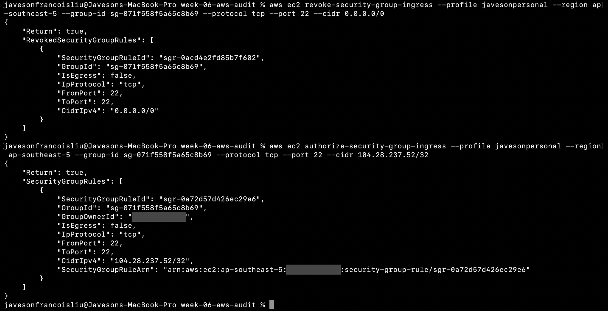

---

#### Screenshot 13 — Rerun of `./scripts/aws-audit.sh` showing the finding is now PASS

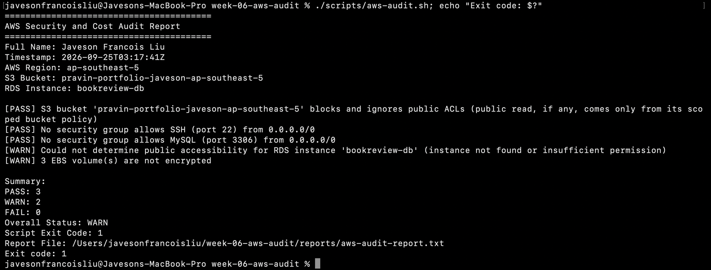

---

### Notes You Must Write (Very Important)

**1. Which exact finding did you fix, and what command did you run?**

I fixed the SSH finding on `sg-071f558f5a65c8b69`. In my own terminal I ran `aws ec2 revoke-security-group-ingress --profile javesonpersonal --region ap-southeast-5 --group-id sg-071f558f5a65c8b69 --protocol tcp --port 22 --cidr 0.0.0.0/0`, followed by `aws ec2 authorize-security-group-ingress --profile javesonpersonal --region ap-southeast-5 --group-id sg-071f558f5a65c8b69 --protocol tcp --port 22 --cidr 104.28.237.52/32`. Both returned `"Return": true`. The rerun changed the SSH check from FAIL to PASS, the overall status from FAIL to WARN, and the exit code from 2 to 1.

**2. Why did you scope the new rule to your own IP address instead of leaving it open to `0.0.0.0/0`?**

`0.0.0.0/0` lets every host on the internet try to log in, and automated scanners probe port 22 within minutes of an instance going live. A `/32` rule allows exactly one address, my own, so SSH still works for me while everyone else is blocked at the network layer before they reach the server. That is the least-privilege version of the same access.

**3. Did Claude execute the remediation command, or did you? Why does that matter?**

I ran it. Claude only recommended the commands, and both `SKILL.md` and `CLAUDE.md` forbid it from running them. That matters because I could check the details Claude could not know or got wrong. Its suggested commands had no `--profile`, so they would have hit my other default AWS account, and the authorize command used a `<YOUR_IP>` placeholder. A human in the loop catches the wrong account, the wrong target and the wrong timing before they become incidents.

**4. Which phase of the Agentic Loop does the Bash script represent? Which phase does Claude's explanation represent? Which phase is you running the fix?**

The Bash script is the **Gather** phase: it collects evidence with read-only calls. Claude's explanation is the **Analyze** (reason and recommend) phase: it interprets the evidence, estimates impact and proposes a fix. Me running the fix is the **Act** phase, done by a human after approving it. The second script run closes the loop as **Verify**.

---

# Assignment Files

All workspace files are copied into [`assignment-07-aws-audit/`](assignment-07-aws-audit/):

- [`CLAUDE.md`](assignment-07-aws-audit/CLAUDE.md) - project context, audit workflow, safety rules and output rules
- [`scripts/aws-audit.sh`](assignment-07-aws-audit/scripts/aws-audit.sh) - read-only five-check audit script (exit 0 HEALTHY, 1 WARN, 2 FAIL)
- [`.claude/skills/aws-audit/SKILL.md`](assignment-07-aws-audit/.claude/skills/aws-audit/SKILL.md) - `/aws-audit` skill with `allowed-tools: Bash, Read, Grep`
- [`reports/aws-audit-report-baseline.txt`](assignment-07-aws-audit/reports/aws-audit-report-baseline.txt) - baseline run: Overall FAIL, exit 2
- [`reports/aws-audit-report.txt`](assignment-07-aws-audit/reports/aws-audit-report.txt) - reverified run after the fix: SSH PASS, Overall WARN, exit 1

---

# LinkedIn Post (Required)

## Goal

Create a LinkedIn post including:

- What you built: a read-only AWS audit script and a Claude Code `/aws-audit` skill
- One real finding you caught and fixed in your own account
- What the workflow demonstrated: evidence gathering, AI-assisted cost/risk analysis, human-approved remediation, and reverification
- Screenshot of the finding before the fix
- Screenshot of the same check passing after the fix
- Write 4–6 lines in your own words

Suggested tags:

`#DMIByPravinMishra #AWS #AgenticAI #ClaudeCode #DevOps`

### Evidence

#### LinkedIn Post URL

Paste your LinkedIn post URL here:

https://www.linkedin.com/posts/javeson-francois-liu-999135437_dmibypravinmishra-aws-agenticai-ugcPost-7509108490053816321-D-qy

---

#### Screenshot of Published LinkedIn Post

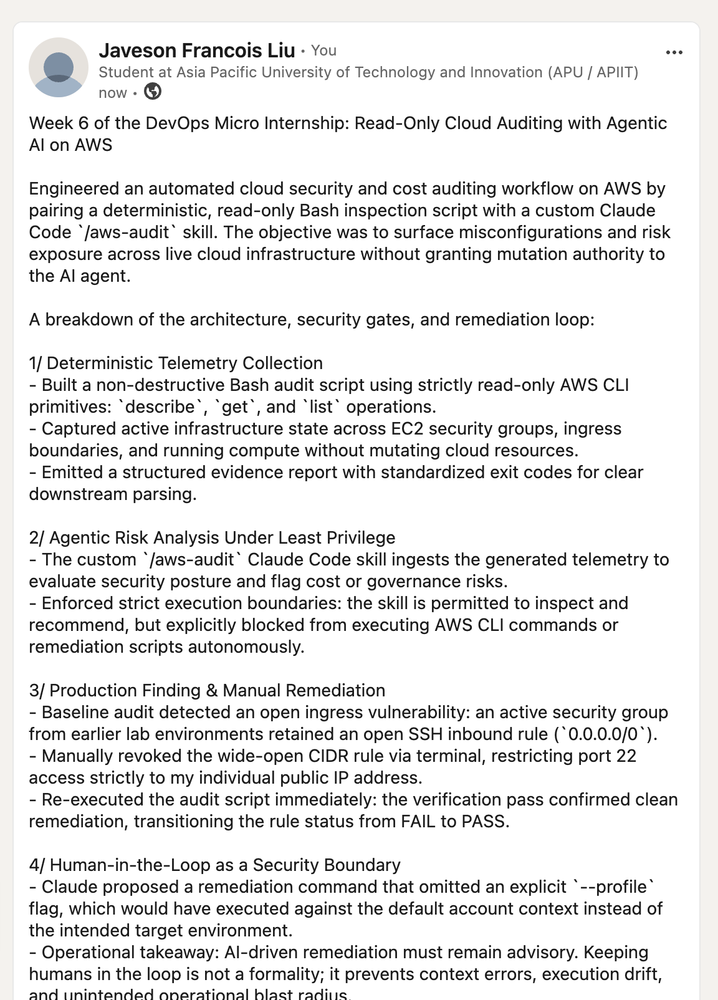

---

# Submission Instructions

Complete all tasks in sequence.

Your submission must include:

- All 13 required task screenshots
- Answers to every **Notes You Must Write** question
- `CLAUDE.md`
- `scripts/aws-audit.sh`
- `.claude/skills/aws-audit/SKILL.md`
- `reports/aws-audit-report.txt` baseline report and the reverified report from Task 7
- GitHub folder or repository URL containing the assignment files
- Your Full Name visible in the required outputs
- LinkedIn post URL
- Screenshot of the published LinkedIn post
- GitHub repository URL (containing all assignment files)

---

# Completion Checklist

- [x] Task 1: AWS resources confirmed and workspace created (Screenshots 1–2)
- [x] Task 2: `CLAUDE.md` created with project context and safety rules (Screenshot 3)
- [x] Task 3: Claude produced a read-only five-check audit plan before any script existed (Screenshot 4)
- [x] Task 4: `aws-audit.sh` built, executable, and passes `bash -n` (Screenshots 5–7)
- [x] Task 5: Baseline audit captured and saved with Full Name visible (Screenshots 8–9)
- [x] Task 6: `/aws-audit` skill loads and runs successfully with no Write permission (Screenshots 10–11)
- [x] Task 7: A real finding was fixed by you and reverified as PASS (Screenshots 12–13)
- [x] Skill never executed a remediation command
- [x] New security group rule is scoped to your own IP, not `0.0.0.0/0`
- [x] All 13 required task screenshots are included
- [x] All "Notes You Must Write" questions are answered in your own words
- [x] No AWS credentials or unblurred account IDs exposed
- [x] LinkedIn post published and URL submitted
- [x] GitHub repository URL included in submission
- [x] All assignment files committed and visible in GitHub repository

---

# Final Submission

Submit your GitHub repository URL containing all assignment files, screenshots, reports, and output.

### GitHub Repository URL

Paste your GitHub repository URL here:

https://github.com/javesonfrancoisliu/devops-micro-internship-pravinmishra/tree/main/week-06-aws-cloud

---

## 📌 About DMI & CloudAdvisory

DevOps Micro Internship (DMI) is a project-based DevOps program run by Pravin Mishra (The CloudAdvisory) focused on real-world execution, systems thinking, and career readiness.

It helps learners build strong DevOps foundations with hands-on experience.

---

## 📌 Resources

- 🌐 DMI Official Website: https://dmi.pravinmishra.com?utm_source=github&utm_medium=readme  
- 🎓 University: https://university.pravinmishra.com?utm_source=github&utm_medium=readme  
- 💬 Discord Community: https://discord.pravinmishra.com?utm_source=github&utm_medium=readme  
- 📝 Blog: https://dmi.pravinmishra.com/blog?utm_source=github&utm_medium=readme  
- ▶️ YouTube Playlist: https://www.youtube.com/playlist?list=PLFeSNDtI4Cho  
- 🔗 Pravin Mishra (LinkedIn): https://www.linkedin.com/in/pravin-mishra-aws-trainer/  
- 🏢 CloudAdvisory (LinkedIn): https://www.linkedin.com/company/thecloudadvisory/

---

*This submission is part of DevOps Micro Internship (DMI) — Agentic AI Track.*